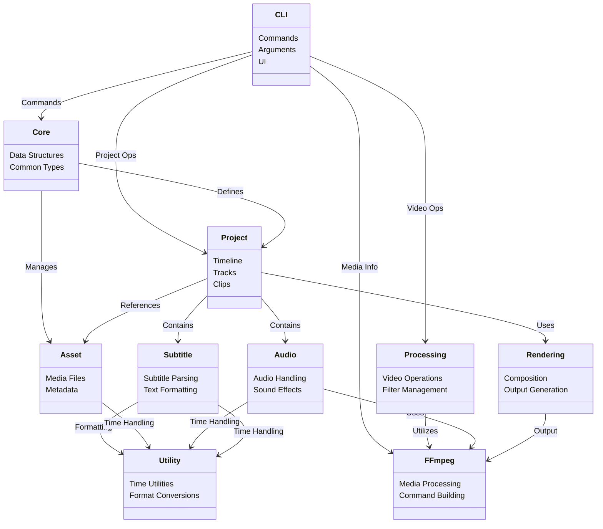
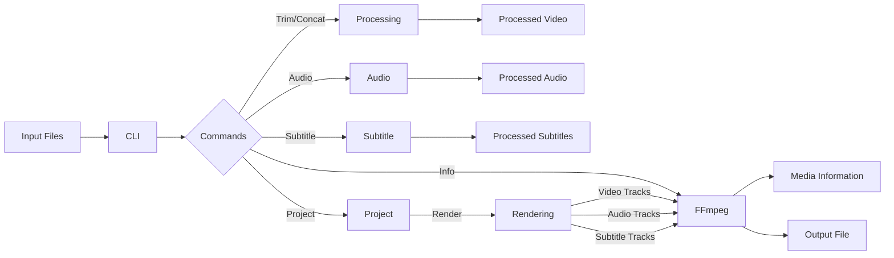
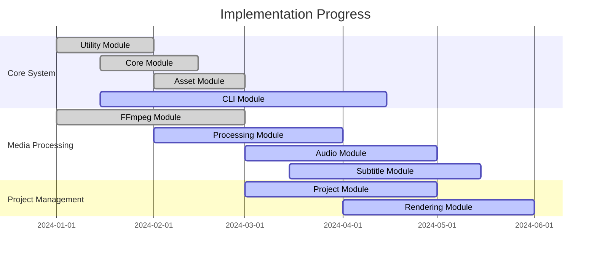

# edv - Architecture Overview

This document provides an overview of the edv application architecture, explaining the main modules and their relationships.

## Module Structure

The edv application is divided into several key modules, each with a specific responsibility:

```mermaid
flowchart TD
    subgraph Core["Core System"]
        CLI["CLI Module"]
        Core["Core Module"]
        Asset["Asset Module"]
        Utility["Utility Module"]
    end
    
    subgraph Media["Media Processing"]
        FFmpeg["FFmpeg Module"]
        Processing["Processing Module"]
        Audio["Audio Module"]
        Subtitle["Subtitle Module"]
    end
    
    subgraph Project["Project Management"]
        Project["Project Module"]
        Rendering["Rendering Module"]
    end
    
    CLI --> Core
    CLI --> Processing
    Core --> Asset
    Core --> Project
    
    Processing --> FFmpeg
    Audio --> FFmpeg
    Subtitle --> Utility
    Project --> Asset
    Project --> Rendering
    
    Rendering --> FFmpeg
    Audio --> Utility
    Asset --> Utility
```

### Core Modules

- **CLI Module**: Provides the command-line interface for the application.
- **Core Module**: Contains core data structures and utilities used throughout the application.
- **Asset Module**: Manages media assets and their metadata.
- **Utility Module**: Contains common utility functions and shared code.

### Media Processing Modules

- **FFmpeg Module**: Integrates with FFmpeg for media processing operations.
- **Processing Module**: Handles video processing operations through FFmpeg.
- **Audio Module**: Manages audio extraction, processing, and replacement.
- **Subtitle Module**: Handles subtitle extraction, editing, and embedding.

### Project Management Modules

- **Project Module**: Manages project data, including timelines and tracks.
- **Rendering Module**: Handles the rendering of projects to output files.

## Module Dependencies



## Data Flow



## Key Interfaces

1. **Command Line Interface**: Provides user access to application functionality.
2. **FFmpeg Integration**: Abstracts FFmpeg command-line operations for higher-level modules.
3. **Asset Management**: Provides a unified interface for managing media assets.
4. **Project Management**: Handles project configuration, saving, and loading.
5. **Rendering Pipeline**: Facilitates the rendering of projects to output files.

## Future Architecture Enhancements

The following architectural enhancements are planned for future versions:

1. **Plugin System**: Allow for extensibility through custom plugins.
2. **Distributed Processing**: Support for distributed rendering across multiple machines.
3. **GPU Acceleration**: Integration with hardware acceleration for faster processing.
4. **Cloud Storage**: Support for cloud-based asset storage and management.
5. **Web API**: RESTful API for integration with web applications.

## Implementation Status



The architecture of edv is designed to be modular and extensible, with clear separation of concerns between different parts of the system. This enables easier maintenance, testing, and future enhancements to the application. 