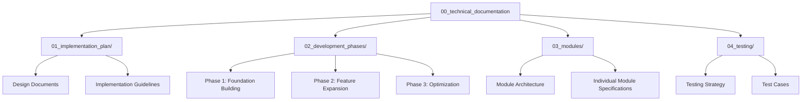

# edv - Technical Documentation Collection

This directory contains technical documentation for the edv project. It includes detailed specifications, design documents, and implementation guidelines for developers.

## Directory Structure

## Section Overview

### 01_implementation_plan/

Contains documents related to implementation plans and overall design. This section defines the technical foundation and direction of the project.

- **Architecture Design**: System-wide architecture and design principles
- **Technology Stack**: Rationale for selected technologies and libraries
- **Coding Conventions**: Coding standards applied throughout the project
- **Implementation Roadmap**: Sequence and priorities for implementing key features

### 02_development_phases/

Contains documents related to development phases and milestones. This section defines project stages and goals for each phase.

- **Phase 1**: Implementation of foundation modules and core features
- **Phase 2**: Implementation of extended features and advanced processing
- **Phase 3**: Performance optimization and usability improvements
- **Release Planning**: Version management and release cycles

### 03_modules/

Contains detailed specifications and API designs for each module. This section serves as the primary reference for developers implementing and integrating modules.

- **00_architecture_overview.md**: Inter-module relationships and overall architecture
- **01_cli_module.md**: Command-line interface module
- **02_core_module.md**: Core functionality module
- **03_processing_module.md**: Processing module
- **04_project_module.md**: Project management module
- **05_asset_module.md**: Asset management module
- **06_utility_module.md**: Utility module
- **07_subtitle_module.md**: Subtitle processing module
- **08_audio_module.md**: Audio processing module
- **09_ffmpeg_module.md**: FFmpeg integration module

### 04_testing/

Contains specifications for testing strategies and test cases. This section defines quality assurance processes and testing methodologies.

- **Testing Approach**: Unit testing, integration testing, and system testing approaches
- **Test Environment**: Test environment configuration and requirements
- **Test Cases**: Test cases for key features
- **Automated Testing**: CI/CD pipeline and test automation

## Documentation Update Guidelines

Technical documentation is as important as code in the project assets. Please follow these guidelines when updating documentation:

1. **Sync with Code**: Update corresponding documentation when making significant code changes
2. **Mermaid Diagrams**: Use Mermaid diagrams to visualize complex concepts and relationships
3. **Commit Messages**: Use the `docs: ` prefix for documentation update commit messages
4. **Reviews**: Include documentation review as part of code reviews

## Notation and Formatting

Documentation should be written in a consistent style:

- **Headings**: Use appropriate heading levels to represent topic hierarchy
- **Code Blocks**: Enclose code examples in language-specified code blocks
- **Cross-References**: Provide links to related documentation
- **Diagrams**: Explain complex concepts using Mermaid diagrams

## Contributing

Contributions to technical documentation are welcome. Please submit new documentation or updates to existing documentation through pull requests. 