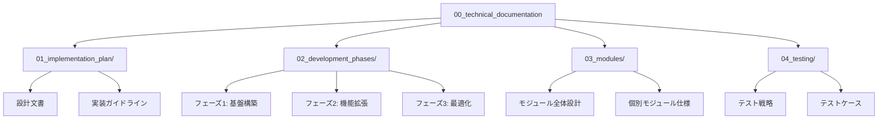

# edv - 技術ドキュメント集

このディレクトリには、edvプロジェクトの技術ドキュメントが格納されています。開発者向けの詳細な仕様、設計文書、実装ガイドラインなどが含まれます。

## ディレクトリ構造

## セクション概要

### 01_implementation_plan/

実装計画と全体設計に関するドキュメントが含まれています。このセクションは、プロジェクトの技術的な基盤と方向性を定義します。

- **アーキテクチャ設計**: システム全体のアーキテクチャと設計原則
- **技術スタック**: 使用する技術とライブラリの選定理由
- **コーディング規約**: プロジェクト全体で適用されるコーディング規約
- **実装ロードマップ**: 主要機能の実装順序と優先順位

### 02_development_phases/

開発フェーズとマイルストーンに関するドキュメントが含まれています。プロジェクトの進行段階と各フェーズの目標を定義します。

- **フェーズ1**: 基盤モジュールと核となる機能の実装
- **フェーズ2**: 拡張機能と高度な処理の実装
- **フェーズ3**: パフォーマンス最適化とユーザビリティ向上
- **リリース計画**: バージョン管理とリリースサイクル

### 03_modules/

各モジュールの詳細仕様とAPI設計が含まれています。このセクションは、開発者がモジュールの実装と統合を行う際の主要な参照先となります。

- **00_architecture_overview.md**: モジュール間の関係と全体アーキテクチャ
- **01_cli_module.md**: コマンドラインインターフェースモジュール
- **02_core_module.md**: コア機能モジュール
- **03_processing_module.md**: 処理モジュール
- **04_project_module.md**: プロジェクト管理モジュール
- **05_asset_module.md**: アセット管理モジュール
- **06_utility_module.md**: ユーティリティモジュール
- **07_subtitle_module.md**: 字幕処理モジュール
- **08_audio_module.md**: 音声処理モジュール
- **09_ffmpeg_module.md**: FFmpeg連携モジュール

### 04_testing/

テスト戦略とテストケースの仕様が含まれています。品質保証プロセスとテスト手法を定義します。

- **テスト方針**: 単体テスト、統合テスト、システムテストのアプローチ
- **テスト環境**: テスト実行環境の設定と要件
- **テストケース**: 主要機能のテストケース
- **自動化テスト**: CI/CDパイプラインとテスト自動化

## ドキュメント更新ガイドライン

技術ドキュメントは、コードと同様に重要なプロジェクト資産です。以下のガイドラインに従ってドキュメントを更新してください：

1. **コードと同期**: 大きなコード変更時には対応するドキュメントも更新する
2. **Mermaidダイアグラム**: 複雑な概念や関係はMermaidダイアグラムを使用して視覚化する
3. **コミットメッセージ**: ドキュメント更新時は `docs: ` プレフィックスを使用する
4. **レビュー**: コードレビューにはドキュメントレビューも含める

## 記法とフォーマット

ドキュメントは一貫したスタイルで書かれるべきです：

- **見出し**: トピック階層を表現するために適切な見出しレベルを使用
- **コードブロック**: コード例は言語指定付きのコードブロックで囲む
- **相互参照**: 関連ドキュメントへのリンクを提供する
- **図表**: 複雑な概念はMermaidダイアグラムを使用して説明

## 貢献

技術ドキュメントへの貢献を歓迎します。新しいドキュメントを追加、既存のドキュメントを更新する場合は、プルリクエストを通じて提出してください。 