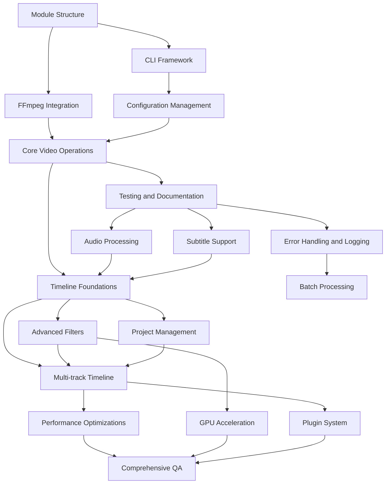

# edv - Detailed Development Phases

This document provides a detailed breakdown of each development phase for the edv project, expanding on the high-level plan outlined in the implementation plan.

## Phase 1: Core Infrastructure (MVP)

### Module Structure Setup (Week 1)
- Create initial project with Cargo
- Set up directory structure according to the design
- Configure CI/CD pipeline (GitHub Actions/GitLab CI)
- Establish code style and linting rules
- Set up test framework and initial tests
- Configure dependency management

### CLI Framework (Week 2)
- Implement command-line argument parsing using clap
- Create the main application entry point
- Build command registry system
- Implement help and version commands
- Set up terminal output formatting
- Implement progress display for long-running operations

### FFmpeg Integration (Weeks 2-3)
- Develop FFmpeg detection and validation
- Create the FFmpeg wrapper module
- Implement command construction API
- Build process execution and monitoring
- Develop output parsing functionality
- Implement error handling for FFmpeg errors

### Configuration Management (Week 3)
- Implement configuration file loading/saving
- Create default configuration generation
- Develop environment variable integration
- Build configuration validation
- Implement user preferences storage

### Core Video Operations (Weeks 4-5)
- Implement trim operation
  - Input validation
  - FFmpeg command generation
  - Progress monitoring
  - Output validation
- Implement concat operation
  - Multiple input handling
  - Concat demuxer implementation
  - Filter complex implementation
  - Format compatibility handling
- Implement cut operation
  - Section removal logic
  - Temporary file management
  - Stream copying optimization

### Testing and Documentation (Week 6)
- Write comprehensive unit tests for all modules
- Develop integration tests for end-to-end workflows
- Create initial user documentation
- Document API for future extension
- Perform cross-platform testing
- Package the MVP for initial testing

## Phase 2: Extended Functionality

### Audio Processing (Weeks 1-2)
- Implement volume adjustment
  - dB and percentage-based adjustments
  - Temporal volume changes (fade in/out)
- Develop audio extraction
  - Format selection
  - Quality control
  - Metadata preservation
- Implement audio replacement
  - Synchronization handling
  - Multi-track support
  - Format conversion if needed

### Subtitle Support (Weeks 2-3)
- Implement subtitle loading
  - SRT format support
  - VTT format support
  - Character encoding handling
- Develop subtitle editing
  - Timing adjustments
  - Text modifications
  - Style customization
- Implement subtitle burning
  - Font selection and styling
  - Position customization
  - Filter generation for FFmpeg

### Timeline Editing Foundations (Weeks 3-5)
- Design timeline data model
- Implement project state management
- Develop clip management
  - Add/remove clips
  - Clip ordering
  - Clip properties
- Implement basic timeline operations
  - Positioning clips
  - Adjusting duration
  - Managing transitions

### Enhanced Error Handling and Logging (Weeks 5-6)
- Implement structured logging system
- Develop detailed error types
- Create user-friendly error messages
- Implement crash recovery
- Add operation logging for audit/undo support
- Build debug information collection

## Phase 3: Advanced Features

### Advanced Filters and Effects (Weeks 1-3)
- Implement color adjustment filters
  - Brightness, contrast, saturation
  - Color grading and LUTs
  - Advanced color transformations
- Develop visual effect filters
  - Blur, sharpen, denoise
  - Artistic filters
  - Composition overlays
- Implement transition effects
  - Cross-fade
  - Wipes and slides
  - Custom transition support

### Batch Processing (Weeks 3-5)
- Design batch job specification format
- Implement directory scanning and filtering
- Develop parallel processing engine
- Add scheduling and prioritization
- Implement progress tracking across multiple files
- Create batch error handling and recovery

### Project Management (Weeks 5-7)
- Implement project file format
- Develop serialization/deserialization
- Create project saving and loading
- Implement edit history
- Develop undo/redo functionality
- Add project templates and presets

### Multi-track Timeline Enhancement (Weeks 7-8)
- Extend timeline for multiple video tracks
- Implement multiple audio tracks
- Develop track management
- Create compositing between tracks
- Implement track locking and visibility
- Add keyframe support for effects

## Phase 4: Optimization and Enhancements

### Performance Optimizations (Weeks 1-2)
- Profile application performance
- Optimize memory usage
- Improve file I/O operations
- Enhance parallel processing
- Optimize FFmpeg command generation
- Reduce unnecessary processing

### GPU Acceleration (Weeks 2-3)
- Research GPU acceleration options with FFmpeg
- Implement hardware detection
- Add hardware acceleration configuration
- Develop fallback mechanisms
- Test performance improvements
- Document hardware compatibility

### Plugin System (Weeks 3-5)
- Design plugin architecture
- Implement plugin loading mechanism
- Create plugin API
- Develop documentation for plugin developers
- Create example plugins
- Implement plugin management and configuration

### Comprehensive Testing and Quality Assurance (Weeks 5-6)
- Implement performance benchmark suite
- Develop stress testing for large files
- Create compatibility test suite
- Enhance automated testing coverage
- Perform security review and testing
- Conduct usability testing

## Dependencies Between Phases

## Risk Factors for Each Phase

| Phase | Key Risk Areas | Contingency Plan |
|-------|---------------|------------------|
| Phase 1 | FFmpeg compatibility across platforms | Build abstraction layer to handle differences |
| | Command parsing complexity | Simplify initial command set if needed |
| Phase 2 | Subtitle format complexity | Focus on most common formats first |
| | Timeline data structure design | Prototype different designs before full implementation |
| Phase 3 | Batch processing performance | Implement throttling and resource management |
| | Project file compatibility | Strong versioning and migration support |
| Phase 4 | GPU support variation | Clear feature detection and graceful fallback |
| | Plugin security | Strict sandboxing and validation |

This phased approach allows for incremental development with clearly defined deliverables at each stage, while maintaining the flexibility to adjust priorities based on feedback and challenges encountered during development. 