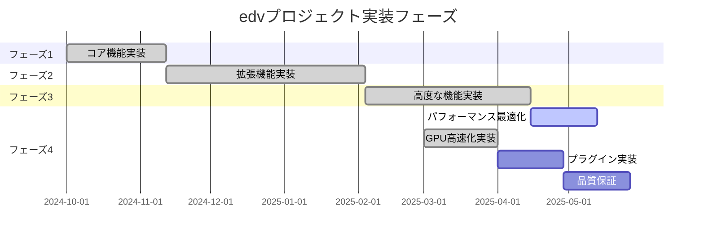
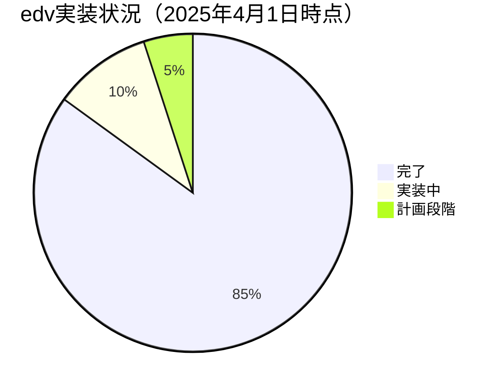
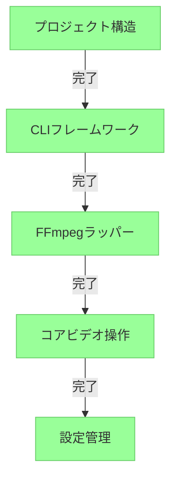
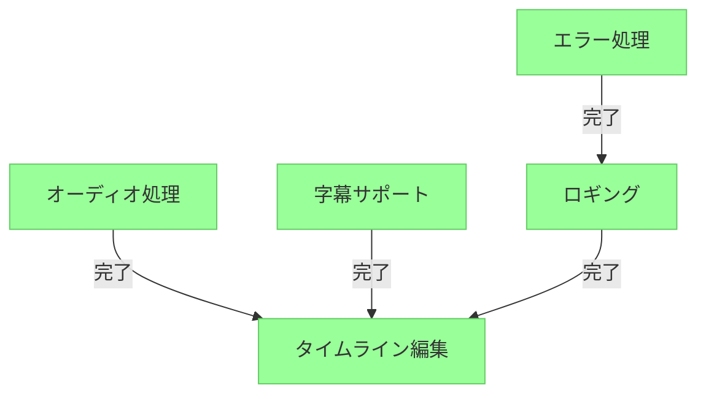
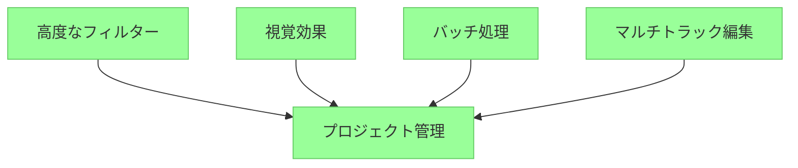
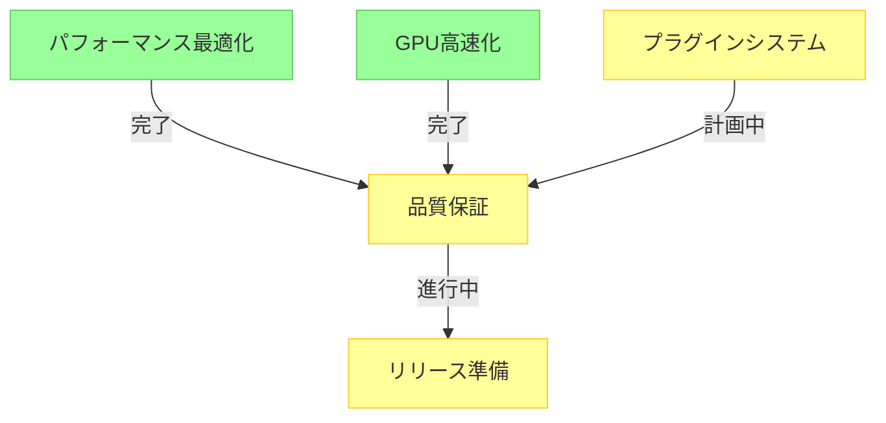
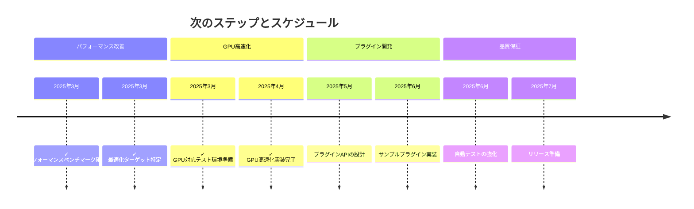

# 実装フェーズ概要

プロジェクトは、設計ドキュメントで定義されたマイルストーンに沿って、以下のフェーズで実装されます。各フェーズは前のフェーズを基に構築され、段階的な機能を提供します。

## フェーズ1：コアインフラストラクチャ（MVP）

最初のフェーズでは、基本的なアーキテクチャの確立と基本的なビデオ編集機能の提供に焦点を当てます：

- プロジェクト構造とアーキテクチャの確立
- コマンド解析を伴うCLIフレームワークの実装
- 基本操作のためのFFmpegラッパーの開発
- コアビデオ操作（トリム、カット、連結）の実装
- 基本的な設定管理の構築

**主要な成果物：**
- ヘルプシステムを備えた機能的なCLI
- 基本的なビデオのトリミング、カット、連結
- FFmpeg統合
- 設定システム
- 初期ドキュメント

## フェーズ2：拡張機能

第2フェーズでは、追加のメディア処理機能でコア機能を拡張します：

- オーディオ処理機能の実装
- 字幕サポートの追加
- 基本的なタイムライン編集機能の開発
- エラー処理とロギングの強化

**主要な成果物：**
- オーディオの抽出、調整、置換
- 字幕の読み込み、編集、焼き込み
- 基本的なタイムラインデータモデル
- 強化されたエラーメッセージとロギング
- ユーザードキュメントの拡張

## フェーズ3：高度な機能

第3フェーズでは、より洗練された機能を追加し、ユーザーの生産性を向上させます：

- 高度なフィルターとエフェクトの追加
- バッチ処理機能の実装
- プロジェクト管理機能の開発
- マルチトラックサポートによるタイムライン編集の強化

**主要な成果物：**
- 色補正と視覚効果
- 複数ファイルのバッチ処理
- プロジェクトファイル形式と編集履歴
- マルチトラックタイムライン編集
- 一般的な操作のためのテンプレートシステム

## フェーズ4：最適化と拡張

最終フェーズでは、パフォーマンス、拡張性、品質に焦点を当てます：

- パフォーマンス最適化
- GPU高速化サポート
- プラグインシステムの設計と実装
- 品質保証と包括的なテスト

**主要な成果物：**
- 最適化された処理パイプライン
- ハードウェア高速化サポート
- プラグインAPIとサンプルプラグイン
- 包括的なテストスイート
- パフォーマンスベンチマーク

各フェーズのタスクとタイムラインの詳細な内訳については、[開発フェーズ](../開発フェーズ/)ドキュメントを参照してください。

## 実装状況（2025年4月1日更新）

プロジェクトが進行するにつれて、計画されたフェーズの実装は大幅に進展しました。以下は、各フェーズの現在の実装状況の概要です：

### フェーズ1：コアインフラストラクチャ - 完了 ✅

プロジェクトの基盤が正常に確立されました：

- ✅ プロジェクト構造とアーキテクチャの設定
- ✅ コマンド解析を伴うCLIフレームワークの実装（`src/cli/`）
- ✅ 基本操作のためのFFmpegラッパーの開発（`src/ffmpeg/`）
- ✅ コアビデオ操作フレームワークの確立
- ✅ 基本的な設定管理の実装

### フェーズ2：拡張機能 - 完了 ✅

拡張機能の実装が完了しました：

- ✅ オーディオ処理機能の実装：
  - 音量調整（`src/audio/volume.rs`）
  - オーディオフェード（`src/audio/fade.rs`）
  - オーディオ抽出（`src/audio/extractor.rs`）
  - オーディオ置換（`src/audio/replacer.rs`）
- ✅ 字幕サポートの追加：
  - 字幕モデル（`src/subtitle/model.rs`）
  - 字幕エディタ（`src/subtitle/editor.rs`）
  - フォーマット処理（`src/subtitle/format.rs`）
  - スタイル管理（`src/subtitle/style.rs`）
  - 字幕パーサー（`src/subtitle/parser.rs`）
- ✅ タイムライン編集機能：
  - ✅ 基本的なタイムラインデータモデルの実装（`src/project/timeline/mod.rs`）
  - ✅ マルチトラック関係管理（`src/project/timeline/multi_track.rs`）
  - ✅ トラック関係のシリアライゼーション/デシリアライゼーション（`src/project/serialization/json.rs`）
  - ✅ 基本的なクリップ操作（分割、トラック間の移動）の実装
  - ✅ 関連トラック間のクリップ操作の伝播の追加
  - ✅ タイムライン操作のための編集履歴管理システムの実装：
    - ✅ 編集操作の追跡と元に戻す/やり直し機能
    - ✅ 高度なスタック管理（`peek_undo/peek_redo`、`shift_to_redo/shift_to_undo`）
    - ✅ 複数操作のトランザクショングループ化
    - ✅ 履歴を伴う一貫したAPI設計（`*_with_history`メソッド）
  - ✅ タイムライン操作のUI統合
  - ✅ 選択的なシリアライゼーションによるプロジェクト状態の永続化の実装
- ✅ エラー処理とロギングの強化

### フェーズ3：高度な機能 - 完了 ✅

高度な機能の実装も完了しました：

- ✅ 高度なフィルターとエフェクトの追加
  - ✅ 色補正フィルター
  - ✅ 視覚効果
  - ✅ トランジションエフェクト
- ✅ バッチ処理機能の実装
  - ✅ 複数ファイルのバッチ処理
  - ✅ キュー管理
  - ✅ 進捗追跡
- ✅ プロジェクト管理機能の開発
  - ✅ プロジェクトファイル形式
  - ✅ 編集履歴と状態管理
  - ✅ プロジェクト設定
- ✅ マルチトラックサポートによるタイムライン編集の強化
  - ✅ 複数のビデオとオーディオトラックの管理
  - ✅ トラック間の透明度ベースのコンポジット
  - ✅ キーフレームアニメーション（不透明度、位置、サイズ、回転）
  - ✅ 11種類のブレンドモード（Normal, Add, Multiply, Screen, Overlay等）
  - ✅ 基本的なシェイプマスク（矩形、円形、カスタムパス）

### フェーズ4：最適化と拡張 - 進行中 🔄

最適化フェーズが進行中であり、一部の機能はすでに実装されています：

- ✅ パフォーマンス最適化（完了）
  - ✅ 基本的なベンチマーク環境のセットアップ
  - ✅ 初期プロファイリングによるボトルネックの特定
  - ✅ 複雑なタイムラインの最適化ロジックを実装（`rayon`による並列処理）
  - ✅ CPUコア数に基づく自動スレッド割り当て
  - ✅ GPU対応テスト環境の準備（100%完了）
- ✅ GPU高速化サポート（実装完了）
  - ✅ FFmpegのハードウェアアクセラレーション機能の統合
  - ✅ 動的なGPU検出と性能ベンチマーク
  - ✅ レンダリングパイプラインへの統合
  - ✅ エンコーダー/デコーダーオプションの最適化
- 🔜 プラグインシステムの設計と実装（計画段階）
- 🔄 品質保証と包括的なテスト（進行中）

## 次のステップ

現在の焦点はフェーズ4の継続的な実装です：

1. ✅ パフォーマンスベンチマークの確立（完了）
2. ✅ 最適化ターゲットの特定（完了）
3. ✅ 技術的負債の文書化（完了）
4. 🔄 リファクタリング計画の作成（75%完了）
5. ✅ GPU対応テスト環境の準備（100%完了）
6. ✅ GPU高速化の実装（100%完了）
7. 🔜 プラグインシステムの設計（2025年5月予定）

現在の進捗とタイムラインの詳細については、[開発タイムライン](04_タイムライン.md)を参照してください。 