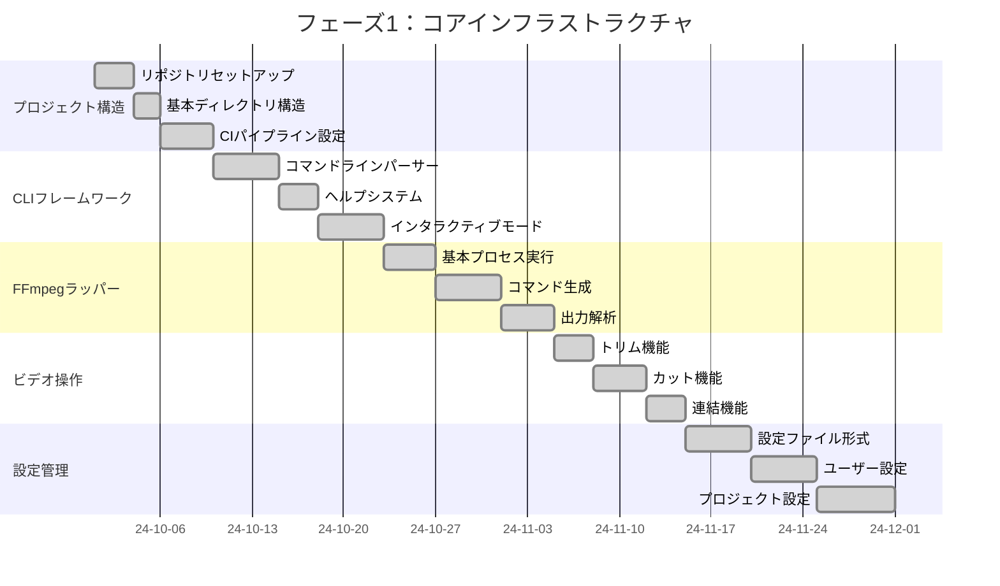
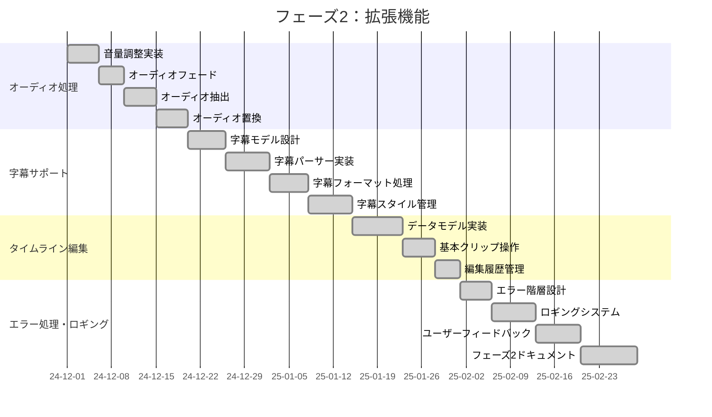
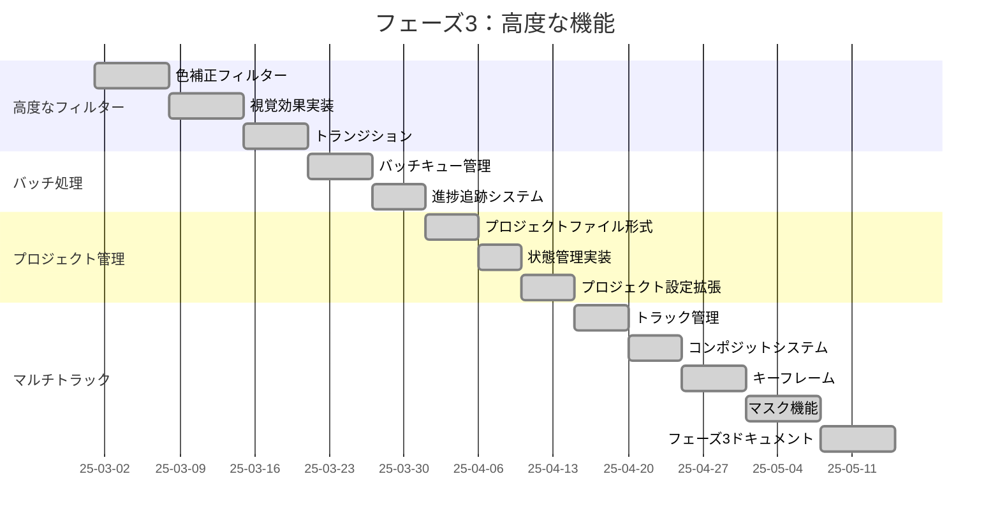
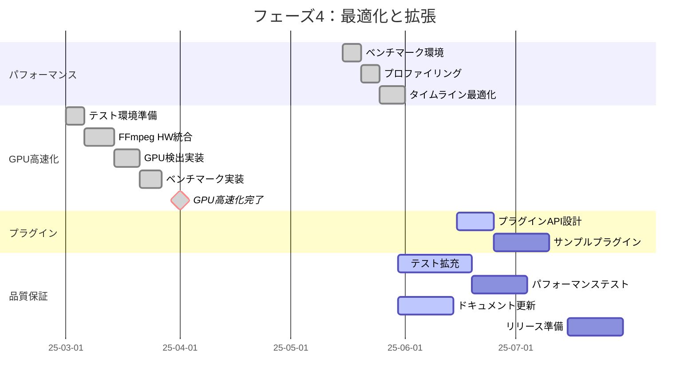
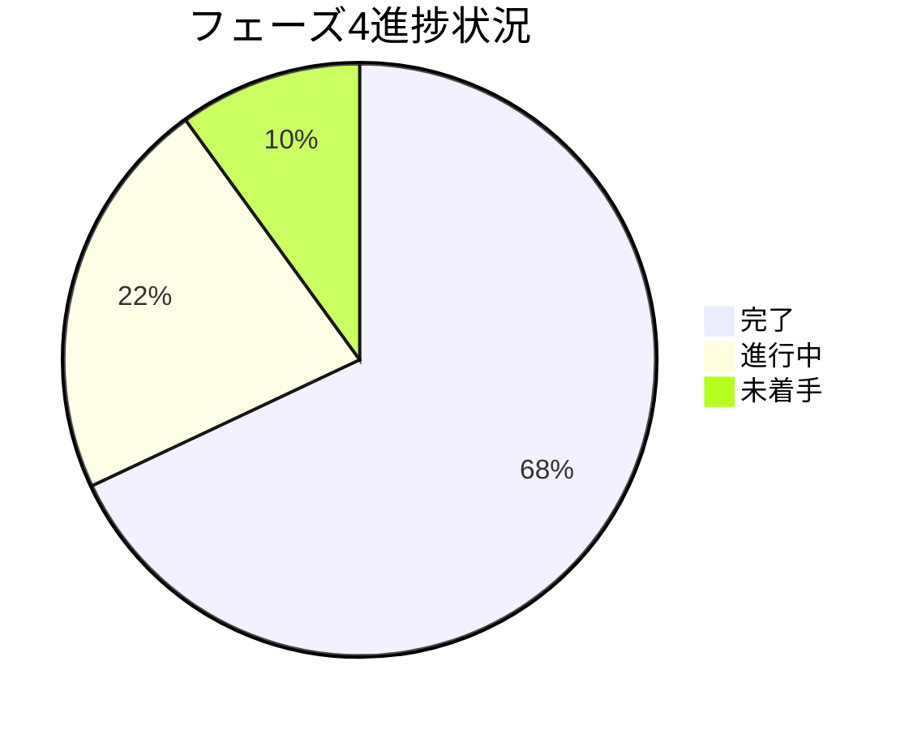
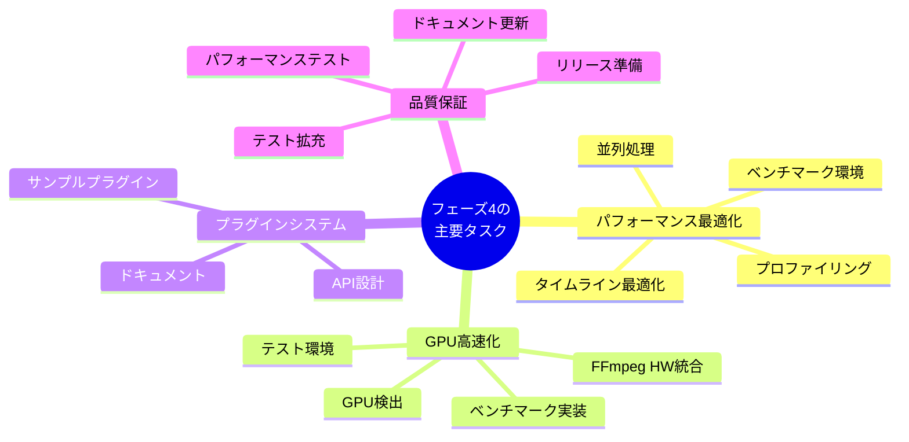
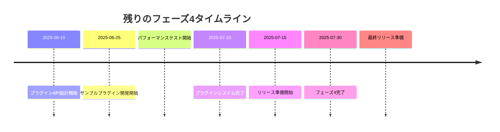

# 開発タイムライン

このドキュメントでは、プロジェクトの主要なマイルストーンとそのタイムラインの詳細な概要を提供します。これは、特定のフェーズとタスクの進捗を追跡するための参照として使用できます。

```mermaid
timeline
    title edv開発タイムライン
    section フェーズ1 : コア機能
        2024-10-01 : プロジェクト開始
        2024-10-15 : CLIフレームワーク完了
        2024-11-01 : FFmpegラッパー完了
        2024-11-15 : 基本ビデオ操作完了
        2024-12-01 : フェーズ1完了
    section フェーズ2 : 拡張機能
        2024-12-15 : オーディオ処理完了
        2025-01-15 : 字幕サポート完了
        2025-02-01 : タイムライン基本機能完了
        2025-03-01 : フェーズ2完了
    section フェーズ3 : 高度な機能
        2025-03-15 : 高度なフィルター完了
        2025-04-01 : バッチ処理完了
        2025-04-15 : プロジェクト管理完了
        2025-05-01 : マルチトラック編集完了
        2025-05-15 : フェーズ3完了
    section フェーズ4 : 最適化と拡張
        2025-06-01 : パフォーマンス最適化完了
        2025-04-01 : GPU高速化完了
        2025-06-15 : プラグインシステム開始
        2025-07-15 : 品質保証と包括的テスト
```

## フェーズ1：コアインフラストラクチャ



### 主要な達成事項

- ✅ 2024-10-01：プロジェクト開始、リポジトリセットアップ
- ✅ 2024-10-15：CLIフレームワーク完了
- ✅ 2024-11-01：FFmpegラッパー完了
- ✅ 2024-11-15：基本ビデオ操作完了（トリム、カット、連結）
- ✅ 2024-12-01：フェーズ1完了（設定管理、初期ドキュメント）

### 主要な成果物

- ✅ ヘルプシステムを備えた機能的なCLI
- ✅ 基本的なビデオのトリミング、カット、連結
- ✅ FFmpeg統合
- ✅ 設定システム
- ✅ 初期ドキュメント

## フェーズ2：拡張機能



### 主要な達成事項

- ✅ 2024-12-15：オーディオ処理完了
- ✅ 2025-01-15：字幕サポート完了
- ✅ 2025-02-01：タイムライン基本機能完了
- ✅ 2025-03-01：フェーズ2完了（エラー処理とロギング強化）

### 主要な成果物

- ✅ オーディオの抽出、調整、置換
- ✅ 字幕の読み込み、編集、焼き込み
- ✅ 基本的なタイムラインデータモデル
- ✅ 強化されたエラーメッセージとロギング
- ✅ ユーザードキュメントの拡張

## フェーズ3：高度な機能



### 主要な達成事項

- ✅ 2025-03-15：高度なフィルター完了
- ✅ 2025-04-01：バッチ処理完了
- ✅ 2025-04-15：プロジェクト管理完了
- ✅ 2025-05-01：マルチトラック編集完了
- ✅ 2025-05-15：フェーズ3完了

### 主要な成果物

- ✅ 色補正と視覚効果
- ✅ 複数ファイルのバッチ処理
- ✅ プロジェクトファイル形式と編集履歴
- ✅ マルチトラックタイムライン編集
- ✅ 一般的な操作のためのテンプレートシステム

## フェーズ4：最適化と拡張（現在のフェーズ）



### 現在の進捗状況



- ✅ パフォーマンス最適化（完了）
  - ✅ ベンチマーク環境セットアップ（2025-05-15 〜 2025-05-20）
  - ✅ プロファイリングとボトルネック特定（2025-05-20 〜 2025-05-25）
  - ✅ タイムライン最適化ロジック実装（2025-05-25 〜 2025-06-01）

- ✅ GPU高速化サポート（完了 - 2025-04-01）
  - ✅ GPU対応テスト環境準備（2025-03-01 〜 2025-03-06）
  - ✅ FFmpegハードウェアアクセラレーション統合（2025-03-06 〜 2025-03-14）
  - ✅ 動的GPU検出と性能ベンチマーク（2025-03-14 〜 2025-03-21）
  - ✅ レンダリングパイプライン統合（2025-03-21 〜 2025-04-01）

- 🔄 プラグインシステム（進行中）
  - 🔄 プラグインAPI設計（2025-06-15 〜 2025-06-25、進行中）
  - 🔜 サンプルプラグイン実装（2025-06-25 〜 2025-07-10、計画済み）

- 🔄 品質保証と包括的なテスト（進行中）
  - 🔄 テスト拡充（2025-05-30 〜 2025-06-19、進行中） 
  - 🔜 パフォーマンステスト（2025-06-19 〜 2025-07-04、計画済み）
  - 🔄 ドキュメント更新（2025-05-30 〜 2025-06-14、進行中）
  - 🔜 リリース準備（2025-07-15 〜 2025-07-30、計画済み）

### フェーズ4の主要なタスク



### 現在の焦点

現在の開発焦点は以下のとおりです：

- ✅ **GPU高速化モジュールの完了**：
  - 主要なGPUメーカー（NVIDIA、AMD、Intel）のサポート実装を完了
  - FFmpegのハードウェアアクセラレーションオプションを完全に統合
  - レンダリングパイプラインとの完全な統合により、GPUが利用可能な場合は自動選択される
  - モジュールに関する包括的なドキュメント作成（今回の更新でこれも完了）

- 🔄 **プラグインシステムの開発**：
  - プラグインAPIの設計と実装を進行中
  - サンプルプラグイン開発の準備
  - プラグインのドキュメントテンプレートの作成

- 🔄 **品質保証の強化**：
  - テストケースの拡充と改善
  - パフォーマンステストスイートの設計
  - ドキュメントの更新と改善（進行中）

## 今後のタイムライン



## 次回のアップデート

次回のプロジェクトレビューは2025年7月初旬に予定されており、以下の内容が含まれる予定です：

- プラグインシステムの進捗と初期サンプル
- パフォーマンステストの結果
- 品質保証の進捗状況
- リリース準備の詳細計画

このドキュメントは、プロジェクトの進行に応じて定期的に更新されます。

最終更新：2025年4月1日 