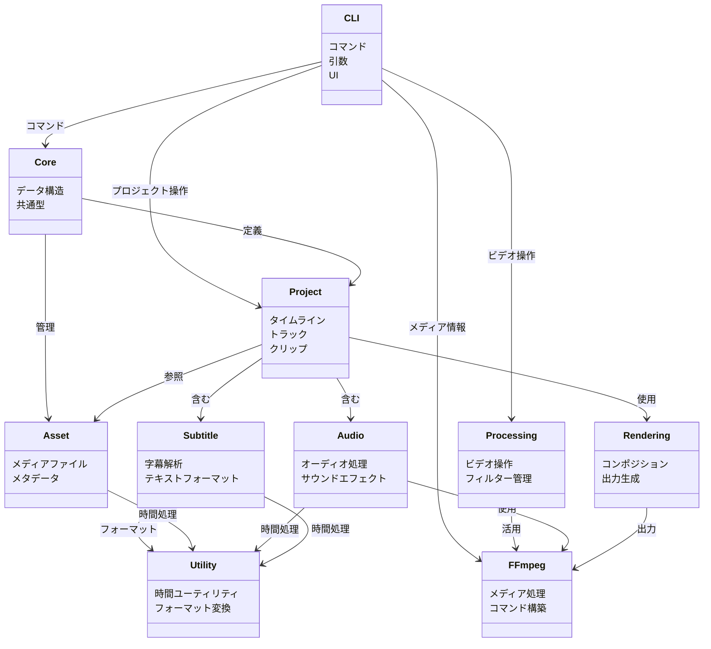
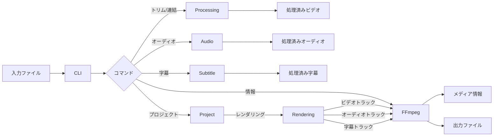
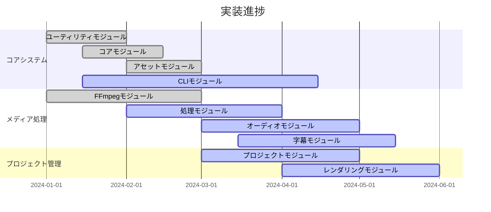

# edv - アーキテクチャ概要

このドキュメントでは、edvアプリケーションのアーキテクチャの概要を説明し、主要なモジュールとその関係性について解説します。

## モジュール構造

edvアプリケーションはいくつかの主要なモジュールに分割されており、それぞれが特定の責任を持っています：

```mermaid
flowchart TD
    subgraph Core["コアシステム"]
        CLI["CLIモジュール"]
        Core["コアモジュール"]
        Asset["アセットモジュール"]
        Utility["ユーティリティモジュール"]
    end
    
    subgraph Media["メディア処理"]
        FFmpeg["FFmpegモジュール"]
        Processing["処理モジュール"]
        Audio["オーディオモジュール"]
        Subtitle["字幕モジュール"]
    end
    
    subgraph Project["プロジェクト管理"]
        Project["プロジェクトモジュール"]
        Rendering["レンダリングモジュール"]
    end
    
    CLI --> Core
    CLI --> Processing
    Core --> Asset
    Core --> Project
    
    Processing --> FFmpeg
    Audio --> FFmpeg
    Subtitle --> Utility
    Project --> Asset
    Project --> Rendering
    
    Rendering --> FFmpeg
    Audio --> Utility
    Asset --> Utility
```

### コアモジュール

- **CLIモジュール**：アプリケーションのコマンドラインインターフェースを提供します。
- **コアモジュール**：アプリケーション全体で使用されるコアデータ構造とユーティリティを含みます。
- **アセットモジュール**：メディアアセットとそのメタデータを管理します。
- **ユーティリティモジュール**：共通のユーティリティ関数と共有コードを含みます。

### メディア処理モジュール

- **FFmpegモジュール**：メディア処理操作のためのFFmpegとの統合を行います。
- **処理モジュール**：FFmpegを通じてビデオ処理操作を扱います。
- **オーディオモジュール**：オーディオの抽出、処理、置換を管理します。
- **字幕モジュール**：字幕の抽出、編集、埋め込みを扱います。

### プロジェクト管理モジュール

- **プロジェクトモジュール**：タイムラインやトラックを含むプロジェクトデータを管理します。
- **レンダリングモジュール**：プロジェクトを出力ファイルにレンダリングする処理を担当します。

## モジュールの依存関係



## データフロー



## 主要なインターフェース

1. **コマンドラインインターフェース**：ユーザーにアプリケーション機能へのアクセスを提供します。
2. **FFmpeg統合**：高レベルモジュール向けにFFmpegコマンドライン操作を抽象化します。
3. **アセット管理**：メディアアセット管理のための統一されたインターフェースを提供します。
4. **プロジェクト管理**：プロジェクト設定、保存、読み込みを処理します。
5. **レンダリングパイプライン**：プロジェクトを出力ファイルにレンダリングする機能を提供します。

## 将来のアーキテクチャ拡張

将来のバージョンでは以下のアーキテクチャ拡張が計画されています：

1. **プラグインシステム**：カスタムプラグインによる拡張性を可能にします。
2. **分散処理**：複数のマシンにわたる分散レンダリングをサポートします。
3. **GPU高速化**：より高速な処理のためのハードウェア高速化との統合。
4. **クラウドストレージ**：クラウドベースのアセット保存と管理のサポート。
5. **Web API**：Webアプリケーションとの統合のためのRESTful API。

## 実装状況



edvのアーキテクチャはモジュール化されており拡張可能で、システムの異なる部分間で明確な関心の分離がなされています。これにより、アプリケーションの保守、テスト、将来の拡張が容易になります。 