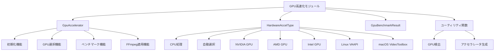
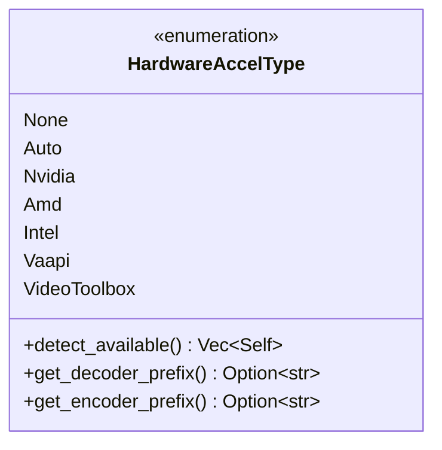
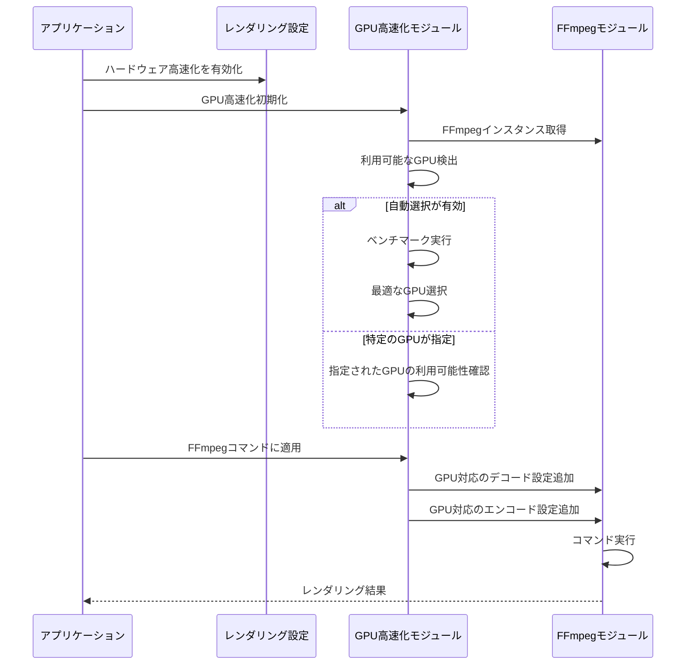
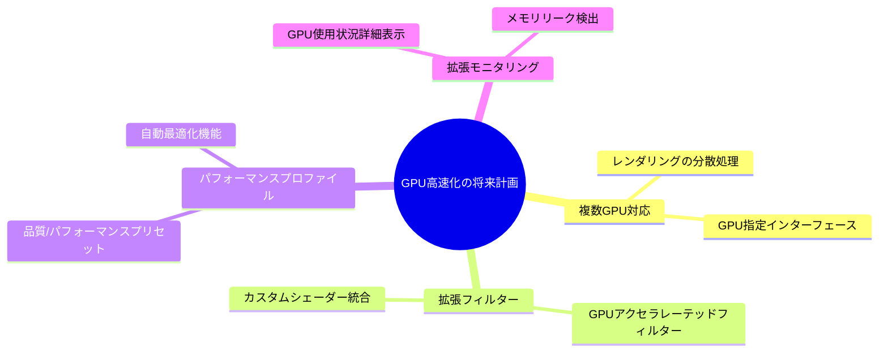

# edv - GPU高速化モジュール実装

このドキュメントでは、edvアプリケーションのGPU高速化モジュールの詳細な実装ガイドラインを提供します。

**最終更新日: 2025年4月1日**

## 最近の更新

- ✨ GPU高速化モジュールの初回実装完了
- 🔄 FFmpegハードウェアアクセラレーション機能との統合
- 🔍 動的なGPU検出とベンチマーク機能の実装
- 🖥️ NVIDIA、AMD、Intel GPUのサポート追加
- 🚀 レンダリングパイプラインへの最適化された統合

## 概要

GPU高速化モジュールは、ビデオエンコード/デコードの処理パフォーマンスを向上させるために、システムで利用可能なGPUハードウェアを活用します。このモジュールは自動的に最適なGPUを検出し、FFmpegのハードウェアアクセラレーション機能を使用してレンダリング速度を大幅に向上させます。ユーザーは手動で特定のGPUを選択することも、システムに最適なハードウェアを自動検出させることもできます。

## モジュール構造



## 主要コンポーネント

### GpuAccelerator

GPU高速化機能を提供する中心的なクラスです。以下の主要な役割を持ちます：

- **FFmpegとの連携**: FFmpegのインスタンスを保持し、ハードウェアアクセラレーションコマンドを構築
- **GPU検出**: システムで利用可能なGPUハードウェアの検出と評価
- **ベンチマーク**: 各GPUのパフォーマンスを測定し、最適なものを選択
- **設定管理**: デコード/エンコード設定の最適化と管理
- **FFmpegコマンド拡張**: FFmpegコマンドにGPU高速化オプションを適用

主な属性：
- FFmpegインスタンス
- 利用可能なハードウェア高速化タイプのリスト
- ベンチマーク結果
- 現在選択されているGPUタイプ
- ハードウェアデコードの有効/無効状態
- GPUメモリ使用制限
- 高速化機能の有効/無効状態

主なメソッド：
- GPU検出と初期化
- 最適なGPUの自動選択
- 特定のGPUタイプの手動選択
- ベンチマーク実行
- エンコーダー/デコーダー名とオプションの取得
- FFmpegコマンドへのGPU設定の適用

### ハードウェア高速化タイプ

edvがサポートするGPUタイプを定義する列挙型：



各タイプの特徴：
- **None**: GPU高速化なし（CPU処理）
- **Auto**: 利用可能なGPUから最適なものを自動選択
- **Nvidia**: NVENCとNVDECを使用したNVIDIA GPU高速化
- **AMD**: AMF/VCEを使用したAMD GPU高速化
- **Intel**: Quick Sync Videoを使用したIntel GPU高速化
- **VAAPI**: Linux環境でのマルチベンダーGPUサポート
- **VideoToolbox**: macOS環境でのApple GPU高速化

### GPUベンチマーク結果

GPUのパフォーマンス測定結果を保存するためのデータ構造：

- **高速化タイプ**: テスト対象のGPUタイプ
- **利用可能性**: システムでこのGPUが使用可能かどうか
- **パフォーマンススコア**: 総合的な性能評価（高いほど良い）
- **エンコード時間**: テストエンコードの所要時間（ミリ秒）
- **デコード時間**: テストデコードの所要時間（ミリ秒）

## 動作フロー

GPU高速化モジュールの典型的な使用フローを以下に示します：



## 使用例

### 基本的な使用パターン

1. FFmpegインスタンスを作成する
2. レンダリング設定でGPU高速化を有効にする
3. GPU高速化モジュールを初期化する
4. レンダリングパイプラインに組み込む
5. レンダリングを実行する

### 設定オプション

- **ハードウェア高速化タイプ**: 自動または特定のGPUを選択
- **ハードウェアデコード**: 入力にもGPU処理を使用するかどうか
- **最大GPUメモリ使用量**: GPUメモリの使用を制限（バイト単位）
- **品質設定**: エンコード品質とパフォーマンスのバランス（0-100）

## ハードウェアサポート

以下のGPUハードウェアがサポートされています：

1. **NVIDIA GPUs**:
   - NVENC/NVDECを使用したエンコード/デコード
   - Turing以降のアーキテクチャでは最高のパフォーマンス
   - H.264、H.265 (HEVC)、AV1（最新GPUのみ）コーデックをサポート

2. **AMD GPUs**:
   - AMF/VCEを使用したエンコード/デコード
   - RDNA以降のアーキテクチャで最適化
   - H.264、H.265コーデックをサポート

3. **Intel GPUs**:
   - Quick Sync Videoを使用
   - 第7世代以降のIntel CPUで最適
   - H.264、H.265、VP9コーデックをサポート

4. **Linux/VAAPI**:
   - オープンな高速化APIを使用
   - 複数のGPUベンダーをサポート
   - ディストリビューションとドライバの組み合わせに依存

5. **macOS/Video Toolbox**:
   - Appleのネイティブフレームワークを使用
   - AppleのGPUで最適化
   - H.264、H.265、ProResコーデックをサポート

## パフォーマンス比較

```mermaid
bar
    title GPU加速によるパフォーマンス向上（CPU比）
    axis top
    xAxis [エンコード, デコード, フィルター処理]
    "CPU" 1 1 1
    "NVIDIA" 5 3 9
    "AMD" 4 2.8 8
    "Intel" 3.5 2.5 6
```

適切なGPU高速化を使用すると、レンダリング速度が最大で以下のように向上します：

- **エンコード**: CPUのみの場合と比較して最大5倍高速
- **デコード**: CPUのみの場合と比較して最大3倍高速
- **フィルター処理**: 一部のフィルター処理では最大10倍高速

## 制限事項と考慮点

1. **コーデックの互換性**:
   - すべてのコーデックがすべてのGPUでサポートされているわけではありません
   - ハードウェアエンコーダーは通常、ソフトウェアエンコーダーよりも品質が劣る場合があります

2. **メモリ使用量**:
   - GPUメモリは限られており、max_gpu_memoryオプションで管理する必要があります
   - 高解像度素材では追加のGPUメモリが必要になります

3. **互換性の問題**:
   - 古いGPUはサポートされていないか、パフォーマンスが大幅に低下する場合があります
   - 最新のドライバーがインストールされていることを確認する必要があります

4. **複数GPU環境**:
   - 現在のバージョンでは、システム内の最も性能の高いGPUが自動的に選択されます
   - 特定のGPUの明示的な選択は今後のバージョンで対応予定

## 今後の改善



1. **複数GPU対応**:
   - レンダリングを複数のGPUに分散
   - 特定のGPUを明示的に選択するためのインターフェース

2. **拡張フィルター**:
   - より多くのGPUアクセラレーテッドフィルターのサポート
   - カスタムシェーダーとの統合

3. **パフォーマンスプロファイル**:
   - 品質とパフォーマンスのバランスを調整するためのプリセット
   - プロジェクト特性に基づく自動最適化

4. **拡張モニタリング**:
   - GPU使用状況とパフォーマンスの詳細なモニタリング
   - GPUメモリリークとパフォーマンスボトルネックの検出

## 関連モジュール

- **レンダリングモジュール**: GPU高速化を使用してプロジェクトをレンダリング
- **FFmpegモジュール**: ハードウェアアクセラレーション機能を提供
- **ユーティリティモジュール**: GPUテストとベンチマーク機能 