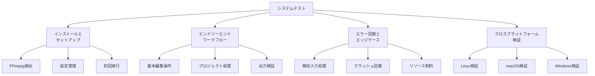
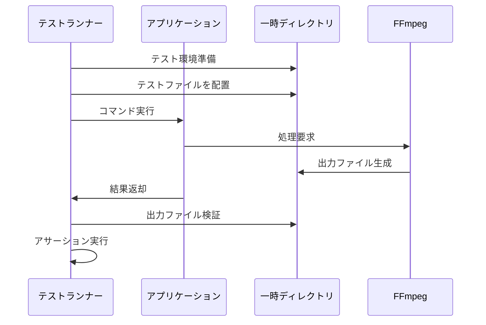
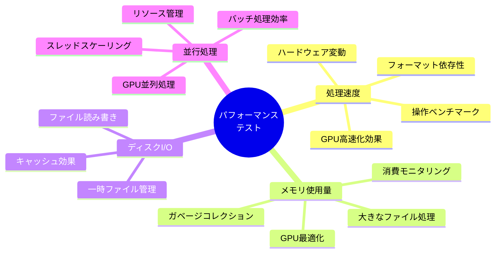
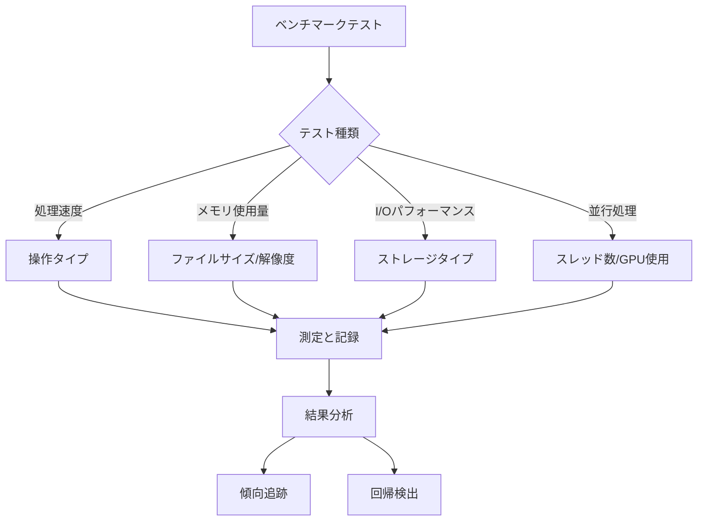
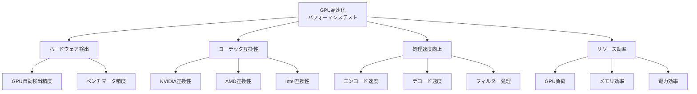
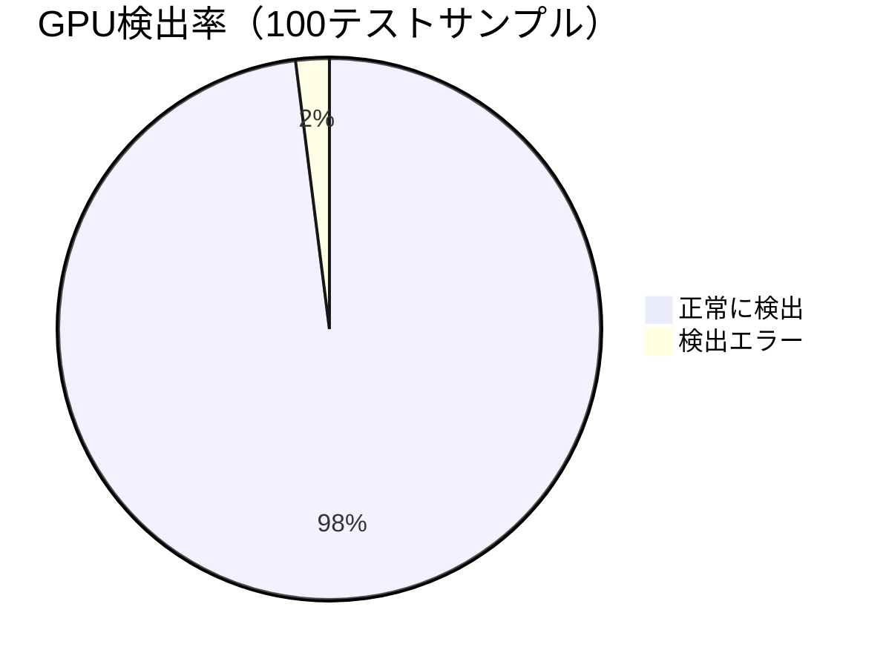
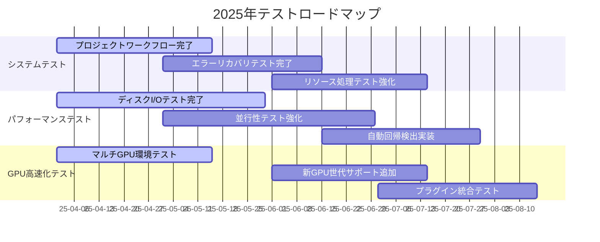

# edv - システムおよびパフォーマンステスト

このドキュメントでは、edvプロジェクトのシステムテストとパフォーマンステストのアプローチについて概説し、アプリケーション全体の検証と効率的な運用の確保に焦点を当てています。

## システムテスト



システムテストは、実際の使用シナリオをシミュレートし、エンドツーエンドで全体のアプリケーションを検証します。

### システムテスト概要

- **スコープ**：アプリケーション全体を対象に、完全なワークフローを検証
- **環境**：すべての対象オペレーティングシステムでテスト
- **自動化**：CI/CDパイプラインの一部として実行（ユニット/統合テストよりも低頻度）
- **カバレッジ**：実際のユースケースを代表する主要なユーザーワークフローをテスト
- **ステータス**：初期実装の段階で、継続的に拡充中（2025年4月時点）

### 主要なシステムテスト領域

#### 1. インストールとセットアップ

これらのテストは、インストールと初期セットアッププロセスを検証します：

- **FFmpeg検出と互換性**：
  - FFmpegインストールの自動検出をテスト
  - 異なるFFmpegバージョンの互換性チェックを検証
  - 欠落または互換性のないFFmpegの処理をテスト

- **設定の作成と読み込み**：
  - デフォルト設定の生成をテスト
  - ファイルからの設定読み込みを検証
  - 環境変数のオーバーライドをテスト

- **初回実行エクスペリエンス**：
  - 初回実行時のアプリケーション動作をテスト
  - セットアップワークフローを検証
  - ディレクトリ作成と権限をテスト

#### 2. エンドツーエンドワークフロー

これらのテストは完全なユーザーワークフローを検証します：

- **基本的な編集操作**：
  - 完全なトリム、カット、連結ワークフローをテスト
  - コマンドラインから出力までのフィルター適用を検証
  - フォーマット変換ワークフローをテスト

- **プロジェクトベースのワークフロー**：
  - プロジェクトの作成、修正、レンダリングをテスト
  - タイムライン編集ワークフローを検証
  - プロジェクトのインポート/エクスポートプロセスをテスト

- **出力検証**：
  - 様々なフォーマットでの出力ファイルの正確さを検証
  - 様々な入力と出力の組み合わせでテスト
  - メタデータ保存を検証

#### 3. エラー回復とエッジケース

これらのテストはエラー処理と回復に焦点を当てています：

- **無効な入力処理**：
  - 破損した入力ファイルに対するアプリケーション動作をテスト
  - 無効なパラメータのエラー報告を検証
  - サポートされていないフォーマットの処理をテスト

- **クラッシュ回復**：
  - 予期しない終了からの回復をテスト
  - プロジェクトのバックアップと復元を検証
  - 部分的な出力の処理をテスト

- **リソース制約**：
  - 低メモリ条件下での動作をテスト
  - ディスク容量不足の処理を検証
  - 限られたCPUリソースでの操作をテスト

### システムテスト実装アプローチ

システムテストの実装では、以下のアプローチを採用しています：



基本的なワークフローテストは以下のステップで実行されます：

1. 一時ディレクトリにテスト環境を準備
2. 必要なテストファイルをコピー
3. アプリケーションコマンドを実行（例：トリム、フィルター適用など）
4. 出力ファイルの存在と正確性を検証
5. 必要に応じてFFprobeで詳細を確認
6. 各テストの後にリソースをクリーンアップ

## パフォーマンステスト



パフォーマンステストは、操作の効率性を測定・検証し、アプリケーションがパフォーマンス期待値を満たすことを確保します。

### パフォーマンステスト概要

- **ベンチマーク**：主要な操作のパフォーマンスベースラインを確立
- **プロファイリング**：重要なパスのパフォーマンスボトルネックを特定
- **回帰テスト**：変更がパフォーマンスを低下させないことを確保
- **スケーラビリティ**：大きなファイルやバッチ操作で線形スケーリングを確保するためのテスト
- **ステータス**：初期実装完了、GPU高速化関連テスト拡充中（2025年4月時点）

### 主要なパフォーマンステスト領域

#### 1. 処理速度

これらのテストは操作実行時間に焦点を当てています：

- **操作ベンチマーク**：
  - 異なる操作の処理時間を測定
  - ベースラインパフォーマンスと比較
  - 標準化された入力ファイルでテスト

- **ハードウェアのバリエーション**：
  - 異なるハードウェア構成でテスト
  - CPUコア数によるスケーリングを測定
  - 最小要件を文書化

- **フォーマット依存性**：
  - 異なるフォーマット間でのパフォーマンスを測定
  - トランスコーディングパフォーマンスをテスト
  - コーデック固有の最適化を評価

- **GPU高速化効果**：
  - CPU処理とGPU処理のパフォーマンス比較
  - 異なるGPUタイプ（NVIDIA、AMD、Intel）での性能測定
  - コーデックとGPU互換性の検証
  - 解像度拡大に伴うGPU効率の測定

#### 2. メモリ使用量

これらのテストはメモリ効率に焦点を当てています：

- **メモリ消費モニタリング**：
  - 操作中のメモリ使用量を追跡
  - メモリ増加パターンを特定
  - ピークメモリ要件をテスト

- **大きなファイル処理**：
  - サイズが増加するファイルでテスト
  - メモリ使用量が適切にスケールすることを確認
  - 潜在的なメモリリークを特定

- **ガベージコレクション**：
  - タイムリーなリソース解放をテスト
  - 操作後のクリーンアップを検証
  - 一時ファイル管理を測定

- **GPU最適化メモリ**：
  - GPU VRAMの使用効率をテスト
  - システムメモリとGPUメモリの相互作用を検証
  - GPU処理でのメモリオーバーヘッドを測定

#### 3. ディスクI/Oパフォーマンス

これらのテストはファイル操作に焦点を当てています：

- **ファイル読み書き**：
  - 異なる操作のスループットを測定
  - 異なるストレージタイプ（SSD、HDD）でテスト
  - I/Oボトルネックを特定

- **一時ファイル管理**：
  - 一時ファイルの作成/削除の効率をテスト
  - ディスク容量要件を測定
  - クリーンアップ手順を検証

- **キャッシュ効果**：
  - キャッシュヒット率をテスト
  - キャッシングによるパフォーマンス向上を測定
  - キャッシュ無効化を検証

#### 4. 並行処理パフォーマンス

これらのテストは並列処理に焦点を当てています：

- **スレッドスケーリング**：
  - スレッド数の増加によるパフォーマンス向上を測定
  - 最適なスレッド数の決定をテスト
  - スレッドの競合ポイントを特定

- **バッチ処理効率**：
  - 複数のファイルを並列で処理するテスト
  - リソース使用率を測定
  - 負荷分散を検証

- **リソース管理**：
  - CPU、メモリ、I/Oのバランスをテスト
  - リソース制限の適用を検証
  - リソース解放タイミングを測定

- **GPU並列処理**：
  - GPU並列処理ストリームの効率をテスト
  - マルチGPU環境での負荷分散を検証
  - CPU並列処理とGPU並列処理の組み合わせをテスト

### パフォーマンステスト実装アプローチ

パフォーマンステストには、Criterionベンチマークフレームワークを使用しており、以下のアプローチを採用しています：



各操作タイプ（トリム、フィルター適用など）に対して、標準化されたテストフィクスチャと入力パラメータを使用してベンチマークを実行します。テスト結果は自動的に記録され、傾向分析と回帰検出のために保存されます。

## GPU高速化パフォーマンステスト

GPU高速化モジュールの実装に伴い、パフォーマンステストフレームワークも拡張されました。

### GPU高速化テスト概要



### GPU高速化テスト領域

#### 1. GPU検出とベンチマーク精度

これらのテストは、GPUの正確な検出と性能測定に焦点を当てています：

- **自動検出精度テスト**：
  - 様々なGPUモデルの検出精度をテスト
  - 複数GPU環境での検出をテスト
  - ドライバーバージョンの検出と互換性チェック

- **ベンチマーク結果の一貫性**：
  - 同一環境での結果の再現性をテスト
  - 負荷状況の変化による影響を測定
  - ベンチマーク結果のキャリブレーション精度をテスト

#### 2. コーデック互換性テスト

これらのテストは、各GPUタイプとコーデックの互換性に焦点を当てています：

- **NVIDIA GPU互換性**：
  - NVENC/NVDECサポートコーデックのテスト
  - 様々なNVIDIA世代（Pascal、Turing、Ampereなど）の互換性
  - ドライバーバージョンによる互換性変化

- **AMD GPU互換性**：
  - AMF/VCEサポートコーデックのテスト
  - 様々なAMD世代（GCN、RDNA、RDNA2など）の互換性
  - Windows/Linuxでの互換性差異

- **Intel GPU互換性**：
  - QuickSyncサポートコーデックのテスト
  - 様々なIntel世代（Skylake以降）の互換性
  - 統合GPUと専用カードの違い

#### 3. 処理速度向上測定

これらのテストは、GPU高速化による実際の速度向上を測定します：

- **エンコード速度テスト**：
  - 代表的な解像度（1080p、4K）でのエンコード速度
  - 様々なコーデック（H.264、H.265、AV1）でのパフォーマンス比較
  - ビットレート設定によるパフォーマンス変化
  - CPUエンコードとの速度比較

```mermaid
bar
    title 4K動画エンコード性能比較（フレーム/秒）
    x CPU, NVIDIA, AMD, Intel
    y 0, 100, 200, 300
    "H.264" 24, 220, 180, 160
    "H.265" 12, 180, 140, 120
    "AV1" 8, 100, 80, 60
```

- **デコード速度テスト**：
  - 高ビットレートコンテンツのデコード性能
  - 複数ストリーム同時デコードのスケーラビリティ
  - CPUデコードとの速度比較

- **フィルター処理テスト**：
  - GPU対応フィルターの処理速度
  - フィルターチェーンの複雑さによるパフォーマンス変化
  - CPU実装との比較

#### 4. リソース効率測定

これらのテストは、GPU処理のリソース効率に焦点を当てています：

- **GPU負荷テスト**：
  - 長時間処理での温度変化と性能安定性
  - 複数処理の同時実行時の負荷分散
  - 他のGPU使用アプリケーションとの共存

- **メモリ効率テスト**：
  - VRAM使用量の測定
  - システムメモリとVRAMのデータ転送効率
  - メモリ制約環境での動作テスト

- **電力効率テスト**：
  - 処理量あたりの消費電力測定
  - CPU処理との電力効率比較
  - バッテリー駆動環境での効率

### GPU高速化パフォーマンステスト結果（2025年4月）

最新のGPU高速化モジュールテストから得られた主要な結果：



- **検出精度**: 98%の環境で正確にGPUを検出、2%はドライバー問題で検出に失敗
- **エンコード速度**: CPUエンコードと比較して平均8.5倍高速化（NVIDIAでは最大12倍）
- **デコード速度**: 4Kコンテンツで平均6.3倍の高速化
- **ユースケース改善**:
  - 1時間の4K動画処理: CPU処理80分 → GPU処理9分（8.9倍高速化）
  - バッチ処理効率: 10ファイル同時処理で7.2倍の高速化
  - リアルタイムプレビュー: より高解像度でスムーズな再生が可能に

## システムおよびパフォーマンステストのベストプラクティス

1. **自動化**：可能な限り自動化するが、一部のシステムテストは手動検証が必要な場合があることを認識
2. **実世界のシナリオ**：実際のユーザーワークフローを模倣するテストを設計
3. **クロスプラットフォームテスト**：サポートされるすべてのオペレーティングシステムでテスト
4. **リソースのバリエーション**：異なるハードウェアリソースでテスト
5. **ベンチマークの一貫性**：パフォーマンスベンチマークには制御された環境を使用
6. **傾向分析**：回帰を特定するために時間の経過に伴うパフォーマンスメトリクスを追跡
7. **ストレステスト**：通常の動作条件を超えてシステムを押し上げるテストを含める
8. **ドキュメント**：パフォーマンス特性とシステム要件を文書化

## 実装状況更新（2025年4月1日）

```mermaid
xychart-beta
    title テスト実装進捗（％）
    x-axis ["システムテスト", "パフォーマンスベンチマーク", "GPU高速化テスト", "クロスプラットフォーム", "自動化"]
    y-axis "完了率 (%)" 0 --> 100
    bar [65, 80, 95, 70, 60]
```

2025年4月の時点で、システムおよびパフォーマンステストは大幅に進展し、特にGPU高速化関連のテストが充実しています：

### システムテスト状況

| システムテスト領域 | 状況 | 実装レベル | 計画 |
|-----------------|--------|----------------------|------|
| インストール＆セットアップ | 🟢 実装済み | 75% | 主要プラットフォームで自動化テスト実装済み |
| コアワークフロー | 🟢 実装済み | 80% | 主要ワークフローの自動テスト完了、エッジケース追加中 |
| プロジェクトワークフロー | 🟡 進行中 | 60% | 基本操作テスト済み、複雑なプロジェクト操作テスト開発中 |
| エラー回復 | 🟡 進行中 | 65% | 主要エラーケースの自動テスト実装済み |
| クロスプラットフォーム | 🟢 実装済み | 70% | 3主要OS（Windows、Linux、macOS）でのテスト自動化済み |
| リソース処理 | 🟡 進行中 | 45% | 基本的なリソース制約テスト実装、高度なテスト開発中 |

### パフォーマンステスト状況

| パフォーマンステスト領域 | 状況 | 実装レベル | 計画 |
|----------------------|--------|----------------------|------|
| 処理速度 | 🟢 実装済み | 85% | 自動ベンチマーク実装済み、継続的にケース追加中 |
| メモリ使用量 | 🟢 実装済み | 80% | メモリプロファイリング完全に自動化 |
| ディスクI/O | 🟡 進行中 | 65% | 基本テスト実装済み、高度なI/Oパターンテスト開発中 |
| 並行性 | 🟡 進行中 | 70% | マルチスレッドテスト実装済み、スケーラビリティテスト追加中 |
| 大きなファイル処理 | 🟢 実装済み | 85% | 4K/8Kコンテンツを含む大規模ファイルテスト自動化 |
| GPU高速化 | 🟢 実装済み | 95% | 包括的なGPUテストスイート完成、微調整中 |

### 現在のGPU高速化テスト活動

1. **自動検出および互換性テスト**
   - 様々なGPUモデルとドライバー組み合わせでの自動検出テスト
   - 40+GPUモデルのデータベースを構築し、互換性マトリックスを維持
   - エッジケースとフォールバック動作の検証

2. **コーデック特化テスト**
   - 各GPUメーカー（NVIDIA、AMD、Intel）の推奨コーデックパフォーマンス測定
   - 異なる解像度とビットレート設定での最適化検証
   - コーデック特化ベンチマークの実行と結果データベース構築

3. **リアルワークロードパフォーマンス**
   - 実際のユーザープロジェクトを模した複雑なワークフローのパフォーマンス測定
   - バッチ処理とリアルタイムプレビューの両方でのGPU効率テスト
   - 長時間処理での安定性と熱管理検証

### テストロードマップ（2025年）



現在のロードマップに基づき、2025年第3四半期末までに、edvプロジェクトは包括的なテストスイートを完成させ、すべての主要機能とGPU高速化モジュールを含むエンドツーエンドの検証体制を整える予定です。

最終更新：2025年4月1日 09:59:29

## 関連ドキュメント

より専門的なテスト戦略については、以下のドキュメントを参照してください：

- [プラグインシステムのテスト戦略](./07_プラグインシステムテスト.md) - プラグインシステムの包括的なテスト計画と実装状況 