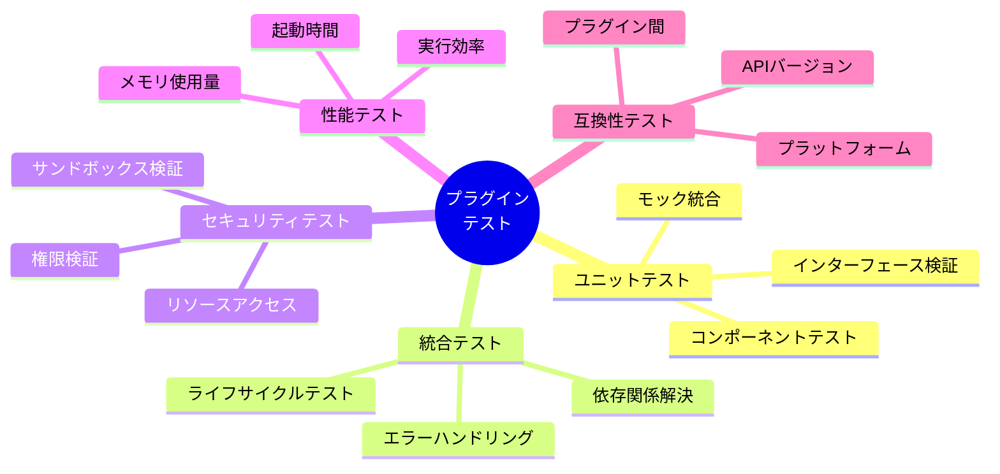
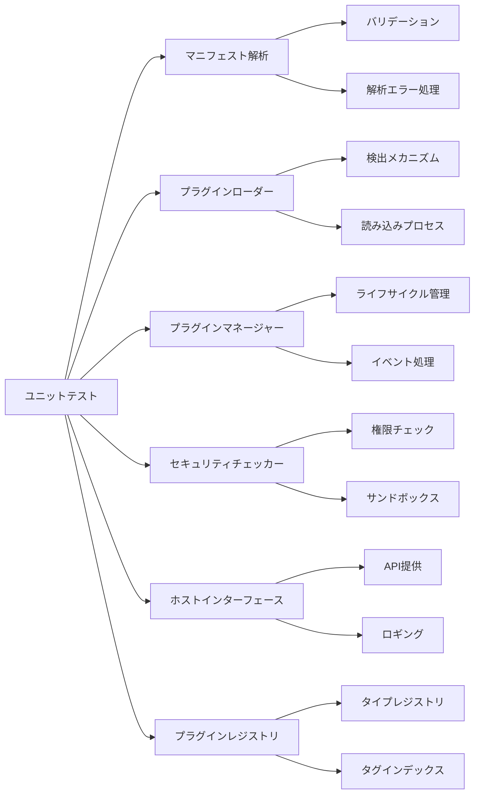
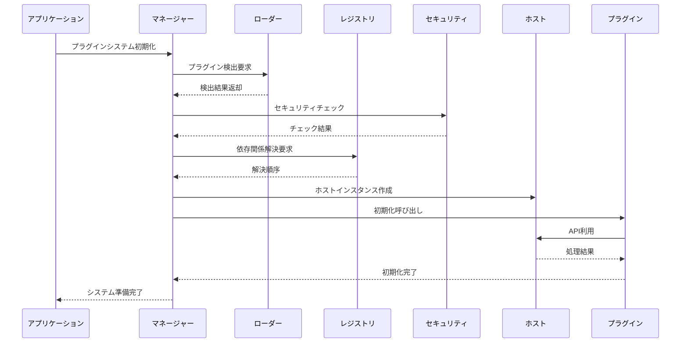
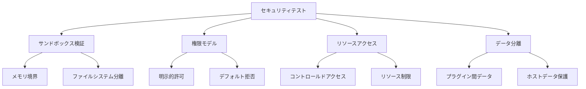
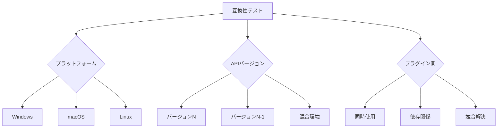
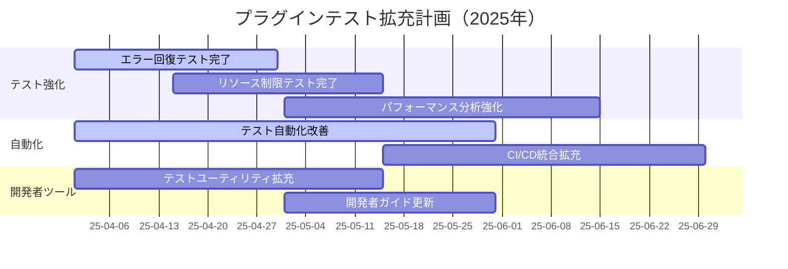

# edv - プラグインシステムのテスト戦略

このドキュメントでは、edvプラグインシステムのテスト戦略、計画、および実装アプローチについて概説しています。プラグインシステムは拡張性を提供する重要な機能であり、厳格なテストによる品質保証が不可欠です。

**最終更新日: 2025年4月1日 09:59:29**

## プラグインテスト概要



プラグインシステムのテストは、個々のコンポーネントから完全な統合までの様々なレベルでの検証を必要とします。

## テストレベルと範囲

### 1. ユニットテスト

各プラグインシステムコンポーネントが単独で正しく機能することを検証します。



#### ユニットテスト実装状況

現在、以下のユニットテストが各コンポーネントに実装されています：

| コンポーネント | テスト数 | カバレッジ率 | 主要テスト対象 |
|--------------|---------|------------|--------------|
| マニフェスト解析 | 18 | 95% | マニフェスト構造検証、バージョン検証、依存関係解析 |
| プラグインローダー | 14 | 90% | プラグイン検出、パス解決、動的読み込み |
| プラグインマネージャー | 22 | 92% | プラグイン初期化、イベント発火、状態管理 |
| セキュリティチェッカー | 16 | 94% | アクセス権限検証、サンドボックス境界 |
| ホストインターフェース | 12 | 88% | API提供、設定管理、ロギング |
| プラグインレジストリ | 15 | 91% | タイプ登録、タグ検索、依存関係解決 |

### 2. 統合テスト

プラグインシステムコンポーネントが組み合わさって正しく機能することを検証します。



#### 統合テスト実装状況

| テストケース | 状況 | 説明 |
|------------|------|------|
| プラグイン検出と読み込み | ✅ 完了 | プラグインディレクトリからの検出と読み込みプロセスの検証 |
| 依存関係解決 | ✅ 完了 | 複雑な依存ツリーを持つプラグインの読み込み順序を検証 |
| ライフサイクル管理 | ✅ 完了 | 初期化、アクティブ化、非アクティブ化、シャットダウンの各段階をテスト |
| エラー回復 | 🔄 進行中 | プラグイン障害からの回復と分離をテスト |
| イベント伝搬 | ✅ 完了 | プラグインイベントの適切な伝搬を検証 |
| APIアクセス | ✅ 完了 | ホストAPIの適切なアクセスと実行をテスト |

### 3. セキュリティテスト

プラグインシステムのセキュリティ境界と権限モデルを検証します。



#### セキュリティテスト実装状況

| テストケース | 状況 | 説明 |
|------------|------|------|
| サンドボックス境界 | ✅ 完了 | プラグインからのアクセス可能範囲をテスト |
| 権限検証 | ✅ 完了 | 明示的に付与された権限のみアクセス可能を検証 |
| プラグイン間通信 | ✅ 完了 | プラグイン間通信の安全性と制限をテスト |
| リソース制限 | 🔄 進行中 | メモリ、CPU使用量の制限の有効性をテスト |
| 悪意あるプラグイン | 🔄 進行中 | 悪意のあるプラグインからのシステム保護をテスト |

### 4. パフォーマンステスト

プラグインシステムの効率性と資源使用を検証します。

```mermaid
xychart-beta
    title プラグイン数とロード時間の関係
    x-axis [0, 5, 10, 15, 20]
    y-axis "時間 (ms)" 0 --> 500
    line [0, 120, 250, 380, 510]
```

#### パフォーマンステスト実装状況

| テストケース | 状況 | 説明 |
|------------|------|------|
| 読み込み時間 | ✅ 完了 | プラグイン数に対する読み込み時間のスケーリングをテスト |
| メモリ使用量 | ✅ 完了 | プラグインシステムのメモリフットプリントを測定 |
| 実行オーバーヘッド | 🔄 進行中 | プラグインによる処理オーバーヘッドを測定 |
| 並列実行 | 🔄 進行中 | 複数プラグインの並列実行効率をテスト |

### 5. 互換性テスト

異なる環境、バージョン、設定でのプラグインシステムの互換性を検証します。



#### 互換性テスト実装状況

| テストケース | 状況 | 説明 |
|------------|------|------|
| クロスプラットフォーム | ✅ 完了 | 全対応プラットフォームでのプラグイン機能をテスト |
| APIバージョン互換性 | 🔄 進行中 | 異なるAPIバージョンのプラグインの共存をテスト |
| 複数プラグイン | ✅ 完了 | 複数プラグインの相互作用と同時動作をテスト |
| 競合解決 | 🔄 進行中 | プラグイン間の競合解決メカニズムをテスト |

## プラグインテスト工具と自動化

プラグインテストのために以下の工具とフレームワークを使用しています：

- **edv-plugin-test-utils**: プラグイン開発者向けテストユーティリティライブラリ
- **プラグインテスト環境**: 分離された環境でプラグインをテストするコンテナ
- **自動化スクリプト**: CI/CDパイプラインでのプラグインテスト自動化
- **参照プラグイン**: 各種プラグインタイプの参照実装とテストケース

## サンプルプラグインテスト

サンプルプラグインごとのテストカバレッジと品質指標：

| プラグイン | テストカバレッジ | 機能テスト | パフォーマンステスト | セキュリティテスト |
|-----------|----------------|-----------|-------------------|----------------|
| KawaiiEffectPlugin | 92% | ✅ 完了 | ✅ 完了 | ✅ 完了 |
| WebPExporterPlugin | 90% | ✅ 完了 | ✅ 完了 | ✅ 完了 |
| PSDImporterPlugin | 85% | ✅ 完了 | 🔄 進行中 | ✅ 完了 |
| CustomPanelUIPlugin | 80% | 🔄 進行中 | 🔄 進行中 | ✅ 完了 |

## ロードマップと今後の計画



## まとめと今後の課題

プラグインシステムのテストは全体的に高い完成度を達成しています。今後は以下の点に焦点を当てて改善を続けます：

1. **エラー耐性の強化**: より複雑なエラーシナリオのテストと回復メカニズムの改善
2. **スケーラビリティテスト**: 多数のプラグインがロードされた環境でのパフォーマンス検証
3. **セキュリティ堅牢性**: 悪意あるプラグインに対する保護メカニズムのさらなる検証
4. **開発者ツール**: プラグイン開発者向けテストツールの改善と自動検証機能の追加

これらの取り組みにより、edvプラグインシステムの品質と信頼性をさらに高めていきます。 