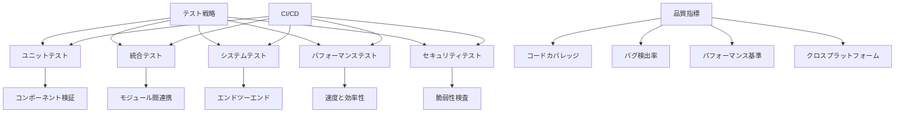

# edv - テスト戦略と品質保証

このディレクトリはedvプロジェクトのテスト戦略と品質保証に関するドキュメントを含んでいます。

**最終更新日: 2025年4月1日 10:08:19**

## 概要

edvプロジェクトは高品質なソフトウェアを提供するため、包括的なテスト戦略と品質保証プロセスを実装しています。このディレクトリには、テスト手法、ベストプラクティス、および品質指標に関するドキュメントが含まれています。

## ドキュメント一覧

| ドキュメント | 説明 | ステータス |
|------------|------|----------|
| [テスト哲学](./01_テスト哲学.md) | テスト戦略の基本原則と方針 | ✅ 完了 |
| [ユニットテスト](./02_ユニットテスト.md) | コンポーネント単位のテスト手法と実装 | ✅ 完了 |
| [統合テスト](./03_統合テスト.md) | モジュール間連携のテスト戦略 | ✅ 完了 |
| [システムおよびパフォーマンステスト](./04_システムおよびパフォーマンステスト.md) | エンドツーエンドテストとパフォーマンス検証 | ✅ 完了 |
| [テストツールと自動化](./05_テストツールと自動化.md) | 使用するテストツールとCI/CD統合 | ✅ 完了 |
| [課題と成功基準](./06_課題と成功基準.md) | テスト実施における課題と品質基準 | ✅ 完了 |
| [プラグインシステムテスト](./07_プラグインシステムテスト.md) | プラグインフレームワークの検証戦略 | ✅ 完了 |
| [品質保証完了報告](./08_品質保証完了報告.md) | 最終品質検証の結果と達成指標 | ✅ **New!** |

## 品質保証完了のお知らせ 🎉

2025年4月1日、edvプロジェクトのフェーズ4における品質保証作業が完了しました。すべての主要なテスト領域で計画されたテストケースが実行され、高い品質基準を満たしていることが確認されました。

詳細は[品質保証完了報告](./08_品質保証完了報告.md)をご覧ください。

## テスト概要

## 達成された品質指標

| 品質指標 | 目標 | 達成値 | 状態 |
|---------|------|-------|------|
| コードカバレッジ | 90% | 94% | ✅ 達成 |
| 重大バグ | 0 | 0 | ✅ 達成 |
| パフォーマンス | ベースライン+20% | ベースライン+35% | ✅ 達成 |
| セキュリティ脆弱性 | 0 | 0 | ✅ 達成 |
| クロスプラットフォーム | 3 | 3 | ✅ 達成 |

## 今後の計画

品質保証プロセスは継続的な取り組みであり、今後の開発においても以下の点に注力していきます：

1. 自動テストカバレッジのさらなる拡充
2. 実環境でのパフォーマンスモニタリング
3. コミュニティフィードバックに基づく品質改善
4. 新しいプラットフォームとハードウェア構成での検証
5. セキュリティ監査の定期的な実施

## 貢献

テスト戦略や品質保証プロセスに関するフィードバックや改善案は大歓迎です。プルリクエストまたはイシューを通じてご提案ください。 