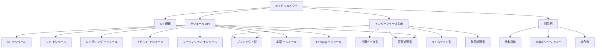

# edv API概要

このドキュメントは`edv`ライブラリのAPIについての概要を説明します。`edv`はRustで実装された高性能な動画編集ツールですが、ライブラリとしても利用可能であり、独自のアプリケーションやスクリプトから動画編集機能を組み込むことができます。

## API設計思想

`edv`のAPIは以下の設計原則に基づいています：

1. **モジュール化**: 機能ごとに分離されたモジュール構造
2. **型安全性**: 強力な型システムを活用したミスの防止
3. **直感的**: 一貫した命名規則と使いやすいインターフェース
4. **拡張性**: 将来の機能追加が容易な柔軟な設計
5. **エラー処理**: 明示的なエラー処理と詳細なエラー情報

## ドキュメント構造

APIドキュメントは以下の構造で提供されています：



## オンラインドキュメント

完全なAPIリファレンスは[GitHub Pages](https://eda3.github.io/edv/)で提供されています。このオンラインドキュメントには、すべての公開API、構造体、列挙型、トレイト、関数に関する詳細な説明が含まれています。

## ライブラリの利用方法

### Cargo.tomlへの追加

```toml
[dependencies]
edv = "0.1.0"
```

### 基本的な使用例

```rust
use edv::project::Project;
use edv::rendering::RenderConfig;
use std::path::Path;

fn main() -> Result<(), Box<dyn std::error::Error>> {
    // プロジェクトの作成
    let mut project = Project::new();
    
    // アセットの追加
    let asset_id = project.add_asset(Path::new("input.mp4"))?;
    
    // タイムラインにクリップを追加
    let track_id = project.timeline.add_track(edv::project::timeline::TrackKind::Video);
    project.timeline.add_clip_with_history(
        track_id,
        edv::project::timeline::Clip::new(
            edv::project::ClipId::new(),
            asset_id,
            edv::utility::time::TimePosition::zero(),
            edv::utility::time::Duration::from_seconds(10.0),
            edv::utility::time::TimePosition::zero(),
            edv::utility::time::TimePosition::from_seconds(10.0),
        ),
    )?;
    
    // プロジェクトの保存
    project.save(Path::new("project.edv"))?;
    
    // プロジェクトのレンダリング
    let config = RenderConfig::new()
        .with_output_path(Path::new("output.mp4"))
        .with_width(1920)
        .with_height(1080);
    
    project.render(&config)?;
    
    Ok(())
}
```

## モジュール概要

`edv`は以下の主要モジュールから構成されています：

- **cli**: コマンドラインインターフェース機能
- **core**: 基本的なコア機能
- **project**: プロジェクト管理と操作
- **rendering**: レンダリングエンジン
- **asset**: アセット管理
- **utility**: ユーティリティ関数とヘルパー
- **subtitle**: 字幕処理
- **audio**: 音声処理
- **ffmpeg**: FFmpegとの連携

各モジュールの詳細なAPIは、それぞれのドキュメントファイルで説明されています。

## バージョニングとAPI安定性

`edv`はセマンティックバージョニングに従います：

- **メジャーバージョン** (x.0.0): 互換性を破る変更
- **マイナーバージョン** (0.x.0): 後方互換性のある機能追加
- **パッチバージョン** (0.0.x): バグ修正と小さな改善

現在のバージョン(0.x.x)では、APIは開発中であり、マイナーバージョン間でも互換性を破る変更が行われる可能性があります。 