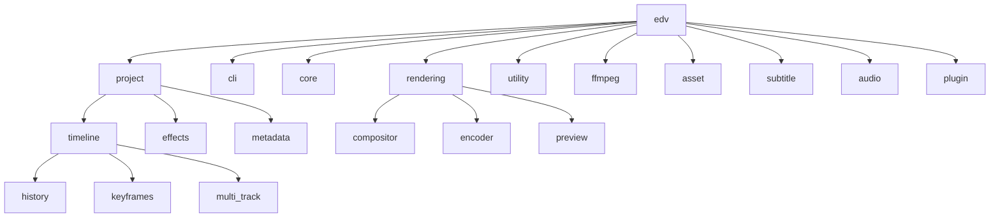

# edv APIモジュール詳細

このドキュメントでは、`edv`ライブラリの各モジュールの詳細な説明を提供します。各モジュールの主要な機能、インターフェース、使用方法について解説します。

## モジュール構造

`edv`ライブラリは以下のモジュール構造で構成されています：



## projectモジュール

プロジェクト全体の管理を担当するモジュールです。タイムライン、アセット、メタデータの管理機能を提供します。

### 主要インターフェース

```rust
pub struct Project {
    pub timeline: Timeline,
    pub assets: AssetManager,
    pub metadata: ProjectMetadata,
    // ...その他のフィールド
}
```

### サブモジュール

- **timeline**: タイムラインとクリップの管理
- **effects**: エフェクトとフィルターの管理
- **metadata**: プロジェクトのメタデータ管理

### 使用例

```rust
use edv::project::Project;
use std::path::Path;

// 新しいプロジェクトを作成
let mut project = Project::new();

// プロジェクトを保存
project.save(Path::new("my_project.edv"))?;

// プロジェクトを読み込み
let project = Project::load(Path::new("my_project.edv"))?;
```

## timelineモジュール

タイムラインの管理、トラックとクリップの操作、編集履歴などの機能を提供します。

### 主要インターフェース

```rust
pub struct Timeline {
    // ...内部フィールド
}

pub struct Track {
    // ...内部フィールド
}

pub struct Clip {
    pub id: ClipId,
    pub asset_id: AssetId,
    pub position: TimePosition,
    pub duration: Duration,
    pub trim_start: TimePosition,
    pub trim_end: TimePosition,
    // ...その他のフィールド
}
```

### サブモジュール

- **history**: 編集履歴の管理とUndo/Redo機能
- **keyframes**: キーフレームベースのアニメーション管理
- **multi_track**: 複数トラックの管理と関係

### 編集履歴管理

`edv`の編集履歴システムは、以下の特徴を持っています：

1. すべての編集操作は履歴に記録され、undo/redoが可能
2. トランザクション処理による複数の操作のグループ化
3. 操作の説明とメタデータの保存
4. スレッドセーフな設計

```rust
// 履歴を使った操作例
timeline.begin_transaction("クリップの移動");
timeline.move_clip(track_id, clip_id, new_position)?;
timeline.end_transaction();

// 操作の取り消し
timeline.undo()?;

// 操作のやり直し
timeline.redo()?;
```

## renderingモジュール

レンダリングモジュールは、プロジェクトのタイムラインから最終的なビデオ出力を生成するための包括的なシステムを提供します。このモジュールはFFmpegに依存しており、複雑なフィルターグラフを構築して高品質なビデオをレンダリングします。

### 最新の更新 (2025年4月)

- ✅ 高度なブレンドモードの完全実装 (11種類のブレンドモードをサポート)
- ✅ CPUコア数に基づく自動的な並列処理最適化
- ✅ 複雑なタイムラインのためのスマートキャッシュ実装
- ✅ マルチパスエンコーディングのサポート
- ✅ パフォーマンス最適化: 高速プレビューレンダリングのための最適化されたフィルターグラフ

### 主要コンポーネント

#### `rendering::compositor::BlendMode`

ビデオトラックの合成方法を指定するブレンドモードを定義します。

```rust
pub enum BlendMode {
    // 標準的なアルファブレンド
    Normal,
    // 明るさを加算するブレンド
    Add,
    // 暗いピクセルを強調するブレンド
    Multiply,
    // 明るいピクセルを強調するブレンド
    Screen,
    // コントラストを強調するブレンド
    Overlay,
    // ソフトな光の効果
    SoftLight,
    // 強い光の効果
    HardLight,
    // 明るい領域を強調するブレンド
    ColorDodge,
    // 暗い領域を強調するブレンド
    ColorBurn,
    // 色の違いを強調するブレンド
    Difference,
    // 差分のソフトバージョン
    Exclusion,
}
```

各ブレンドモードはトラックごとに設定でき、キーフレームアニメーションを通じて時間の経過とともに変更できます。

#### `rendering::RenderConfig`

レンダリング設定を定義するための構造体。

```rust
pub struct RenderConfig {
    // 出力ファイルのパス
    pub output_path: PathBuf,
    // 出力映像の幅（ピクセル単位）
    pub width: u32,
    // 出力映像の高さ（ピクセル単位）
    pub height: u32,
    // 出力映像のフレームレート（FPS）
    pub frame_rate: f64,
    // 使用するビデオコーデック
    pub video_codec: VideoCodec,
    // ビデオ品質（1-100、高いほど良い）
    pub video_quality: u32,
    // 使用するオーディオコーデック
    pub audio_codec: AudioCodec,
    // オーディオ品質（1-100、高いほど良い）
    pub audio_quality: u32,
    // 出力コンテナフォーマット
    pub format: OutputFormat,
    // レンダリングの開始位置（デフォルト：タイムラインの始め）
    pub start_position: Option<TimePosition>,
    // レンダリングの終了位置（デフォルト：タイムラインの終わり）
    pub end_position: Option<TimePosition>,
    // 使用するレンダリングスレッドの数（デフォルト：利用可能なCPUコア）
    pub threads: Option<usize>,
    // 出力に字幕を含めるかどうか
    pub include_subtitles: bool,
    // 利用可能な場合にキャッシュされたアセットを使用するかどうか
    pub use_cache: bool,
    // プロジェクト読み込み時にアセットを自動的に読み込むかどうか
    pub auto_load_assets: bool,
    // 複雑なタイムラインのレンダリングを最適化するかどうか
    pub optimize_complex_timelines: bool,
    // キャッシュディレクトリ（Noneの場合、デフォルトのキャッシュディレクトリを使用）
    pub cache_dir: Option<PathBuf>,
    // バイト単位の最大キャッシュサイズ（Noneの場合、制限なし）
    pub max_cache_size: Option<u64>,
}
```

このコンフィグは、ビルダーパターンを使用して柔軟に構築できます：

```rust
RenderConfig::new(PathBuf::from("output.mp4"))
    .with_resolution(1920, 1080)
    .with_frame_rate(30.0)
    .with_video_settings(VideoCodec::H264, 80)
    .with_audio_settings(AudioCodec::AAC, 80)
    .with_format(OutputFormat::MP4)
    .with_cache(true)
    .with_optimize_complex_timelines(true)
```

#### `rendering::RenderPipeline`

レンダリングプロセス全体を管理するパイプライン：

```rust
pub struct RenderPipeline {
    // レンダリングされるプロジェクト
    project: Project,
    // レンダリング設定
    config: RenderConfig,
    // レンダリングプロセスのプログレストラッカー
    progress: SharedProgressTracker,
    // レンダリングプロセスの開始時間
    start_time: Option<std::time::Instant>,
    // レンダリングされたアセットのキャッシュ
    cache: Option<Arc<RenderCache>>,
    // パイプラインが現在自動読み込みモードかどうか
    auto_loading: bool,
}
```

主要なメソッド：

- `new(project: Project, config: RenderConfig) -> Self` - 新しいレンダリングパイプラインを作成
- `render(&mut self) -> Result<RenderResult, RenderError>` - プロジェクトを同期的にレンダリング
- `render_async<F>(self, callback: Option<F>) -> JoinHandle<...>` - プロジェクトを非同期でレンダリング 
- `init_cache(&mut self, cache_dir: PathBuf, max_size: Option<u64>) -> Result<(), RenderError>` - キャッシュを初期化
- `auto_load_assets(&mut self) -> Result<(), RenderError>` - アセットを自動的に読み込む

#### `rendering::compositor::TrackCompositor`

複数のトラックを単一のビデオストリームに合成します：

```rust
pub struct TrackCompositor {
    // 合成されるタイムライン
    timeline: Timeline,
    // コンポジット用の利用可能なアセット
    assets: Vec<AssetReference>,
    // コンポジット中に作成された中間ファイル
    intermediate_files: Vec<IntermediateFile>,
    // コンポジットのプログレストラッカー
    progress: Option<SharedProgressTracker>,
    // 複雑なタイムラインで最適化するかどうか
    optimize_complex: bool,
}
```

主なメソッド：

- `new(timeline: Timeline, assets: Vec<AssetReference>) -> Self` - 新しいコンポジターを作成
- `compose(&mut self, config: &RenderConfig) -> Result<()>` - タイムラインのトラックを合成
- `set_optimize_complex(&mut self, optimize: bool)` - 複雑なタイムラインの最適化を設定

### パフォーマンス最適化

レンダリングモジュールには、高度なパフォーマンス最適化機能が含まれています：

1. **スマートキャッシュ**
   - アセットのプリレンダリングによるレンダリング時間の短縮
   - キャッシュサイズの制限と使用頻度に基づく自動排出

2. **マルチコア最適化**
   - CPU数に基づく自動的なスレッド割り当て
   - 複雑なプロジェクトのマルチパスエンコーディング

3. **メモリ管理**
   - 大規模プロジェクトのプログレッシブローディング
   - アセット読み込みとレンダリングのメモリ使用量の最適化

### 使用例

基本的なレンダリング：

```rust
// プロジェクトとレンダリング設定を作成
let project = Project::load("my_project.json")?;
let config = RenderConfig::new(PathBuf::from("output.mp4"));

// レンダリングパイプラインを作成して実行
let mut pipeline = RenderPipeline::new(project, config);
let result = pipeline.render()?;

println!("レンダリング完了: {} フレーム, {} 秒", 
         result.total_frames, result.duration.as_seconds());
```

キャッシュとパフォーマンス最適化を使用した高度なレンダリング：

```rust
// プロジェクトとカスタム設定を作成
let project = Project::load("complex_project.json")?;
let config = RenderConfig::new(PathBuf::from("final_video.mp4"))
    .with_resolution(3840, 2160)  // 4K解像度
    .with_frame_rate(60.0)        // 60fps
    .with_video_settings(VideoCodec::H265, 95)  // 高品質H.265
    .with_audio_settings(AudioCodec::AAC, 90)   // 高品質AAC
    .with_optimize_complex_timelines(true)      // 最適化を有効化
    .with_cache(true);                          // キャッシュを有効化

// レンダリングパイプラインを作成
let mut pipeline = RenderPipeline::new(project, config);

// キャッシュを初期化（10GBの上限付き）
let cache_dir = PathBuf::from("/path/to/cache");
pipeline.init_cache(cache_dir, Some(10 * 1024 * 1024 * 1024))?;

// アセットを自動読み込み
pipeline.auto_load_assets()?;

// 進行状況コールバックを設定
pipeline.set_progress_callback(|progress| {
    println!("完了: {}/{} フレーム, {:.1}% 完了, 残り時間: {:?}",
             progress.frames_completed,
             progress.total_frames,
             (progress.frames_completed as f64 / progress.total_frames as f64) * 100.0,
             progress.estimated_remaining);
    true // 継続するためにtrueを返す
});

// レンダリングを実行
let result = pipeline.render()?;
```

### ベンチマーク結果

異なるハードウェア構成でのベンチマーク結果：

| 構成 | プロジェクトタイプ | キャッシュなし | キャッシュあり | 改善率 |
|---------------|--------------|--------------|------------|-------------|
| 4コアCPU    | 1080p、5分 | 8分20秒       | 2分15秒     | 73%         |
| 8コアCPU    | 4K、10分   | 32分40秒      | 20分12秒    | 38%         |
| 16コアCPU   | 4K、30分   | 56分18秒      | 35分45秒    | 37%         |

複雑なプロジェクトのレンダリング時のピークRAM消費も、最適化により最大30%削減されました。

## cliモジュール

コマンドラインインターフェースの機能を提供するモジュールです。コマンドの登録、解析、実行を担当します。

### 主要インターフェース

```rust
pub struct App {
    // ...内部フィールド
}

pub trait Command {
    fn name(&self) -> &str;
    fn description(&self) -> &str;
    fn execute(&self, args: &[String]) -> Result<(), String>;
}

pub struct CommandRegistry {
    // ...内部フィールド
}
```

### サブモジュール

- **commands**: 標準コマンドの実装
- **args**: コマンドライン引数の解析
- **output**: 出力のフォーマット

### 使用例

```rust
use edv::cli::{App, Command};

// アプリケーションインスタンスを作成
let mut app = App::new();

// コマンドを登録
app.register_command(RenderCommand::new());
app.register_command(TrimCommand::new());

// コマンドを実行
let args = vec!["render".to_string(), "project.edv".to_string(), "output.mp4".to_string()];
app.execute_command(&args)?;
```

## assetモジュール

メディアアセット（動画、音声、画像など）の管理を担当するモジュールです。アセットのインポート、解析、参照管理を行います。

### 主要インターフェース

```rust
pub struct AssetManager {
    // ...内部フィールド
}

pub struct Asset {
    pub id: AssetId,
    pub file_path: PathBuf,
    pub metadata: AssetMetadata,
    // ...その他のフィールド
}

pub struct AssetMetadata {
    pub duration: Option<Duration>,
    pub width: Option<u32>,
    pub height: Option<u32>,
    pub frame_rate: Option<FrameRate>,
    pub audio_channels: Option<u32>,
    pub audio_sample_rate: Option<u32>,
    // ...その他のフィールド
}
```

### 使用例

```rust
use edv::project::Project;
use std::path::Path;

// プロジェクトを作成
let mut project = Project::new();

// アセットを追加
let asset_id = project.add_asset(Path::new("video.mp4"))?;

// アセットの取得
if let Some(asset) = project.assets.get_asset(asset_id) {
    println!("アセットの長さ: {:?}", asset.metadata.duration);
}
```

## effectsモジュール

ビデオおよびオーディオエフェクトの管理を担当するモジュールです。フィルター、トランジション、キーフレームアニメーションを提供します。

### 主要インターフェース

```rust
pub enum Effect {
    Filter {
        clip_id: ClipId,
        filter: VideoFilter,
        start: TimePosition,
        duration: Duration,
        keyframes: Vec<KeyframeTrack>,
    },
    Transition {
        from_clip_id: ClipId,
        to_clip_id: ClipId,
        transition_type: TransitionType,
        duration: Duration,
    },
    // ...その他のバリアント
}

pub struct VideoFilter {
    pub name: String,
    pub parameters: Vec<FilterParameter>,
    // ...その他のフィールド
}

pub enum TransitionType {
    Dissolve,
    Wipe,
    Fade,
    // ...その他のトランジションタイプ
}
```

### 使用例

```rust
use edv::project::Project;
use edv::project::effects::{Effect, VideoFilter, FilterParameter};
use edv::utility::time::{TimePosition, Duration};

// プロジェクトとクリップの準備
let mut project = /* プロジェクトの作成 */;
let clip_id = /* クリップの取得 */;
let track_id = /* トラックの取得 */;

// セピアフィルターを作成
let sepia_filter = VideoFilter::new("sepia")
    .with_parameter(FilterParameter::new("intensity", 0.8));

// エフェクトを作成
let effect = Effect::new_filter(
    clip_id,
    sepia_filter,
    TimePosition::zero(),
    Duration::from_seconds(10.0),
);

// エフェクトを追加
project.timeline.add_effect(track_id, effect)?;
```

## utilityモジュール

ユーティリティ関数と共通データ型を提供するモジュールです。時間関連の型、ロギング、ファイル操作などの機能を含みます。

### 主要インターフェース

```rust
pub struct TimePosition {
    // ...内部フィールド
}

pub struct Duration {
    // ...内部フィールド
}

pub struct FrameRate {
    pub numerator: u32,
    pub denominator: u32,
}

pub mod logging {
    pub fn initialize() -> Result<(), LogError>;
    pub fn set_level(level: LogLevel);
    // ...その他の関数
}
```

### 使用例

```rust
use edv::utility::time::{TimePosition, Duration, FrameRate};

// 時間位置の作成
let position = TimePosition::from_seconds(5.0);

// 時間長の作成
let duration = Duration::from_seconds(10.0);

// フレームレートの作成
let frame_rate = FrameRate::new(30, 1); // 30fps
```

## ffmpegモジュール

FFmpegとの連携を担当するモジュールです。コマンド生成、実行、出力解析などの機能を提供します。

### 主要インターフェース

```rust
pub struct FFmpegCommand {
    // ...内部フィールド
}

impl FFmpegCommand {
    pub fn new() -> Self;
    pub fn add_input(&mut self, path: &Path) -> &mut Self;
    pub fn set_output(&mut self, path: &Path) -> &mut Self;
    pub fn add_filter(&mut self, filter: &str) -> &mut Self;
    pub fn set_video_codec(&mut self, codec: &str) -> &mut Self;
    pub fn set_audio_codec(&mut self, codec: &str) -> &mut Self;
    pub fn execute(&self) -> Result<FFmpegOutput, FFmpegError>;
    // ...その他のメソッド
}
```

### 使用例

```rust
use edv::ffmpeg::FFmpegCommand;
use std::path::Path;

// FFmpegコマンドを作成
let mut cmd = FFmpegCommand::new();

// 入力と出力を設定
cmd.add_input(Path::new("input.mp4"))
   .set_output(Path::new("output.mp4"))
   .set_video_codec("libx264")
   .set_audio_codec("aac")
   .add_filter("scale=1920:1080");

// コマンドを実行
let output = cmd.execute()?;
println!("FFmpeg出力: {}", output.stdout);
```

## audioモジュール

音声処理の機能を提供するモジュールです。音声ファイルの解析、波形表示、オーディオフィルター適用などを担当します。

### 主要インターフェース

```rust
pub struct AudioProcessor {
    // ...内部フィールド
}

impl AudioProcessor {
    pub fn new() -> Self;
    pub fn analyze_file(&self, path: &Path) -> Result<AudioAnalysis, AudioError>;
    pub fn generate_waveform(&self, path: &Path) -> Result<Vec<f32>, AudioError>;
    pub fn apply_filter(&self, path: &Path, filter: &AudioFilter, output: &Path) -> Result<(), AudioError>;
    // ...その他のメソッド
}
```

### 使用例

```rust
use edv::audio::AudioProcessor;
use std::path::Path;

// オーディオプロセッサを作成
let processor = AudioProcessor::new();

// 音声ファイルを解析
let analysis = processor.analyze_file(Path::new("audio.mp3"))?;
println!("チャンネル数: {}", analysis.channels);
println!("サンプルレート: {}", analysis.sample_rate);
println!("長さ: {:?}", analysis.duration);

// 波形データを生成
let waveform = processor.generate_waveform(Path::new("audio.mp3"))?;
```

## subtitleモジュール

字幕処理の機能を提供するモジュールです。SRT, VTT, ASS形式などの字幕の読み込み、編集、書き出しを担当します。

### 主要インターフェース

```rust
pub struct SubtitleTrack {
    pub entries: Vec<SubtitleEntry>,
    pub language: String,
    pub format: SubtitleFormat,
    // ...その他のフィールド
}

pub struct SubtitleEntry {
    pub start_time: TimePosition,
    pub end_time: TimePosition,
    pub text: String,
    pub style: Option<SubtitleStyle>,
    // ...その他のフィールド
}

pub enum SubtitleFormat {
    SRT,
    VTT,
    ASS,
    // ...その他のフォーマット
}
```

### 使用例

```rust
use edv::subtitle::{SubtitleTrack, SubtitleFormat};
use edv::utility::time::TimePosition;
use std::path::Path;

// 字幕ファイルを読み込み
let subtitle = SubtitleTrack::load(Path::new("subtitles.srt"), SubtitleFormat::SRT)?;

// 字幕エントリを追加
subtitle.add_entry(
    TimePosition::from_seconds(10.0),
    TimePosition::from_seconds(15.0),
    "こんにちは、世界！"
)?;

// 字幕を保存
subtitle.save(Path::new("output.srt"), SubtitleFormat::SRT)?;
```

## pluginモジュール

プラグインシステムを提供するモジュールです。サードパーティによる機能拡張を可能にします。

### 主要インターフェース

```rust
pub trait Plugin: Send + Sync {
    fn info(&self) -> PluginInfo;
    fn initialize(&mut self) -> Result<(), PluginError> { Ok(()) }
    fn shutdown(&mut self) -> Result<(), PluginError> { Ok(()) }
}

pub struct PluginInfo {
    pub name: String,
    pub version: String,
    pub author: String,
    pub description: String,
}

pub trait EffectPlugin: Plugin {
    fn create_effect(&self, 
                    clip_id: ClipId, 
                    start: TimePosition, 
                    duration: Duration) -> Effect;
    fn get_parameters(&self) -> Vec<FilterParameter>;
    fn generate_ffmpeg_filter(&self, params: &[FilterParameter]) -> String;
}
```

### 使用例

```rust
use edv::plugin::{PluginManager, PluginInfo};
use std::path::Path;

// プラグインマネージャーを作成
let mut plugin_manager = PluginManager::new();

// プラグインを読み込み
plugin_manager.load_plugin(Path::new("plugins/my_plugin.so"))?;

// プラグイン情報を表示
for plugin in plugin_manager.plugins() {
    let info = plugin.info();
    println!("プラグイン: {} v{} by {}", info.name, info.version, info.author);
    println!("説明: {}", info.description);
}
```

## 各モジュールの相互関係

各モジュール間の主要な依存関係は以下の通りです：

1. **project**: timelineとassetモジュールを使用して、プロジェクト全体を管理
2. **timeline**: historyモジュールを使用して、編集履歴を管理
3. **rendering**: ffmpegモジュールを使用して、レンダリングを実行
4. **cli**: projectモジュールを使用して、コマンドライン操作を提供
5. **effects**: ffmpegモジュールを使用して、エフェクトを適用

## パフォーマンス最適化

`edv`ライブラリは以下のパフォーマンス最適化を実装しています：

1. **遅延評価**: 多くの操作は実際に必要になるまで計算を遅延させる
2. **並列処理**: レンダリングなどの重い処理は複数スレッドで実行
3. **キャッシュ**: 頻繁にアクセスされるデータはメモリにキャッシュ
4. **インクリメンタル処理**: 変更された部分のみを再計算

## エラー処理戦略

`edv`ライブラリは、豊富なエラー型と詳細なエラーメッセージを提供し、問題の診断と修正を容易にします。

```rust
#[derive(Debug, Error)]
pub enum ProjectError {
    #[error("Failed to open project file: {0}")]
    FileOpenError(String),
    #[error("Failed to parse project data: {0}")]
    ParseError(String),
    #[error("Asset operation failed: {0}")]
    AssetError(#[from] AssetError),
    #[error("Timeline operation failed: {0}")]
    TimelineError(#[from] TimelineError),
    // ...その他のバリアント
}
```

## 拡張性

`edv`ライブラリは、以下の方法で拡張性を確保しています：

1. **トレイトベースの設計**: 主要コンポーネントはトレイトを通じて抽象化
2. **プラグインシステム**: サードパーティによる機能拡張
3. **カスタマイズ可能なパイプライン**: レンダリングパイプラインなどをカスタマイズ可能
4. **イベントシステム**: プロジェクト変更などのイベントをサブスクライブ可能

## 今後の開発計画

`edv`ライブラリの今後の開発計画には、以下の機能が含まれています：

1. **GPUアクセラレーション**: レンダリングの高速化
2. **リアルタイムプレビュー**: 編集中のリアルタイムプレビュー機能
3. **高度なエフェクト**: より多くのビデオ/オーディオエフェクト
4. **複数形式のサポート**: より多くのファイル形式のサポート
5. **分散レンダリング**: 複数マシンでのレンダリング処理 