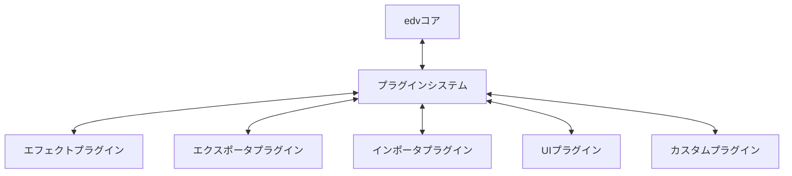
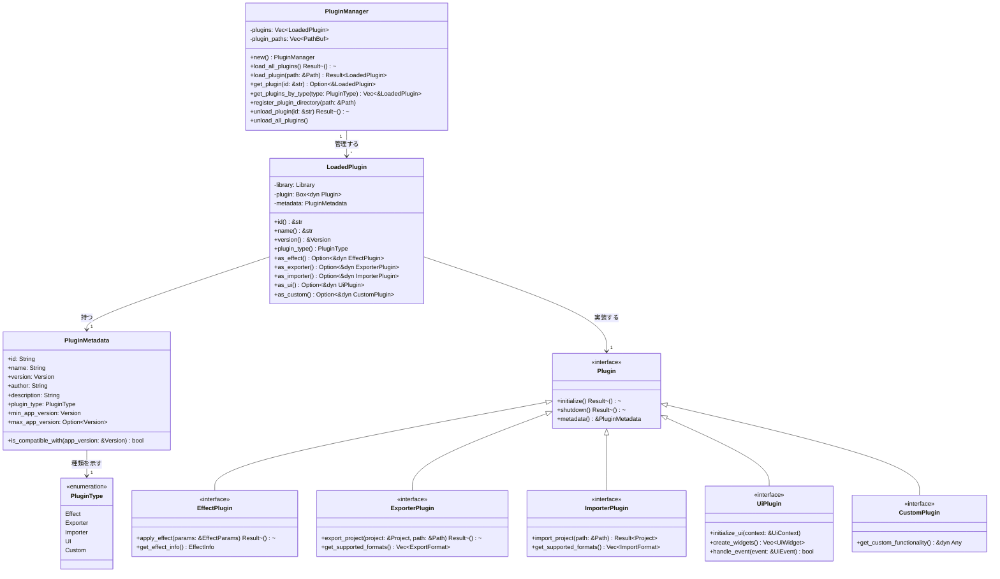
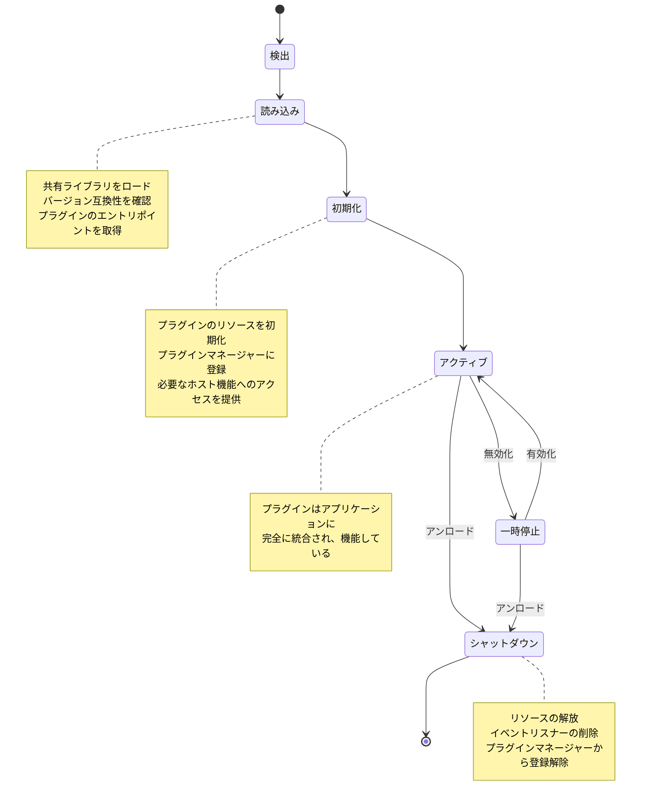
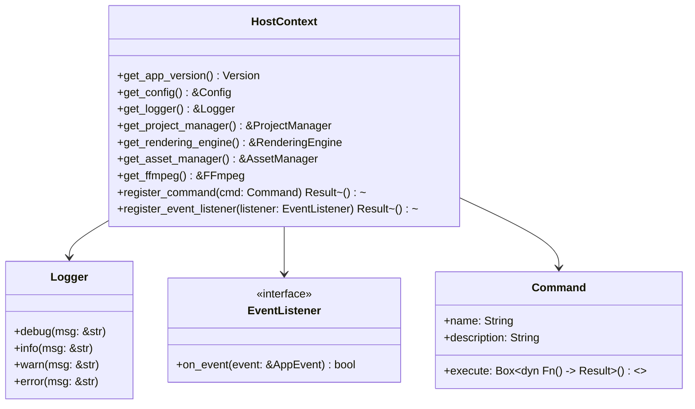
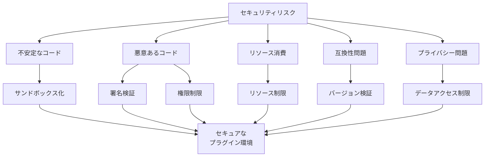
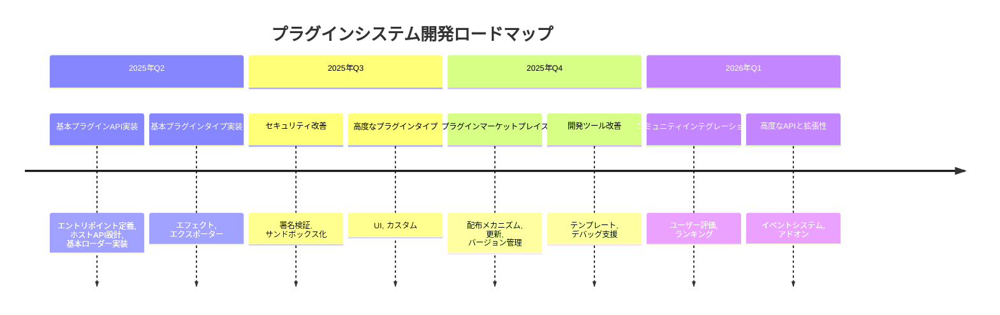

# edv - プラグインシステム基本設計

このドキュメントでは、edvアプリケーションのプラグインシステムの基本設計について詳細に説明します。プラグインシステムは、サードパーティ開発者がedvの機能を拡張できるようにするためのフレームワークを提供します。

**最終更新日: 2025年4月1日**

## 概要



edvプラグインシステムは、アプリケーションの機能を拡張するための標準化されたインターフェースを提供します。主な目標は以下の通りです：

- **拡張性**: サードパーティ開発者が新機能を追加できるようにする
- **分離**: プラグインの問題がコアアプリケーションに影響しないようにする
- **バージョン互換性**: API変更時にもプラグインの互換性を維持する
- **パフォーマンス**: 最小限のオーバーヘッドでプラグインを実行する
- **セキュリティ**: プラグインの実行を安全に行う

## プラグインシステムの構造



### 主要コンポーネント

#### プラグインマネージャー

`PluginManager`は、すべてのプラグインの読み込み、管理、検索、アンロードを担当します。主な機能は以下です：

- プラグインディレクトリからすべてのプラグインを自動的に読み込む
- 個別のプラグインを明示的に読み込む
- プラグインの種類やIDに基づいてプラグインを検索する
- プラグインの互換性を確認する
- プラグインをアンロードする
- プラグインのライフサイクルを管理する

#### プラグインメタデータ

各プラグインは、以下の情報を含むメタデータを提供する必要があります：

- プラグインID（一意の識別子）
- プラグイン名（表示用）
- バージョン情報
- 作者情報
- 説明文
- プラグインの種類
- 対応するアプリケーションのバージョン範囲

#### プラグインタイプ

プラグインは以下の主要な種類に分類されます：

1. **エフェクトプラグイン**: ビデオやオーディオにエフェクトを適用する
2. **エクスポータプラグイン**: プロジェクトを特定の形式にエクスポートする
3. **インポータプラグイン**: 特定の形式からプロジェクトをインポートする
4. **UIプラグイン**: ユーザーインターフェースを拡張する
5. **カスタムプラグイン**: その他の特殊な機能を提供する

## プラグインのライフサイクル



### 検出と読み込み

1. アプリケーション起動時または明示的な要求時、プラグインマネージャーは登録されたディレクトリ内のプラグインを検索
2. 検出されたプラグインファイル（`.dll`、`.so`、`.dylib`）を検証
3. 動的ライブラリとしてプラグインをロード
4. バージョン互換性を確認
5. プラグインのエントリポイント関数を取得

### 初期化と登録

1. プラグインの`initialize()`メソッドを呼び出し
2. プラグインマネージャーにプラグインを登録
3. プラグインに必要なホスト機能へのアクセスを提供

### 実行と統合

1. プラグインはアプリケーションのライフサイクルに統合
2. プラグインの種類に応じた方法で機能を提供
3. アプリケーションはプラグインの機能を必要に応じて呼び出し

### シャットダウンとアンロード

1. プラグインの`shutdown()`メソッドを呼び出し
2. プラグインが使用しているリソースを解放
3. プラグインマネージャーからプラグインの登録を解除
4. 動的ライブラリをアンロード

## プラグインAPI

プラグインシステムは、プラグイン開発者に対して以下のAPIを提供します：

### コアインターフェース

すべてのプラグインが実装する必要がある基本インターフェース：

```rust
// プラグインのエントリポイント関数の定義
#[no_mangle]
pub extern "C" fn create_plugin() -> *mut Box<dyn Plugin> {
    // プラグインのインスタンスを生成して返す
    let plugin = Box::new(Box::new(MyPlugin::new()));
    Box::into_raw(plugin)
}

// すべてのプラグインが実装する必要がある基本トレイト
pub trait Plugin: Send + Sync {
    /// プラグインの初期化
    fn initialize(&mut self) -> Result<()>;
    
    /// プラグインのシャットダウン
    fn shutdown(&mut self) -> Result<()>;
    
    /// プラグインのメタデータを取得
    fn metadata(&self) -> &PluginMetadata;
}
```

### 種類別インターフェース

各プラグインタイプに対応する専用インターフェース：

```rust
// エフェクトプラグイン
pub trait EffectPlugin: Plugin {
    fn apply_effect(&self, params: &EffectParams) -> Result<()>;
    fn get_effect_info(&self) -> EffectInfo;
}

// エクスポータプラグイン
pub trait ExporterPlugin: Plugin {
    fn export_project(&self, project: &Project, path: &Path) -> Result<()>;
    fn get_supported_formats(&self) -> Vec<ExportFormat>;
}

// インポータプラグイン
pub trait ImporterPlugin: Plugin {
    fn import_project(&self, path: &Path) -> Result<Project>;
    fn get_supported_formats(&self) -> Vec<ImportFormat>;
}

// UIプラグイン
pub trait UiPlugin: Plugin {
    fn initialize_ui(&self, context: &UiContext);
    fn create_widgets(&self) -> Vec<UiWidget>;
    fn handle_event(&self, event: &UiEvent) -> bool;
}

// カスタムプラグイン
pub trait CustomPlugin: Plugin {
    fn get_custom_functionality(&self) -> &dyn Any;
}
```

## ホストAPI

プラグインがアプリケーションの機能にアクセスするためのAPI：



ホストAPIは、プラグインがアプリケーションの機能を利用するための一連のインターフェースを提供します：

- **アプリケーション情報**: バージョン、設定などのアクセス
- **ロギング**: プラグインからのログメッセージ出力
- **プロジェクト管理**: プロジェクトデータへのアクセスと操作
- **レンダリング**: レンダリングエンジンへのアクセス
- **アセット管理**: アセットの読み込みと操作
- **FFmpeg**: FFmpeg機能へのアクセス
- **コマンド登録**: カスタムコマンドの登録
- **イベントリスナー**: アプリケーションイベントの監視

## プラグインの構造

プラグインは以下の要素で構成されます：

1. **共有ライブラリファイル**: `.dll`（Windows）、`.so`（Linux）、または`.dylib`（macOS）
2. **マニフェストファイル**: プラグインのメタデータを含むJSON（オプション）
3. **リソースファイル**: アイコン、翻訳、その他のリソース（オプション）

```
my_plugin/
├── target/
│   └── release/
│       └── libmy_plugin.so  # または .dll/.dylib
├── manifest.json
├── resources/
│   ├── icons/
│   ├── translations/
│   └── ...
├── Cargo.toml
└── src/
    ├── lib.rs
    └── ...
```

### マニフェスト例

```json
{
  "id": "com.example.my-effect-plugin",
  "name": "スーパーエフェクト",
  "version": "1.0.0",
  "author": "サンプル開発者",
  "description": "edvに新しいビデオエフェクトを追加するプラグイン",
  "plugin_type": "effect",
  "min_app_version": "1.5.0",
  "max_app_version": "2.0.0"
}
```

## セキュリティ考慮事項

プラグインシステムにおけるセキュリティリスクと対策：



### リスクと対策

1. **不安定なコード**
   - プラグインを別プロセスで実行（将来の拡張）
   - エラー処理とクラッシュ保護メカニズム

2. **悪意あるコード**
   - プラグイン署名と検証システム
   - 信頼できるソースからのプラグインのみをロード
   - 制限付きAPI設計

3. **リソース消費**
   - メモリとCPU使用量の制限
   - リソース使用量のモニタリング
   - 問題があるプラグインの自動無効化

4. **互換性問題**
   - 厳格なバージョン互換性チェック
   - API安定性と後方互換性の維持
   - 明確な非推奨化ポリシー

5. **プライバシーとデータセキュリティ**
   - ファイルシステムアクセスの制限
   - センシティブデータへのアクセス制御
   - ユーザー同意に基づくデータアクセス

## パフォーマンス考慮事項

プラグインシステムにおけるパフォーマンス最適化：

1. **遅延ロード**
   - 起動時にメタデータのみを読み込み
   - 必要に応じてプラグインを完全に初期化

2. **リソース管理**
   - プラグインごとのメモリ制限
   - 未使用プラグインのリソースの解放
   - リソース使用量のモニタリング

3. **インターフェース設計**
   - 最小限のオーバーヘッドのAPI設計
   - ゼロコストの抽象化の使用
   - 効率的なデータ共有メカニズム

4. **並列処理**
   - プラグイン操作の並列実行
   - スレッドプールの共有
   - 効率的な同期メカニズム

## ビルドとデプロイメント

プラグイン開発者のためのビルド手順：

1. Cargo.tomlの設定：
```toml
[package]
name = "my-plugin"
version = "0.1.0"
edition = "2021"

[lib]
crate-type = ["cdylib"]

[dependencies]
edv-plugin-api = "0.1.0"  # プラグインAPI依存関係
```

2. プラグインエントリポイントの実装：
```rust
#[no_mangle]
pub extern "C" fn create_plugin() -> *mut Box<dyn Plugin> {
    let plugin = Box::new(Box::new(MyPlugin::new()));
    Box::into_raw(plugin)
}
```

3. プラグインのビルド：
```bash
cargo build --release
```

4. プラグインのインストール：
   - ビルドした共有ライブラリファイルを`plugins`ディレクトリにコピー
   - 必要なリソースファイルもコピー

## プラグイン開発ガイドライン

プラグイン開発者向けのベストプラクティス：

1. **エラー処理**
   - すべてのエラーを適切に処理
   - パニックの回避
   - 明確なエラーメッセージの提供

2. **リソース管理**
   - リソースの適切な初期化と解放
   - メモリリークの防止
   - ファイルハンドルの適切なクローズ

3. **スレッド安全性**
   - スレッド安全な設計
   - 適切な同期メカニズムの使用
   - データ競合の回避

4. **パフォーマンス**
   - 効率的なアルゴリズムの使用
   - 不必要なメモリ割り当ての回避
   - 処理時間の最小化

5. **互換性**
   - API変更への適切な対応
   - マイナーバージョンアップでの互換性維持
   - 非推奨API使用時の警告対応

## 今後の改善計画



1. **サンドボックス実行**
   - プラグインを別プロセスで実行するオプション
   - リソース使用量の詳細な制限と監視

2. **プラグインマーケットプレイス**
   - プラグインの簡単な検索と発見
   - ワンクリックインストールと更新
   - バージョン管理と互換性チェック

3. **開発ツールの改善**
   - プラグインテンプレートジェネレーター
   - デバッグサポートの強化
   - 自動テストフレームワーク

4. **高度なAPIと拡張性**
   - より詳細なイベントシステム
   - プラグイン間の通信メカニズム
   - プラグインのアドオンサポート

## 関連モジュール

- **コアモジュール**: プラグインが拡張する基本機能を提供
- **UIモジュール**: プラグインのUI統合をサポート
- **プロジェクトモジュール**: プラグインがプロジェクトデータにアクセスするための機能
- **レンダリングモジュール**: プラグインがレンダリングパイプラインに統合するための機能 