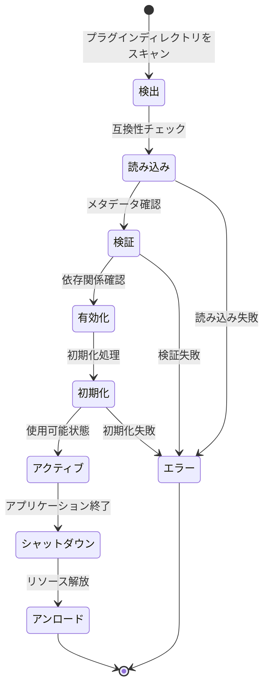
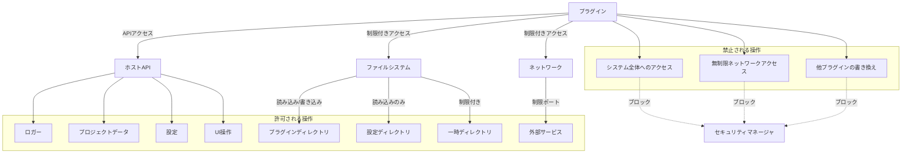

# プラグインインターフェース設計

## 概要 🔌

このドキュメントではedvプラグインシステムのインターフェース設計について詳細に説明します。プラグイン開発者はこれらのインターフェースを実装することで、edvアプリケーションの機能を拡張できます。

最終更新日: 2025年4月1日

## プラグインのコアトレイト 🌟

すべてのプラグインは`Plugin`トレイトを実装する必要があります。このトレイトはプラグインの基本的なライフサイクルとメタデータを定義します。

```rust
/// edvプラグインの基本インターフェース
pub trait Plugin: Send + Sync + 'static {
    /// プラグインの一意のID
    fn id(&self) -> &str;
    
    /// プラグインの名前
    fn name(&self) -> &str;
    
    /// プラグインのバージョン
    fn version(&self) -> (u32, u32, u32);
    
    /// プラグイン作者情報
    fn author(&self) -> &str;
    
    /// プラグインの説明
    fn description(&self) -> &str;
    
    /// プラグインの初期化
    fn initialize(&mut self, host: Box<dyn PluginHost>) -> Result<(), PluginError>;
    
    /// プラグインのシャットダウン
    fn shutdown(&mut self) -> Result<(), PluginError>;
    
    /// プラグインの種類
    fn plugin_type(&self) -> PluginType;
    
    /// プラグインのAPIバージョン
    fn api_version(&self) -> (u32, u32);
    
    /// プラグインの依存関係
    fn dependencies(&self) -> Vec<PluginDependency> {
        Vec::new() // デフォルトでは依存関係なし
    }
    
    /// プラグインの設定
    fn settings(&self) -> Option<PluginSettings> {
        None // デフォルトでは設定なし
    }
    
    /// プラグインの機能
    fn capabilities(&self) -> PluginCapabilities;
}
```

## プラグインの種類 🧩

プラグインは以下の種類に分類されます：

```rust
/// プラグインの種類を表す列挙型
pub enum PluginType {
    /// エフェクトプラグイン - ビデオまたはオーディオに効果を適用
    Effect,
    /// エクスポータープラグイン - 新しい出力フォーマットをサポート
    Exporter,
    /// インポータープラグイン - 新しい入力フォーマットをサポート
    Importer,
    /// UIプラグイン - ユーザーインターフェースをカスタマイズ
    UserInterface,
    /// カスタムプラグイン - 上記以外の拡張機能
    Custom,
}
```

## プラグインメタデータ 📋

プラグインのメタデータは以下の構造体で表現されます：

```rust
/// プラグインの依存関係
pub struct PluginDependency {
    /// 依存するプラグインのID
    pub plugin_id: String,
    /// 必要な最小バージョン (major, minor, patch)
    pub min_version: (u32, u32, u32),
    /// 互換性のある最大バージョン (major, minor, patch)
    pub max_version: Option<(u32, u32, u32)>,
    /// この依存関係が必須かどうか
    pub required: bool,
}

/// プラグイン機能フラグ
pub struct PluginCapabilities {
    /// 設定UIをサポートしているか
    pub has_settings_ui: bool,
    /// ホットリロード（実行中の再読み込み）をサポートしているか
    pub supports_hot_reload: bool,
    /// 非同期処理をサポートしているか
    pub supports_async: bool,
    /// GPUアクセラレーションをサポートしているか
    pub supports_gpu: bool,
    /// 複数のスレッドで安全に実行できるか
    pub thread_safe: bool,
}

/// プラグイン設定
pub struct PluginSettings {
    /// 設定項目のリスト
    pub items: Vec<SettingItem>,
    /// 設定値更新時のコールバック
    pub on_change: Option<Box<dyn Fn(&str, &SettingValue) -> Result<(), PluginError> + Send + Sync>>,
}

/// 設定項目の種類
pub enum SettingItemType {
    Boolean,
    Integer,
    Float,
    String,
    Enum(Vec<String>),
    Color,
    FilePath,
    DirectoryPath,
}

/// 設定項目
pub struct SettingItem {
    /// 設定キー
    pub key: String,
    /// 表示名
    pub display_name: String,
    /// 説明
    pub description: String,
    /// 設定タイプ
    pub item_type: SettingItemType,
    /// デフォルト値
    pub default_value: SettingValue,
    /// 設定が必須かどうか
    pub required: bool,
    /// 可視性条件（他の設定値に依存して表示/非表示を切り替える）
    pub visibility_condition: Option<Box<dyn Fn(&HashMap<String, SettingValue>) -> bool + Send + Sync>>,
}

/// 設定値
pub enum SettingValue {
    Boolean(bool),
    Integer(i64),
    Float(f64),
    String(String),
    Enum(String),
    Color(u8, u8, u8, u8), // RGBA
    FilePath(PathBuf),
    DirectoryPath(PathBuf),
}
```

## プラグイン固有インターフェース 🛠️

各プラグインタイプは特定のトレイトを実装する必要があります。

### エフェクトプラグイン

```rust
/// ビデオエフェクトプラグインのインターフェース
pub trait VideoEffectPlugin: Plugin {
    /// エフェクトを適用する
    fn apply_effect(&self, 
                   frame: &mut VideoFrame,
                   parameters: &HashMap<String, EffectParameter>,
                   context: &EffectContext) -> Result<(), PluginError>;
    
    /// サポートするエフェクトパラメータを取得
    fn get_parameters(&self) -> Vec<EffectParameterDefinition>;
    
    /// エフェクトのプレビューを生成（オプション）
    fn generate_preview(&self, 
                       parameters: &HashMap<String, EffectParameter>,
                       size: (u32, u32)) -> Option<Result<VideoFrame, PluginError>> {
        None
    }
    
    /// GPU加速をサポートしているかどうか
    fn supports_gpu_acceleration(&self) -> bool {
        false
    }
    
    /// GPU加速版のエフェクト適用関数（GPU加速をサポートする場合）
    fn apply_effect_gpu(&self,
                       frame: &mut GpuVideoFrame,
                       parameters: &HashMap<String, EffectParameter>,
                       context: &EffectContext) -> Result<(), PluginError> {
        Err(PluginError::NotImplemented)
    }
}

/// オーディオエフェクトプラグインのインターフェース
pub trait AudioEffectPlugin: Plugin {
    /// エフェクトを適用する
    fn apply_effect(&self,
                   buffer: &mut AudioBuffer,
                   parameters: &HashMap<String, EffectParameter>,
                   context: &EffectContext) -> Result<(), PluginError>;
    
    /// サポートするエフェクトパラメータを取得
    fn get_parameters(&self) -> Vec<EffectParameterDefinition>;
}
```

### エクスポータープラグイン

```rust
/// エクスポータープラグインのインターフェース
pub trait ExporterPlugin: Plugin {
    /// サポートするフォーマットを取得
    fn supported_formats(&self) -> Vec<ExportFormat>;
    
    /// エクスポートオプションを取得
    fn export_options(&self, format: &str) -> Result<Vec<ExportOption>, PluginError>;
    
    /// エクスポートを開始
    fn begin_export(&mut self, 
                   target_path: &Path,
                   format: &str,
                   options: &HashMap<String, ExportOptionValue>,
                   context: &ExportContext) -> Result<(), PluginError>;
    
    /// フレームをエクスポート
    fn export_frame(&mut self, 
                   frame: &VideoFrame,
                   timestamp: f64) -> Result<(), PluginError>;
    
    /// オーディオバッファをエクスポート
    fn export_audio(&mut self,
                   buffer: &AudioBuffer,
                   timestamp: f64) -> Result<(), PluginError>;
    
    /// エクスポートを終了
    fn end_export(&mut self) -> Result<(), PluginError>;
    
    /// エクスポートの進捗状況を取得
    fn export_progress(&self) -> f32;
    
    /// エクスポートをキャンセル
    fn cancel_export(&mut self) -> Result<(), PluginError>;
}
```

### インポータープラグイン

```rust
/// インポータープラグインのインターフェース
pub trait ImporterPlugin: Plugin {
    /// サポートするフォーマットを取得
    fn supported_formats(&self) -> Vec<ImportFormat>;
    
    /// ファイルがサポートされているかを確認
    fn can_import_file(&self, path: &Path) -> bool;
    
    /// ファイルからメディア情報を取得
    fn get_media_info(&self, path: &Path) -> Result<MediaInfo, PluginError>;
    
    /// ビデオフレームを読み込む
    fn read_video_frame(&mut self, 
                       path: &Path,
                       timestamp: f64) -> Result<Option<VideoFrame>, PluginError>;
    
    /// オーディオバッファを読み込む
    fn read_audio_buffer(&mut self,
                        path: &Path,
                        start_time: f64,
                        duration: f64) -> Result<Option<AudioBuffer>, PluginError>;
    
    /// インポートをキャンセル
    fn cancel_import(&mut self) -> Result<(), PluginError>;
}
```

### UIプラグイン

```rust
/// UIプラグインのインターフェース
pub trait UserInterfacePlugin: Plugin {
    /// UIコンポーネントを登録
    fn register_components(&self, registry: &mut dyn UiComponentRegistry) -> Result<(), PluginError>;
    
    /// UIテーマを提供
    fn provide_theme(&self) -> Option<UiTheme> {
        None
    }
    
    /// UIイベントハンドラを登録
    fn register_event_handlers(&self, registry: &mut dyn UiEventRegistry) -> Result<(), PluginError>;
    
    /// カスタムUIパネルを提供
    fn provide_panels(&self) -> Vec<UiPanelDefinition>;
    
    /// メニュー項目を提供
    fn provide_menu_items(&self) -> Vec<MenuItem>;
}
```

## ホストインターフェース 🏠

プラグインはホストアプリケーションとやり取りするために以下のインターフェースを使用します：

```rust
/// プラグインホストインターフェース
pub trait PluginHost: Send + Sync + 'static {
    /// ホストアプリケーションのバージョンを取得
    fn host_version(&self) -> (u32, u32, u32);
    
    /// ホストアプリケーションの名前を取得
    fn host_name(&self) -> &str;
    
    /// ロガーを取得
    fn logger(&self) -> &dyn PluginLogger;
    
    /// 現在のプロジェクトを取得
    fn current_project(&self) -> Option<&dyn ProjectAccess>;
    
    /// プラグインの作業ディレクトリを取得
    fn plugin_data_dir(&self, plugin_id: &str) -> Result<PathBuf, PluginError>;
    
    /// 設定を取得
    fn get_setting(&self, key: &str) -> Result<Option<SettingValue>, PluginError>;
    
    /// 設定を保存
    fn save_setting(&self, key: &str, value: SettingValue) -> Result<(), PluginError>;
    
    /// 他のプラグインにアクセス
    fn get_plugin(&self, plugin_id: &str) -> Option<&dyn Plugin>;
    
    /// ユーザーに通知
    fn notify_user(&self, 
                  message: &str,
                  notification_type: NotificationType) -> Result<(), PluginError>;
    
    /// アプリケーションイベントの購読
    fn subscribe_to_event(&self, 
                         event_type: ApplicationEventType,
                         callback: Box<dyn Fn(&ApplicationEvent) + Send + Sync>) -> EventSubscriptionId;
    
    /// イベント購読の解除
    fn unsubscribe_from_event(&self, subscription_id: EventSubscriptionId) -> Result<(), PluginError>;
}

/// プラグインのログ機能
pub trait PluginLogger: Send + Sync + 'static {
    /// デバッグレベルのログを記録
    fn debug(&self, message: &str);
    
    /// 情報レベルのログを記録
    fn info(&self, message: &str);
    
    /// 警告レベルのログを記録
    fn warn(&self, message: &str);
    
    /// エラーレベルのログを記録
    fn error(&self, message: &str);
}

/// プロジェクトアクセスインターフェース
pub trait ProjectAccess: Send + Sync + 'static {
    /// プロジェクト名を取得
    fn name(&self) -> &str;
    
    /// タイムラインを取得
    fn timeline(&self) -> &dyn TimelineAccess;
    
    /// アセットを取得
    fn assets(&self) -> &dyn AssetAccess;
    
    /// プロジェクト設定を取得
    fn settings(&self) -> &ProjectSettings;
    
    /// プロジェクトを保存
    fn save(&self) -> Result<(), ProjectError>;
    
    /// レンダリングを開始
    fn start_render(&self, config: RenderConfig) -> Result<RenderJobHandle, ProjectError>;
}
```

## エラー処理 🚨

プラグインシステムでは以下のエラー型を使用します：

```rust
/// プラグインエラー
#[derive(Debug, thiserror::Error)]
pub enum PluginError {
    #[error("プラグインが見つかりません: {0}")]
    PluginNotFound(String),
    
    #[error("プラグインの読み込みに失敗しました: {0}")]
    LoadingFailed(String),
    
    #[error("プラグインの初期化に失敗しました: {0}")]
    InitializationFailed(String),
    
    #[error("プラグインバージョンが互換性がありません: 必要={required}, 現在={current}")]
    IncompatibleVersion { required: String, current: String },
    
    #[error("依存プラグインが見つかりません: {0}")]
    DependencyNotFound(String),
    
    #[error("無効なプラグインデータ: {0}")]
    InvalidPluginData(String),
    
    #[error("プラグインの権限が不足しています: {0}")]
    InsufficientPermissions(String),
    
    #[error("実装されていない機能です")]
    NotImplemented,
    
    #[error("内部エラー: {0}")]
    Internal(String),
    
    #[error("IO エラー: {0}")]
    Io(#[from] std::io::Error),
}
```

## プラグインのライフサイクル 🔄



## セキュリティモデル 🔒

プラグインシステムはサンドボックス化されたアクセス権限を持ちます：



## マニフェストファイル 📄

各プラグインには`plugin.toml`マニフェストファイルが必要です：

```toml
[plugin]
id = "com.example.my-effect-plugin"
name = "素晴らしいエフェクト"
version = "1.0.0"
author = "サンプル開発者"
description = "素晴らしいビデオエフェクトを追加します"
api_version = "1.0"
plugin_type = "effect"

[dependencies]
"com.example.utility-plugin" = { min_version = "0.5.0", required = true }

[capabilities]
has_settings_ui = true
supports_hot_reload = false
supports_async = true
supports_gpu = true
thread_safe = true
```

## 実装例 📝

以下に簡単なエフェクトプラグインの実装例を示します：

```rust
use edv_plugin_api::*;

#[derive(Default)]
pub struct GrayscaleEffectPlugin {
    host: Option<Box<dyn PluginHost>>,
}

impl Plugin for GrayscaleEffectPlugin {
    fn id(&self) -> &str {
        "com.example.grayscale-effect"
    }
    
    fn name(&self) -> &str {
        "グレースケールエフェクト"
    }
    
    fn version(&self) -> (u32, u32, u32) {
        (1, 0, 0)
    }
    
    fn author(&self) -> &str {
        "サンプル開発者"
    }
    
    fn description(&self) -> &str {
        "ビデオをグレースケールに変換します"
    }
    
    fn initialize(&mut self, host: Box<dyn PluginHost>) -> Result<(), PluginError> {
        host.logger().info("グレースケールプラグインを初期化中...");
        self.host = Some(host);
        Ok(())
    }
    
    fn shutdown(&mut self) -> Result<(), PluginError> {
        if let Some(host) = &self.host {
            host.logger().info("グレースケールプラグインをシャットダウン中...");
        }
        Ok(())
    }
    
    fn plugin_type(&self) -> PluginType {
        PluginType::Effect
    }
    
    fn api_version(&self) -> (u32, u32) {
        (1, 0)
    }
    
    fn capabilities(&self) -> PluginCapabilities {
        PluginCapabilities {
            has_settings_ui: false,
            supports_hot_reload: true,
            supports_async: false,
            supports_gpu: true,
            thread_safe: true,
        }
    }
}

impl VideoEffectPlugin for GrayscaleEffectPlugin {
    fn apply_effect(&self, 
                  frame: &mut VideoFrame,
                  parameters: &HashMap<String, EffectParameter>,
                  _context: &EffectContext) -> Result<(), PluginError> {
        let intensity = if let Some(EffectParameter::Float(value)) = parameters.get("intensity") {
            *value
        } else {
            1.0 // デフォルト値
        };
        
        if let Some(host) = &self.host {
            host.logger().debug(&format!("グレースケールエフェクトを適用中 (強度: {})", intensity));
        }
        
        for y in 0..frame.height() {
            for x in 0..frame.width() {
                let pixel = frame.get_pixel(x, y)?;
                let gray = (0.299 * pixel.r as f64 + 0.587 * pixel.g as f64 + 0.114 * pixel.b as f64) as u8;
                
                // 元のカラーと調整後のグレースケールを強度に基づいて混合
                let r = lerp(pixel.r, gray, intensity);
                let g = lerp(pixel.g, gray, intensity);
                let b = lerp(pixel.b, gray, intensity);
                
                frame.set_pixel(x, y, Pixel { r, g, b, a: pixel.a })?;
            }
        }
        
        Ok(())
    }
    
    fn get_parameters(&self) -> Vec<EffectParameterDefinition> {
        vec![
            EffectParameterDefinition {
                id: "intensity".into(),
                name: "強度".into(),
                description: "グレースケールエフェクトの強度".into(),
                parameter_type: EffectParameterType::Float,
                default_value: EffectParameter::Float(1.0),
                min_value: Some(EffectParameter::Float(0.0)),
                max_value: Some(EffectParameter::Float(1.0)),
                step: Some(EffectParameter::Float(0.01)),
            }
        ]
    }
    
    fn supports_gpu_acceleration(&self) -> bool {
        true
    }
    
    fn apply_effect_gpu(&self,
                      frame: &mut GpuVideoFrame,
                      parameters: &HashMap<String, EffectParameter>,
                      context: &EffectContext) -> Result<(), PluginError> {
        let intensity = if let Some(EffectParameter::Float(value)) = parameters.get("intensity") {
            *value
        } else {
            1.0 // デフォルト値
        };
        
        // GPU版のグレースケール処理を実装
        // （実際の実装はGPUバックエンドに依存します）
        frame.apply_shader("grayscale", &[("intensity", intensity)])?;
        
        Ok(())
    }
}

// ヘルパー関数: 線形補間
fn lerp(a: u8, b: u8, t: f32) -> u8 {
    ((1.0 - t) * a as f32 + t * b as f32) as u8
}

// プラグインファクトリの定義
#[no_mangle]
pub extern "C" fn create_plugin() -> *mut dyn Plugin {
    let plugin = GrayscaleEffectPlugin::default();
    Box::into_raw(Box::new(plugin))
}
```

## ビルドと配布 🔨

プラグインは動的ライブラリ（`.dll`、`.so`、または`.dylib`）として構築され、以下のディレクトリ構造で配布されます：

```
my-plugin/
├── plugin.toml              # プラグインマニフェスト
├── libmy_plugin.so          # Linux用共有ライブラリ
├── my_plugin.dll            # Windows用DLL
├── libmy_plugin.dylib       # macOS用共有ライブラリ
├── resources/               # プラグインリソース
│   ├── images/              # 画像
│   ├── shaders/             # シェーダー
│   └── i18n/                # 国際化リソース
└── docs/                    # ドキュメント
    └── README.md            # プラグインのドキュメント
```

## 次のステップ 🚀

1. プラグインローダーの実装
2. プラグインマネージャーの実装
3. サンプルプラグインの開発
4. 開発者向けドキュメントの充実
5. プラグインSDKの提供

## 関連ドキュメント 📚

- [01_プラグイン基本設計.md](./01_プラグイン基本設計.md) - プラグインシステムの基本設計
- [03_プラグインライフサイクル.md](./03_プラグインライフサイクル.md) - プラグインのライフサイクル
- [04_プラグインセキュリティ.md](./04_プラグインセキュリティ.md) - セキュリティモデル
- [05_プラグイン開発ガイド.md](./05_プラグイン開発ガイド.md) - 開発者向けガイド（予定） 