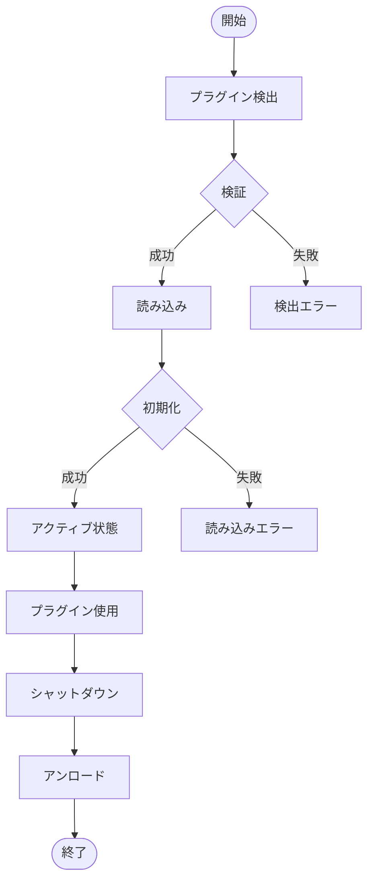
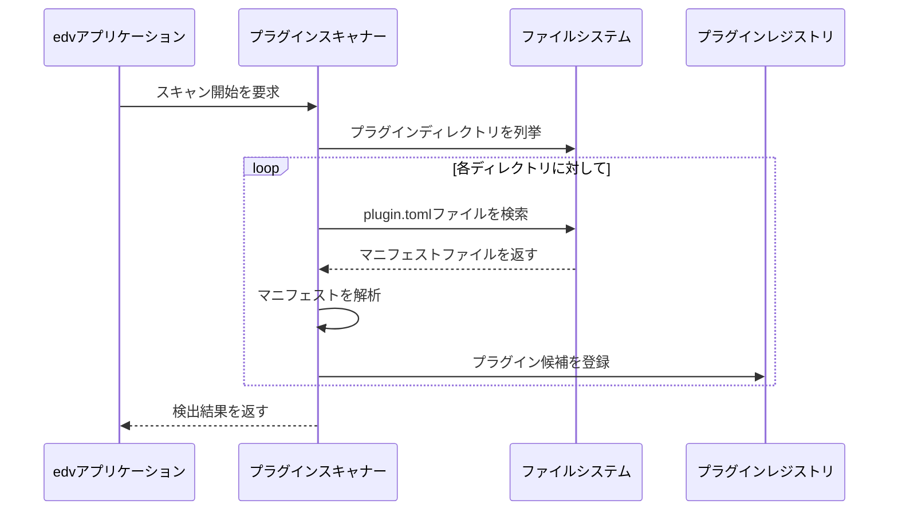
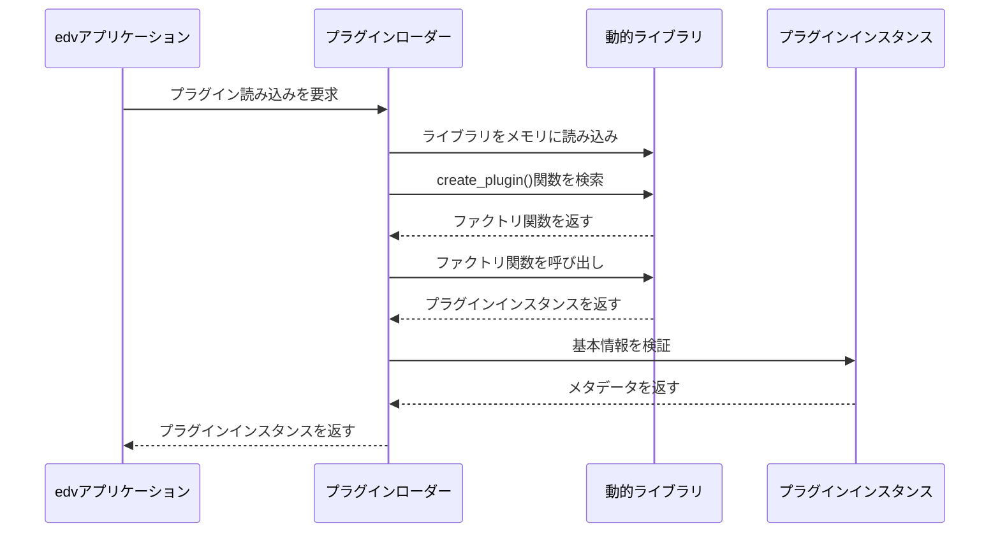
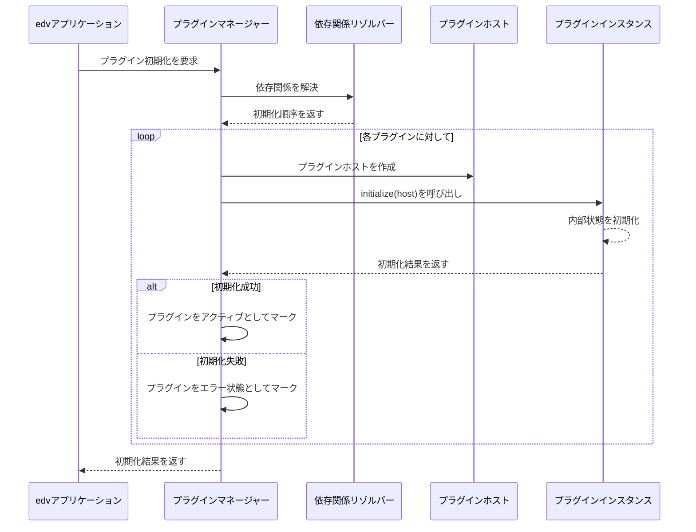
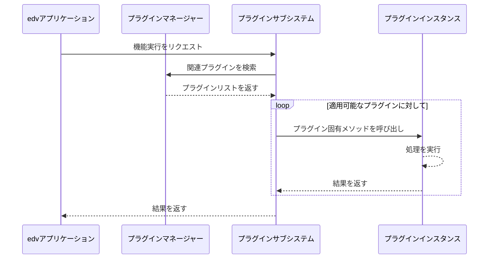
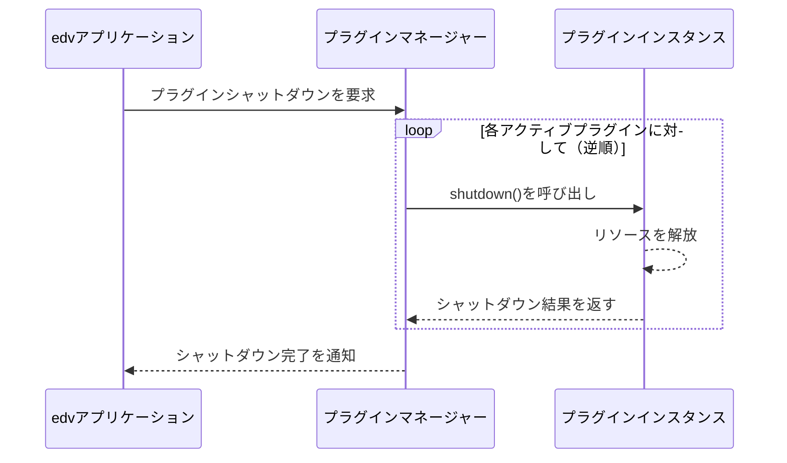
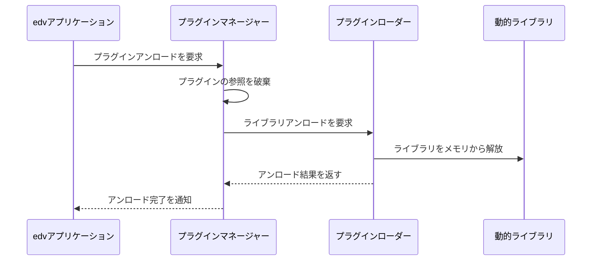
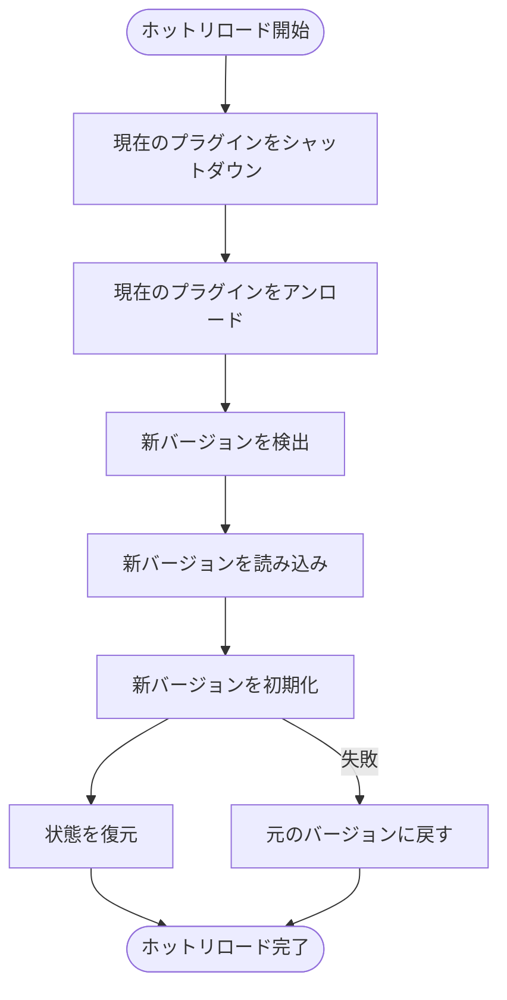
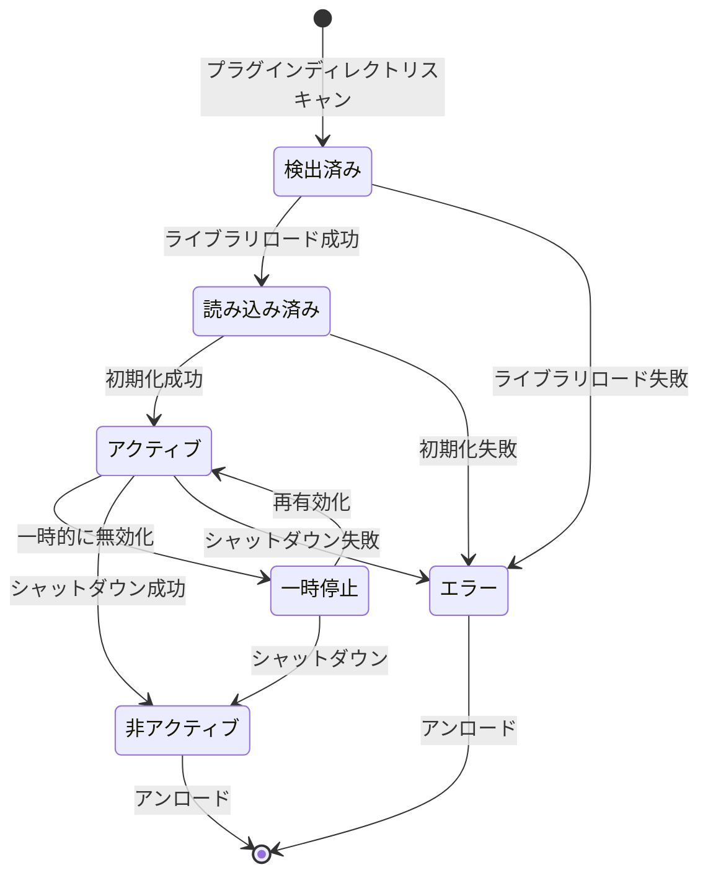

# プラグインライフサイクル

## 概要 🔄

このドキュメントではedvプラグインシステムのライフサイクル管理について詳細に説明します。プラグインの検出から読み込み、初期化、実行、シャットダウン、そしてアンロードまでの一連のプロセスを解説します。

最終更新日: 2025年4月1日

## ライフサイクルの全体像 👁️

edvプラグインには以下の主要なライフサイクルステージがあります：



## 詳細ステージ説明 📋

### 1. プラグイン検出 🔍

プラグイン検出は、アプリケーション起動時またはプラグイン管理インターフェースからのリクエストで開始されます。



#### 検出フェーズの主要ステップ:

1. **ディレクトリスキャン**
   - 以下のディレクトリをスキャンします：
     - システムプラグインディレクトリ: `/usr/lib/edv/plugins` (Linux)
     - ユーザープラグインディレクトリ: `~/.local/share/edv/plugins` (Linux)
     - アプリケーションプラグインディレクトリ: `./plugins/`

2. **マニフェスト検証**
   - 各ディレクトリで `plugin.toml` ファイルを検索します
   - マニフェストが必須フィールドを含んでいるか確認します:
     - `id`: プラグイン識別子
     - `name`: プラグイン名
     - `version`: プラグインバージョン
     - `api_version`: APIバージョン要求
     - `plugin_type`: プラグインタイプ

3. **ライブラリファイル確認**
   - 対応するプラットフォームの動的ライブラリが存在するか確認します
   - Linux: `.so` ファイル
   - Windows: `.dll` ファイル
   - macOS: `.dylib` ファイル

#### 検出エラーの種類:

- **マニフェスト不足**: `plugin.toml` ファイルが見つからないか無効
- **必須フィールド欠落**: マニフェストに必要な情報が含まれていない
- **互換性のないAPI**: プラグインが要求するAPIバージョンがサポートされていない
- **ライブラリ不足**: 対応するプラットフォーム用のライブラリファイルが見つからない
- **重複プラグイン**: 同じIDを持つプラグインが複数検出された

### 2. プラグインの読み込み 📦

検証に成功したプラグインは、必要に応じて動的に読み込まれます。



#### 読み込みフェーズの主要ステップ:

1. **ライブラリロード**
   - 適切なプラットフォーム用のライブラリファイルを動的に読み込みます
   - プラットフォーム固有のAPIを使用:
     - Linux: `dlopen`/`dlsym`
     - Windows: `LoadLibrary`/`GetProcAddress`
     - macOS: `dlopen`/`dlsym`

2. **ファクトリ関数検索**
   - ライブラリから `create_plugin` エクスポート関数を取得します
   - この関数はプラグインのインスタンスを作成する役割を持ちます

3. **インスタンス作成**
   - ファクトリ関数を呼び出してプラグインインスタンスを取得します
   - インスタンスが `Plugin` トレイトを実装していることを確認します

4. **プラグイン検証**
   - プラグインのメタデータがマニフェストと一致するか確認します
   - APIバージョンの互換性をチェックします

#### 読み込みエラーの種類:

- **ライブラリロードエラー**: ライブラリを読み込めない (不足している依存関係など)
- **シンボル不足**: `create_plugin` 関数が見つからない
- **無効なプラグイン**: 返されたインスタンスが `Plugin` トレイトを実装していない
- **バージョン不一致**: プラグインのバージョンがマニフェストと一致しない

### 3. プラグインの初期化 🚀

読み込まれたプラグインは、使用前に初期化する必要があります。



#### 初期化フェーズの主要ステップ:

1. **依存関係解決**
   - プラグインの依存関係グラフを構築します
   - 循環依存関係をチェックします
   - トポロジカルソートにより初期化順序を決定します

2. **ホスト作成**
   - 各プラグイン用に `PluginHost` インスタンスを作成します
   - ホストにはログ記録、設定アクセス、プロジェクトアクセスなどの機能が含まれます
   - プラグインに付与する権限レベルを設定します

3. **初期化呼び出し**
   - プラグインの `initialize` メソッドを呼び出します
   - 初期化中にプラグインはリソースを確保し、内部状態を設定します

4. **状態管理**
   - 初期化結果に基づいてプラグインの状態を更新します
   - 成功した場合は「アクティブ」、失敗した場合は「エラー」としてマークします

#### 初期化エラーの種類:

- **依存関係エラー**: 必要な依存プラグインが利用できない
- **循環依存関係**: プラグイン間の循環依存関係が検出された
- **リソース確保失敗**: プラグインがリソースの確保に失敗した
- **構成エラー**: プラグインの設定が無効または不足している
- **権限エラー**: プラグインに必要な権限が付与されていない

### 4. プラグインの実行 ▶️

初期化されたプラグインはアプリケーションから呼び出されて使用されます。



#### 実行フェーズの例:

1. **エフェクトプラグイン**
   ```rust
   // ビデオエフェクトの適用
   fn apply_video_effect(frame: &mut VideoFrame, effect_id: &str, params: &HashMap<String, EffectParameter>) -> Result<(), EdvError> {
       let plugin_manager = PluginManager::instance();
       
       // 指定されたIDのエフェクトプラグインを検索
       if let Some(plugin) = plugin_manager.get_effect_plugin(effect_id) {
           // プラグインがビデオエフェクトをサポートしているか確認
           if let Some(video_effect) = plugin.as_video_effect() {
               // エフェクトコンテキストを作成
               let context = EffectContext::new(/* ... */);
               
               // エフェクトを適用
               return video_effect.apply_effect(frame, params, &context)
                   .map_err(|e| EdvError::PluginError(e));
           }
       }
       
       Err(EdvError::PluginNotFound(effect_id.to_string()))
   }
   ```

2. **エクスポータープラグイン**
   ```rust
   // カスタムフォーマットへのエクスポート
   fn export_project(project: &Project, path: &Path, format: &str, options: &HashMap<String, ExportOptionValue>) -> Result<(), EdvError> {
       let plugin_manager = PluginManager::instance();
       
       // 指定されたフォーマットをサポートするエクスポーターを検索
       for plugin in plugin_manager.get_exporter_plugins() {
           if plugin.supported_formats().iter().any(|f| f.id == format) {
               // エクスポートコンテキストを作成
               let context = ExportContext::from_project(project);
               
               // エクスポート処理を開始
               plugin.begin_export(path, format, options, &context)?;
               
               // タイムラインの各フレームをエクスポート
               for frame in project.timeline().frames() {
                   plugin.export_frame(&frame.video, frame.timestamp)?;
                   
                   if let Some(audio) = &frame.audio {
                       plugin.export_audio(audio, frame.timestamp)?;
                   }
               }
               
               // エクスポート処理を終了
               return plugin.end_export()
                   .map_err(|e| EdvError::PluginError(e));
           }
       }
       
       Err(EdvError::UnsupportedFormat(format.to_string()))
   }
   ```

3. **UIプラグイン**
   ```rust
   // UIコンポーネントの登録
   fn initialize_ui(app: &mut EdvApplication) -> Result<(), EdvError> {
       let plugin_manager = PluginManager::instance();
       let mut ui_registry = UiComponentRegistry::new();
       
       // すべてのUIプラグインを取得
       for plugin in plugin_manager.get_ui_plugins() {
           // UIコンポーネントを登録
           plugin.register_components(&mut ui_registry)?;
           
           // カスタムパネルを追加
           for panel in plugin.provide_panels() {
               app.add_panel(panel)?;
           }
           
           // メニュー項目を追加
           for menu_item in plugin.provide_menu_items() {
               app.add_menu_item(menu_item)?;
           }
       }
       
       app.set_ui_registry(ui_registry);
       Ok(())
   }
   ```

### 5. プラグインのシャットダウン 🛑

アプリケーションの終了時またはプラグインの無効化時に、プラグインはシャットダウンされます。



#### シャットダウンフェーズの主要ステップ:

1. **シャットダウン順序の決定**
   - 初期化の逆順でプラグインをシャットダウンします
   - 依存関係を考慮して、依存先のプラグインが先にシャットダウンされないようにします

2. **シャットダウン呼び出し**
   - 各プラグインの `shutdown` メソッドを呼び出します
   - プラグインは確保したリソースを解放します
   - 永続的な状態を保存します

3. **状態更新**
   - プラグインの状態を「非アクティブ」に更新します
   - シャットダウンに失敗したプラグインをログに記録します

#### シャットダウンエラーの処理:

- シャットダウンエラーはログに記録されますが、プロセスは続行されます
- 重大なエラーの場合でも、可能な限り多くのプラグインをシャットダウンすることを優先します
- エラーのあるプラグインは「エラー」状態としてマークされ、問題のトラブルシューティングに役立てられます

```rust
// プラグインのシャットダウン
fn shutdown_plugin(plugin_id: &str) -> Result<(), EdvError> {
    let plugin_manager = PluginManager::instance_mut();
    
    // 指定されたIDのプラグインを検索
    if let Some(plugin) = plugin_manager.get_plugin_mut(plugin_id) {
        // 依存プラグインをチェック
        let dependent_plugins = plugin_manager.find_dependents(plugin_id);
        if !dependent_plugins.is_empty() {
            return Err(EdvError::DependentPluginsExist(dependent_plugins));
        }
        
        // プラグインをシャットダウン
        match plugin.shutdown() {
            Ok(()) => {
                // 状態を更新
                plugin_manager.set_plugin_state(plugin_id, PluginState::Inactive);
                Ok(())
            },
            Err(e) => {
                // エラーをログに記録し、状態を更新
                log::error!("プラグイン {} のシャットダウンに失敗: {}", plugin_id, e);
                plugin_manager.set_plugin_state(plugin_id, PluginState::Error);
                Err(EdvError::PluginError(e))
            }
        }
    } else {
        Err(EdvError::PluginNotFound(plugin_id.to_string()))
    }
}
```

### 6. プラグインのアンロード 🗑️

シャットダウンされたプラグインはメモリからアンロードされることがあります。



#### アンロードフェーズの主要ステップ:

1. **リファレンス解放**
   - プラグインインスタンスへのすべての参照を解放します
   - プラグインのメモリが確実に解放されるようにします

2. **ライブラリアンロード**
   - 動的ライブラリをメモリからアンロードします
   - プラットフォーム固有のAPIを使用:
     - Linux/macOS: `dlclose`
     - Windows: `FreeLibrary`

3. **状態更新**
   - プラグインレジストリからプラグインを削除するか、「アンロード済み」としてマークします

#### アンロードのタイミング:

- **明示的アンロード**: ユーザーがプラグイン管理インターフェースを通じてアンロードを要求した場合
- **バージョン更新**: プラグインの新しいバージョンがインストールされた場合
- **エラー後のクリーンアップ**: 初期化またはシャットダウン中に重大なエラーが発生した場合
- **アプリケーション終了**: 通常、アプリケーション終了時にすべてのプラグインがアンロードされます

#### 注意事項:

- アンロードは注意が必要な操作であり、すべてのリソースと参照が適切に解放されていることを確認する必要があります
- 一部のプラットフォームやシナリオでは、ライブラリの完全なアンロードが難しい場合があります
- ホットリロード機能（実行中のアプリケーションでプラグインを再読み込みする機能）を実装する場合は、特に慎重にリソース管理を行う必要があります

## プラグインホットリロード 🔄

一部のプラグインはホットリロード機能をサポートしており、アプリケーションを再起動せずにプラグインを更新できます。



### ホットリロードの主要ステップ:

1. **状態の保存**
   - プラグインの現在の状態や設定を保存します
   - これにより新しいバージョンに状態を引き継ぐことができます

2. **古いバージョンのシャットダウンとアンロード**
   - 既存のプラグインインスタンスを適切にシャットダウンします
   - ライブラリをアンロードします

3. **新しいバージョンの読み込みと初期化**
   - 更新されたプラグインライブラリを読み込みます
   - 新しいプラグインインスタンスを初期化します

4. **状態の復元**
   - 保存された状態を新しいプラグインインスタンスに適用します
   - 必要に応じてデータ変換や移行を実行します

5. **フォールバック**
   - 新しいバージョンの初期化に失敗した場合は、古いバージョンに戻します
   - エラーをユーザーに通知します

### ホットリロードの制限:

- すべてのプラグインがホットリロードをサポートしているわけではありません
- プラグインのAPIに互換性のない変更がある場合、ホットリロードが失敗することがあります
- ホットリロード中に一時的に機能が利用できなくなることがあります
- 複雑な状態を持つプラグインでは、ホットリロード後に状態の不整合が発生する可能性があります

### ホットリロードの実装例:

```rust
// プラグインのホットリロード
fn hot_reload_plugin(plugin_id: &str) -> Result<(), EdvError> {
    let plugin_manager = PluginManager::instance_mut();
    
    // 現在のプラグインインスタンスを取得
    let old_plugin = match plugin_manager.get_plugin(plugin_id) {
        Some(p) => p,
        None => return Err(EdvError::PluginNotFound(plugin_id.to_string())),
    };
    
    // ホットリロードをサポートしているか確認
    if !old_plugin.capabilities().supports_hot_reload {
        return Err(EdvError::HotReloadNotSupported(plugin_id.to_string()));
    }
    
    // 現在の状態を保存
    let state = plugin_manager.export_plugin_state(plugin_id)?;
    
    // 古いプラグインをシャットダウン
    let result = plugin_manager.shutdown_plugin(plugin_id);
    if let Err(e) = &result {
        log::warn!("プラグイン {} のシャットダウン中にエラーが発生: {}", plugin_id, e);
        // シャットダウンエラーでもプロセスを続行
    }
    
    // 古いプラグインをアンロード
    plugin_manager.unload_plugin(plugin_id)?;
    
    // 新しいバージョンを検出して読み込む
    let plugin_info = plugin_manager.discover_plugin(plugin_id)?;
    let new_plugin_id = plugin_manager.load_plugin(&plugin_info)?;
    
    // 新しいプラグインを初期化
    match plugin_manager.initialize_plugin(&new_plugin_id) {
        Ok(()) => {
            // 状態を復元
            plugin_manager.import_plugin_state(&new_plugin_id, &state)?;
            log::info!("プラグイン {} のホットリロードに成功", plugin_id);
            Ok(())
        },
        Err(e) => {
            // 初期化に失敗した場合、新バージョンをアンロード
            let _ = plugin_manager.unload_plugin(&new_plugin_id);
            log::error!("新しいバージョンの初期化に失敗: {}", e);
            
            // 古いバージョンを再読み込み
            let old_plugin_info = plugin_manager.get_plugin_info(plugin_id)?;
            let _ = plugin_manager.load_plugin(&old_plugin_info);
            let _ = plugin_manager.initialize_plugin(plugin_id);
            
            Err(EdvError::HotReloadFailed(plugin_id.to_string(), e.to_string()))
        }
    }
}
```

## プラグイン状態の遷移 🚦

プラグインは以下の状態を持ち、ライフサイクルに応じて遷移します:



### 状態定義:

- **検出済み**: プラグインがシステムで検出されましたが、まだ読み込まれていません
- **読み込み済み**: ライブラリが読み込まれましたが、まだ初期化されていません
- **アクティブ**: プラグインが完全に初期化され、使用可能です
- **一時停止**: プラグインは初期化されていますが、一時的に無効化されています
- **非アクティブ**: プラグインはシャットダウンされましたが、まだアンロードされていません
- **エラー**: プラグインの読み込み、初期化、またはシャットダウン中にエラーが発生しました

## プラグインマネージャの役割 👨‍💼

プラグインマネージャはプラグインのライフサイクル全体を管理し、以下の機能を提供します:

1. **プラグイン検出と管理**
   - プラグインディレクトリのスキャン
   - マニフェストの解析
   - プラグインレジストリの維持

2. **ライフサイクル管理**
   - プラグインの読み込み
   - 初期化順序の管理
   - シャットダウンとアンロードの管理

3. **プラグインアクセス**
   - IDによるプラグイン検索
   - タイプによるプラグインフィルタリング
   - プラグイン機能へのアクセス提供

4. **状態と設定**
   - プラグイン状態の管理
   - 設定の保存と読み込み
   - プラグイン状態のエクスポートとインポート

5. **エラー処理**
   - プラグインエラーのログ記録
   - 問題のあるプラグインの隔離
   - エラー回復とフォールバック

## 開発者向け: ライフサイクルイベントの実装 💻

プラグインを実装する際に考慮すべきライフサイクルイベントのベストプラクティス:

### 初期化

```rust
impl Plugin for MyPlugin {
    // ...
    
    fn initialize(&mut self, host: Box<dyn PluginHost>) -> Result<(), PluginError> {
        // ホストインスタンスを保存
        self.host = Some(host);
        
        // ロガーを取得
        let logger = self.host.as_ref().unwrap().logger();
        logger.info("MyPluginを初期化中...");
        
        // 設定を読み込み
        if let Ok(Some(config)) = self.host.as_ref().unwrap().get_setting("my_plugin.config") {
            match self.load_config_from_value(&config) {
                Ok(()) => logger.info("設定を読み込みました"),
                Err(e) => {
                    logger.warn(&format!("設定の読み込みに失敗しました: {}", e));
                    // デフォルト設定を使用
                    self.use_default_config();
                }
            }
        } else {
            // 設定がない場合はデフォルトを使用
            logger.info("設定が見つからないため、デフォルト設定を使用します");
            self.use_default_config();
        }
        
        // リソースを初期化
        self.initialize_resources()?;
        
        // 必要に応じてイベントを購読
        self.event_subscription = Some(
            self.host.as_ref().unwrap().subscribe_to_event(
                ApplicationEventType::ProjectOpened,
                Box::new(|event| {
                    // プロジェクトが開かれたときの処理
                    println!("プロジェクトが開かれました: {:?}", event);
                })
            )
        );
        
        Ok(())
    }
    
    // ...
}
```

### シャットダウン

```rust
impl Plugin for MyPlugin {
    // ...
    
    fn shutdown(&mut self) -> Result<(), PluginError> {
        if let Some(host) = &self.host {
            let logger = host.logger();
            logger.info("MyPluginをシャットダウン中...");
            
            // イベント購読を解除
            if let Some(subscription_id) = self.event_subscription.take() {
                if let Err(e) = host.unsubscribe_from_event(subscription_id) {
                    logger.warn(&format!("イベント購読の解除に失敗: {}", e));
                }
            }
            
            // 変更された設定を保存
            if self.config_changed {
                let config_value = self.save_config_to_value()?;
                if let Err(e) = host.save_setting("my_plugin.config", config_value) {
                    logger.warn(&format!("設定の保存に失敗: {}", e));
                }
            }
            
            // リソースを解放
            self.release_resources()?;
        }
        
        Ok(())
    }
    
    // ...
}
```

## 関連ドキュメント 📚

- [01_プラグイン基本設計.md](./01_プラグイン基本設計.md) - プラグインシステムの基本設計
- [02_プラグインインターフェース.md](./02_プラグインインターフェース.md) - プラグインAPI
- [04_プラグインセキュリティ.md](./04_プラグインセキュリティ.md) - セキュリティモデル
- [05_プラグイン開発ガイド.md](./05_プラグイン開発ガイド.md) - 開発者向けガイド（予定） 