# プラグインセキュリティモデル

## 概要 🔒

このドキュメントではedvプラグインシステムのセキュリティモデルについて詳細に説明します。プラグインは強力な拡張機能を提供する一方で、セキュリティリスクも伴います。このドキュメントでは、プラグインシステムにおけるセキュリティの考慮事項、権限モデル、実装方法、そして開発者とユーザーのためのベストプラクティスを解説します。

最終更新日: 2025年4月1日

## セキュリティ設計の原則 🛡️

edvプラグインシステムのセキュリティ設計は、以下の原則に基づいています：

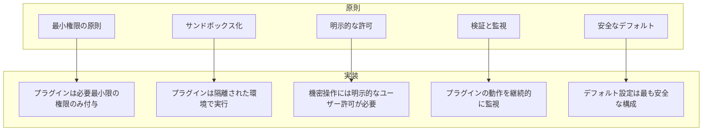

## セキュリティリスク分析 🔍

プラグインシステムには以下の主要なセキュリティリスクがあります：

### 1. 不正なシステムアクセス

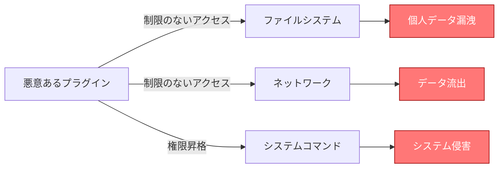

### 2. プライバシーリスク

- ユーザーの編集プロジェクトへの不正アクセス
- メディアファイルの流出
- 使用パターンの追跡とプロファイリング
- 設定情報やアプリケーション状態の漏洩

### 3. アプリケーション安定性リスク

- リソースの過剰使用（CPU、メモリ、ディスク）
- クラッシュや不安定化を引き起こす不適切な操作
- 他のプラグインとの競合
- データ破損やプロジェクトファイルの損傷

### 4. GDPR等の規制への対応

- ユーザーデータの処理と同意
- データ処理の透明性の確保
- プラグインのデータ処理ポリシーの明示

## 権限モデル 👮

edvプラグインシステムは細分化された権限モデルを採用し、プラグインに必要最小限の権限のみを付与します。

### 権限カテゴリ

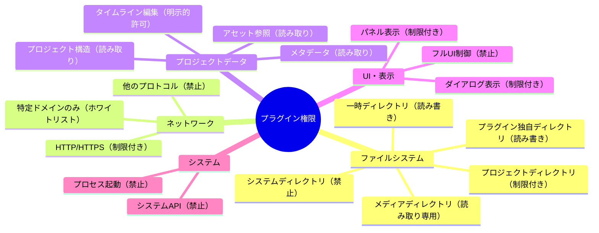

### 権限レベル

プラグインは以下の権限レベルに分類されます：

1. **基本レベル（デフォルト）**
   - プラグイン独自ディレクトリへの読み書きアクセス
   - 一時ディレクトリへのアクセス
   - UIコンポーネントの提供（限定的）
   - プロジェクトデータの読み取り（メタデータのみ）

2. **標準レベル（確認要）**
   - 基本レベルのすべての権限
   - 特定のネットワークアクセス（HTTPSのみ、ホワイトリストドメイン）
   - プロジェクトアセットへの読み取りアクセス
   - エフェクトの適用と処理

3. **拡張レベル（明示的許可要）**
   - 標準レベルのすべての権限
   - プロジェクトデータの変更
   - 選択されたシステムディレクトリへの読み取りアクセス
   - 広範なネットワークアクセス

4. **管理者レベル（開発者用）**
   - すべての権限
   - デバッグ目的でのみ使用

## 権限実装メカニズム 🔧

edvプラグインシステムは以下のメカニズムを使用して権限を実装します：

### 1. サンドボックス技術

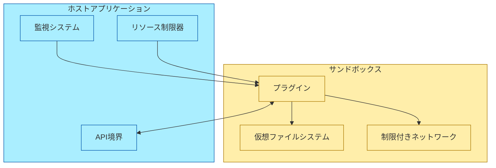

#### サンドボックスの主要コンポーネント:

- **仮想ファイルシステム（VFS）**: プラグインのファイルアクセスを制御します
- **リソース制限**: CPU、メモリ、ディスク使用量を制限します
- **ネットワークフィルタリング**: 許可されたネットワーク接続のみを許可します
- **APIゲートウェイ**: ホストアプリケーションとの通信を仲介します

### 2. 権限実施方法

```rust
// プラグインホスト実装の一部
struct SecurePluginHost {
    plugin_id: String,
    permission_level: PermissionLevel,
    allowed_domains: Vec<String>,
    allowed_directories: HashMap<PathBuf, DirectoryPermission>,
    resource_limits: ResourceLimits,
    user_consent: HashMap<Permission, bool>,
    logger: Logger,
}

impl PluginHost for SecurePluginHost {
    // ファイルアクセス権限のチェック
    fn open_file(&self, path: &Path, mode: FileMode) -> Result<FileHandle, PluginError> {
        // パスが許可されているか確認
        let allowed = self.allowed_directories.iter().any(|(dir, perm)| {
            path.starts_with(dir) && match mode {
                FileMode::Read => true,
                FileMode::Write => *perm == DirectoryPermission::ReadWrite,
                FileMode::Append => *perm == DirectoryPermission::ReadWrite,
            }
        });
        
        if !allowed {
            return Err(PluginError::InsufficientPermissions(format!(
                "ファイル {} へのアクセス権限がありません", path.display()
            )));
        }
        
        // アクセスを記録
        self.logger.debug(&format!("プラグイン {} がファイル {} を {:?} モードで開きました",
            self.plugin_id, path.display(), mode));
        
        // 実際のファイルオープン処理
        // ...
    }
    
    // ネットワークアクセス権限のチェック
    fn http_request(&self, url: &str, method: &str) -> Result<HttpResponse, PluginError> {
        // URLが許可されているか確認
        let url_parsed = url::Url::parse(url)
            .map_err(|e| PluginError::InvalidArgument(format!("無効なURL: {}", e)))?;
        
        let host = url_parsed.host_str().ok_or_else(|| 
            PluginError::InvalidArgument("ホスト名がありません".to_string()))?;
        
        // ホワイトリストチェック
        if !self.allowed_domains.iter().any(|domain| host.ends_with(domain)) {
            return Err(PluginError::InsufficientPermissions(format!(
                "ドメイン {} へのアクセス権限がありません", host
            )));
        }
        
        // HTTPSプロトコル強制（標準レベル以上）
        if self.permission_level <= PermissionLevel::Standard && url_parsed.scheme() != "https" {
            return Err(PluginError::InsufficientPermissions(
                "HTTPSプロトコルのみ許可されています".to_string()
            ));
        }
        
        // アクセスを記録
        self.logger.debug(&format!("プラグイン {} が {} {} にリクエストを送信しました",
            self.plugin_id, method, url));
        
        // 実際のHTTPリクエスト処理
        // ...
    }
    
    // プロジェクトデータ変更権限のチェック
    fn modify_project_data(&self, project_id: &str, operation: &ModifyOperation)
        -> Result<(), PluginError> {
        // 拡張レベル以上の権限が必要
        if self.permission_level < PermissionLevel::Extended {
            // ユーザー同意を確認
            if let Some(true) = self.user_consent.get(&Permission::ModifyProject) {
                // 同意済み
            } else {
                return Err(PluginError::InsufficientPermissions(
                    "プロジェクト変更には明示的な許可が必要です".to_string()
                ));
            }
        }
        
        // 操作を記録
        self.logger.info(&format!("プラグイン {} がプロジェクト {} に {:?} 操作を実行しました",
            self.plugin_id, project_id, operation));
        
        // 実際のプロジェクト変更処理
        // ...
    }
}
```

### 3. ユーザー同意システム

プラグインがより高度な権限を必要とする場合、ユーザーからの明示的な同意を要求します：

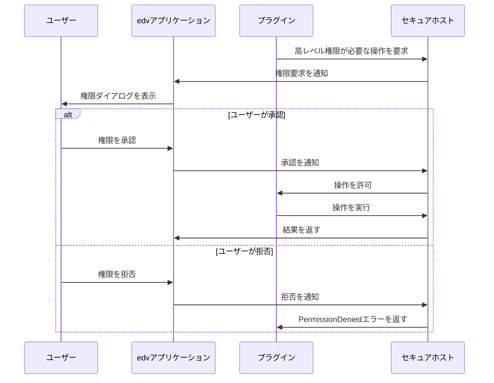

権限リクエストのユーザーインターフェース例：

```
┌─────────────────────────────────────────────────────┐
│  プラグイン「画像エンハンサー」が権限を要求しています │
├─────────────────────────────────────────────────────┤
│                                                     │
│  このプラグインは以下の権限を要求しています：          │
│                                                     │
│  ☑ インターネットアクセス                            │
│    • api.enhancer.com へのアクセス                   │
│    • 画像処理APIと通信するため                        │
│                                                     │
│  ☑ プロジェクトファイルの変更                         │
│    • 選択した画像に拡張処理を適用するため              │
│                                                     │
│  以下のデータが送信される可能性があります：             │
│    • 選択した画像（プライバシーポリシーを確認）         │
│                                                     │
│                                                     │
│          ┌─────────┐      ┌──────────┐             │
│          │  拒否   │      │   許可   │             │
│          └─────────┘      └──────────┘             │
└─────────────────────────────────────────────────────┘
```

## リソース制限と監視 📊

プラグインが過剰なリソースを消費しないように、以下の制限と監視が実施されます：

### 1. リソース制限

```rust
struct ResourceLimits {
    max_memory_mb: usize,       // 最大メモリ使用量 (MB)
    max_cpu_percent: f32,       // 最大CPU使用率 (%)
    max_disk_space_mb: usize,   // 最大ディスク使用量 (MB)
    max_network_mb: usize,      // 最大ネットワーク帯域幅 (MB)
    io_operations_per_sec: u32, // 1秒あたりの最大IO操作数
    max_execution_time_ms: u64, // 単一操作の最大実行時間 (ms)
}
```

### 2. 監視システム

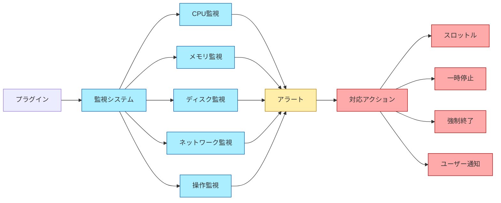

### 3. 異常検出と対応

リソース使用量の異常を検出した場合、以下の対応を実施します：

1. **スロットリング**: リソース使用量が閾値を超えた場合、プラグインの動作を遅くします
2. **一時停止**: 継続的な高リソース使用がある場合、プラグインを一時的に停止します
3. **強制終了**: 重大なリソース枯渇や異常動作がある場合、プラグインを強制終了します
4. **ユーザー通知**: 異常を検出した場合、ユーザーに通知し対応を求めます

## コード署名と検証 ✅

プラグインの安全性を確保するために、コード署名と検証メカニズムを実装します：

### 1. 署名プロセス

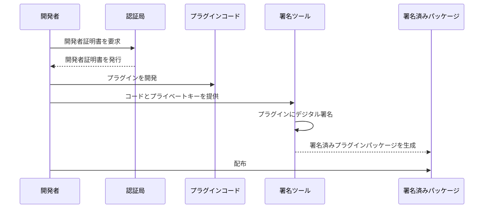

### 2. 検証プロセス

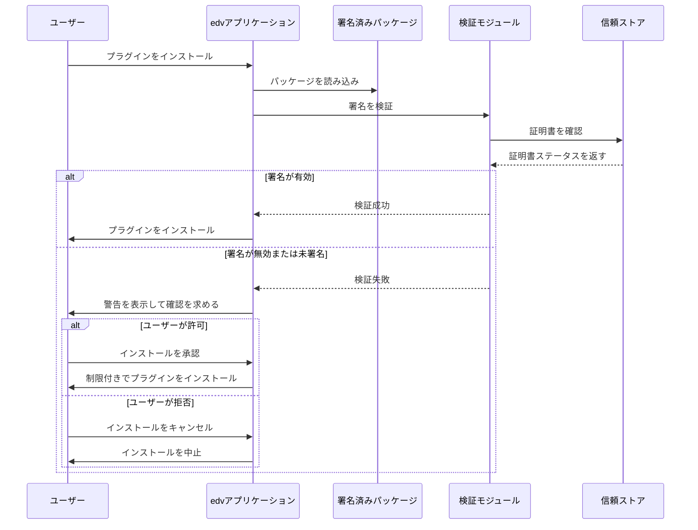

### 3. 署名検証の実装

```rust
// プラグインの署名検証
fn verify_plugin_signature(plugin_path: &Path) -> Result<SignatureStatus, PluginError> {
    // プラグインパッケージから署名情報を抽出
    let package = PluginPackage::from_path(plugin_path)?;
    let signature = package.signature().ok_or(PluginError::UnsignedPlugin)?;
    let certificate = package.certificate().ok_or(PluginError::InvalidSignature("証明書がありません".to_string()))?;
    
    // 証明書チェーンを検証
    let cert_chain_status = verify_certificate_chain(certificate)?;
    
    // 証明書が信頼できない場合
    if !cert_chain_status.trusted {
        return Ok(SignatureStatus::UntrustedCertificate);
    }
    
    // 証明書の失効状態を確認
    let revocation_status = check_certificate_revocation(certificate)?;
    if revocation_status.revoked {
        return Ok(SignatureStatus::RevokedCertificate);
    }
    
    // パッケージコンテンツの整合性検証
    let content_hash = package.calculate_content_hash()?;
    let signature_valid = verify_signature(&content_hash, &signature, &certificate.public_key())?;
    
    if !signature_valid {
        return Ok(SignatureStatus::InvalidSignature);
    }
    
    // プラグインIDと証明書の対応を検証
    let plugin_id = package.manifest().id();
    if !certificate.subject_matches(plugin_id) {
        return Ok(SignatureStatus::IdentityMismatch);
    }
    
    // すべての検証を通過
    Ok(SignatureStatus::Valid)
}
```

## プラグインストア 🏪

edvは信頼できるプラグインを配布するための公式プラグインストアを提供します：

### 1. セキュリティレビュープロセス

すべての公式プラグインは以下のレビュープロセスを経ます：

1. **自動検査**:
   - マルウェアスキャン
   - 脆弱性検査
   - API使用分析
   - リソース使用分析

2. **人的レビュー**:
   - コードレビュー
   - 権限使用の妥当性チェック
   - プライバシー方針の確認

3. **承認プロセス**:
   - セキュリティレベル割り当て
   - 権限ラベリング
   - 署名と検証

### 2. プラグインのセキュリティラベル

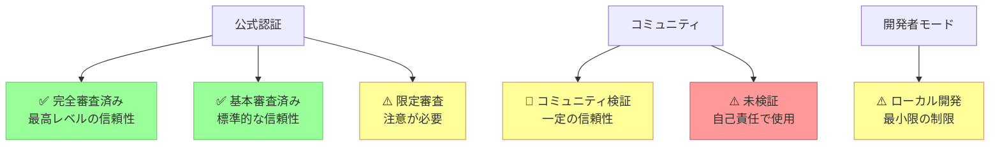

## セキュリティインシデント対応 🚨

セキュリティ問題が発見された場合の対応プロセス：

### 1. プラグインの緊急無効化

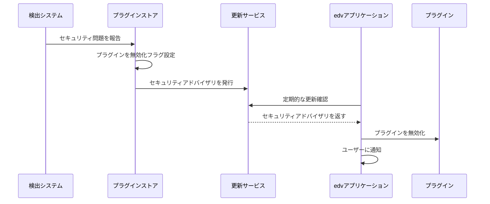

### 2. 脆弱性管理プロセス

1. **報告**: セキュリティ脆弱性の報告受付
2. **評価**: 影響範囲と深刻度の評価
3. **封じ込め**: 脆弱なプラグインの無効化と隔離
4. **修正**: 開発者との協力による問題修正
5. **検証**: 修正の有効性確認
6. **再公開**: 修正されたプラグインの再公開
7. **通知**: ユーザーへの通知と更新促進

## 開発者向けセキュリティガイドライン 📝

プラグイン開発者向けのセキュリティベストプラクティス：

### 1. 安全なコーディング規範

```rust
// ❌ 安全でない実装
fn process_user_input(input: &str) -> Result<(), Error> {
    // 入力検証がない
    let cmd = format!("convert {} output.png", input);
    std::process::Command::new("sh")
        .arg("-c")
        .arg(cmd)
        .output()?;
    Ok(())
}

// ✅ 安全な実装
fn process_user_input(input: &str) -> Result<(), Error> {
    // 入力パスの検証
    let path = std::path::Path::new(input);
    if !path.exists() || !path.is_file() {
        return Err(Error::InvalidInput("ファイルが存在しません".to_string()));
    }
    
    // パスの正規化と検証
    let canonical_path = path.canonicalize()?;
    if !is_within_allowed_directory(&canonical_path) {
        return Err(Error::PermissionDenied("許可されていないディレクトリです".to_string()));
    }
    
    // 安全なAPIの使用
    let img = image::open(&canonical_path)?;
    img.save("output.png")?;
    Ok(())
}
```

### 2. 権限使用のベストプラクティス

1. **最小権限の要求**:
   - 必要最小限の権限のみを要求する
   - 権限の必要性を明確に説明する

2. **段階的な権限要求**:
   - 初回起動時にすべての権限を要求せず、必要に応じて段階的に要求する
   - 特定の機能を使用する際に関連する権限のみを要求する

3. **明確な使用目的の説明**:
   - 各権限の使用目的をユーザーに明確に説明する
   - 個人データの収集理由と使用方法を透明にする

4. **オプショナルな機能分離**:
   - 高度な権限が必要な機能は分離し、オプショナルにする
   - 基本機能は最小権限で動作するようにする

### 3. セキュリティテスト

プラグイン開発時に実施すべきセキュリティテスト：

- **静的解析**: コードの脆弱性を検出するための静的解析ツールの利用
- **依存関係スキャン**: 使用するライブラリの脆弱性チェック
- **境界テスト**: 権限境界の効果を検証するテスト
- **リソース使用テスト**: 異常なリソース使用シナリオでのテスト
- **エラー処理テスト**: 異常なエラー状態での動作確認

## ユーザー向けセキュリティガイド 👤

edvを安全に使用するためのユーザー向けガイドライン：

### 1. プラグインのインストールと管理

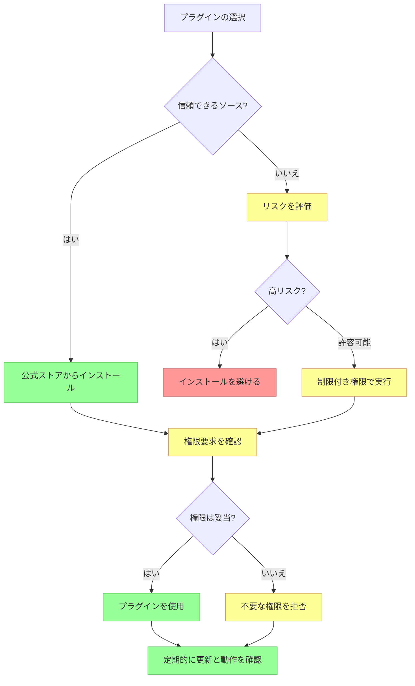

### 2. セキュリティ警告サインの認識

以下のような警告サインに注意してください：

- **過剰な権限要求**: 機能に対して不釣り合いな権限を要求するプラグイン
- **不安定な動作**: 頻繁にクラッシュするプラグイン
- **異常なリソース使用**: 過剰なCPUやメモリを使用するプラグイン
- **不審なネットワーク活動**: 頻繁または大量のデータを送信するプラグイン
- **望ましくない変更**: ユーザーの同意なく設定や環境を変更するプラグイン

### 3. セキュリティインシデントの報告

セキュリティ問題を発見した場合の報告方法：

1. プラグインを即時無効化する
2. edvセキュリティチームに報告する:
   - security@edv-project.org
   - バグ追跡システムのセキュリティ報告フォーム
3. 問題の詳細、再現手順、影響範囲を提供する
4. 修正が公開されるまで問題を公表しない (責任ある開示)

## 関連ドキュメント 📚

- [01_プラグイン基本設計.md](./01_プラグイン基本設計.md) - プラグインシステムの基本設計
- [02_プラグインインターフェース.md](./02_プラグインインターフェース.md) - プラグインAPI
- [03_プラグインライフサイクル.md](./03_プラグインライフサイクル.md) - プラグインのライフサイクル
- [05_プラグイン開発ガイド.md](./05_プラグイン開発ガイド.md) - 開発者向けガイド（予定） 