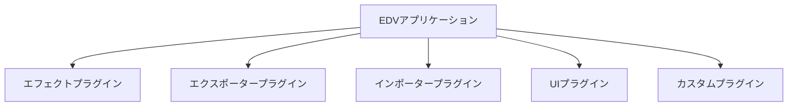

# プラグイン開発ガイド

## 概要 🚀

このドキュメントではEDVプラグインの開発方法について詳しく説明します。開発環境のセットアップから基本的なプラグイン実装、テスト、配布までの一連の流れを解説します。このガイドに従うことで、独自のプラグインを簡単に開発できるようになります。

**最終更新日: 2025年4月1日 09:26:53**

## 目次 📑

1. [開発環境のセットアップ](#開発環境のセットアップ)
2. [プラグインの基本構造](#プラグインの基本構造)
3. [プラグインの種類と選択](#プラグインの種類と選択)
4. [プラグインの実装](#プラグインの実装)
5. [プラグインのテスト](#プラグインのテスト)
6. [プラグインの配布](#プラグインの配布)
7. [実装例と参考コード](#実装例と参考コード)
8. [よくある質問とトラブルシューティング](#よくある質問とトラブルシューティング)

## 開発環境のセットアップ 🛠️

### 必要なツール

- **Rust** (1.68以上)
- **Cargo**
- **edv-plugin-sdk**
- **pkg-config** (Linuxの場合)
- **C++ビルドツール** (プラットフォームに依存)

### インストール手順

#### Rustツールチェーンのインストール

Rustがインストールされていない場合は、Rustupを使ってインストールします：

```bash
# Unix系OS（Linux, macOS）
curl --proto '=https' --tlsv1.2 -sSf https://sh.rustup.rs | sh

# Windows
curl -sSf https://static.rust-lang.org/rustup/dist/x86_64-pc-windows-msvc/rustup-init.exe -o rustup-init.exe
rustup-init.exe
```

#### EDVプラグイン開発キットのインストール

```bash
# EDVプラグイン開発キットのインストール
cargo install edv-plugin-sdk

# バージョン確認
edv-plugin-sdk --version
```

#### プラグインプロジェクトの作成

```bash
# プラグインテンプレートの生成
edv-plugin-sdk new my-awesome-plugin --type effect

# ディレクトリに移動
cd my-awesome-plugin
```

`--type` オプションには、作成するプラグインの種類を指定します：
- `effect` - エフェクトプラグイン
- `exporter` - エクスポータープラグイン
- `importer` - インポータープラグイン
- `ui` - UIプラグイン
- `custom` - カスタムプラグイン

### プラットフォーム別の追加設定

#### Linux

Linuxでは、いくつかの開発ライブラリが必要です：

```bash
# Ubuntu/Debian
sudo apt install build-essential pkg-config libssl-dev

# Fedora
sudo dnf install gcc gcc-c++ make pkgconfig openssl-devel
```

#### macOS

Xcodeコマンドラインツールが必要です：

```bash
xcode-select --install
```

#### Windows

Visual Studio Build Toolsが必要です：
1. [Visual Studio Build Tools](https://visualstudio.microsoft.com/visual-cpp-build-tools/)をダウンロードしてインストール
2. インストール時に「C++によるデスクトップ開発」ワークロードを選択

## プラグインの基本構造 📂

EDVプラグインは、Rust言語で作成されたダイナミックライブラリ（`.so`、`.dll`、`.dylib`）とマニフェストファイル（`plugin.toml`）から構成されます。

### プロジェクト構造

プラグインテンプレートの基本構造：

```
my-awesome-plugin/
├── Cargo.toml              # 依存関係と設定
├── plugin.toml             # プラグインマニフェスト
├── src/
│   ├── lib.rs              # プラグインのエントリーポイント
│   ├── plugin.rs           # Pluginトレイト実装
│   └── effect.rs           # 実際のプラグイン機能実装
├── assets/                 # リソースファイル
│   ├── images/             # プラグインで使用する画像
│   └── data/               # その他のデータファイル
└── tests/                  # テストファイル
```

### マニフェストファイル

`plugin.toml` ファイルにはプラグインのメタデータを記述します：

```toml
[plugin]
id = "com.example.my-awesome-plugin"
name = "My Awesome Plugin"
version = "0.1.0"
author = "Your Name"
description = "This plugin does awesome things"
api_version = "1.0"
plugin_type = "effect"
entry_point = "create_plugin"

[dependencies]
# 依存するプラグインがあれば記述
# "com.example.other-plugin" = { min-version = "0.5.0", required = true }

[capabilities]
has_settings_ui = true
supports_hot_reload = false
supports_async = true
gpu_accelerated = false
thread_safe = true
```

### Cargo.toml設定

```toml
[package]
name = "edv-my-awesome-plugin"
version = "0.1.0"
edition = "2021"
authors = ["Your Name <your.email@example.com>"]
description = "My Awesome Plugin for EDV"
license = "MIT OR Apache-2.0"
repository = "https://github.com/yourusername/edv-my-awesome-plugin"

[lib]
crate-type = ["cdylib"]  # ダイナミックライブラリとしてビルド

[dependencies]
edv-plugin-api = "1.0"  # プラグインAPI
serde = { version = "1.0", features = ["derive"] }
serde_json = "1.0"
log = "0.4"
image = "0.24"

[dev-dependencies]
edv-plugin-test-utils = "1.0"  # テスト用ユーティリティ
```

## プラグインの種類と選択 🧩

EDVは以下のプラグインタイプをサポートしています：



### 1. エフェクトプラグイン

画像や動画に視覚効果を適用するプラグイン。

**ユースケース：**
- フィルター（セピア、白黒、色調補正など）
- オーバーレイ（テキスト、画像、ウォーターマークなど）
- 変形（回転、反転、クロップなど）

**実装するトレイト：**
- `Plugin` (基本)
- `EffectPlugin` (効果機能)
- オプション: `SettingsAccess` (設定管理)

### 2. エクスポータープラグイン

特定のファイル形式へのエクスポート機能を提供するプラグイン。

**ユースケース：**
- 特殊な画像/動画フォーマットへの出力
- カスタムメタデータを含む出力
- クラウドサービスへの直接アップロード

**実装するトレイト：**
- `Plugin` (基本)
- `ExporterPlugin` (エクスポート機能)
- オプション: `SettingsAccess` (設定管理)

### 3. インポータープラグイン

特定のファイル形式からのインポート機能を提供するプラグイン。

**ユースケース：**
- 特殊な画像/動画フォーマットの読み込み
- ベクター画像の読み込みと変換
- 特殊なカメラ形式のサポート

**実装するトレイト：**
- `Plugin` (基本)
- `ImporterPlugin` (インポート機能)
- オプション: `SettingsAccess` (設定管理)

### 4. UIプラグイン

ユーザーインターフェースをカスタマイズするプラグイン。

**ユースケース：**
- カスタムパネルやツール
- 特殊な編集インターフェース
- テーマやスタイルのカスタマイズ

**実装するトレイト：**
- `Plugin` (基本)
- `UserInterfacePlugin` (UI機能)
- オプション: `SettingsAccess` (設定管理)

### 5. カスタムプラグイン

上記のカテゴリに当てはまらない特殊な機能を提供するプラグイン。

**ユースケース：**
- 自動化スクリプト
- 外部サービス連携
- バッチ処理ツール

**実装するトレイト：**
- `Plugin` (基本)
- `CustomPlugin` (カスタム機能)
- オプション: `SettingsAccess` (設定管理)

## プラグインの実装 💻

### 1. 基本的なプラグイン実装

すべてのプラグインは `Plugin` トレイトを実装する必要があります：

```rust
use edv_plugin_api::*;
use std::sync::{Arc, Mutex};
use std::collections::HashMap;

pub struct MyPlugin {
    metadata: PluginMetadata,
    capabilities: PluginCapabilities,
    settings: Mutex<HashMap<String, String>>,
    host: Option<Arc<dyn Host>>,
    initialized: bool,
}

impl MyPlugin {
    pub fn new() -> Self {
        // メタデータを設定
        let metadata = PluginMetadata {
            id: "com.example.my-plugin".to_string(),
            name: "My Plugin".to_string(),
            version: "1.0.0".to_string(),
            author: "Your Name".to_string(),
            description: "My awesome plugin description".to_string(),
            plugin_type: PluginType::Effect,
            api_version: "1.0".to_string(),
        };

        // 機能を設定
        let capabilities = PluginCapabilities {
            has_settings_ui: true,
            supports_hot_reload: false,
            supports_async: true,
            gpu_accelerated: false,
            thread_safe: true,
        };

        Self {
            metadata,
            capabilities,
            settings: Mutex::new(HashMap::new()),
            host: None,
            initialized: false,
        }
    }
}

impl Plugin for MyPlugin {
    fn metadata(&self) -> &PluginMetadata {
        &self.metadata
    }

    fn capabilities(&self) -> &PluginCapabilities {
        &self.capabilities
    }

    fn initialize(&mut self, host: Arc<dyn Host>) -> Result<(), String> {
        log::info!("プラグインを初期化中...");
        self.host = Some(host.clone());
        
        // 設定の読み込み
        if let Some(saved_settings) = host.load_plugin_settings(&self.metadata.id) {
            let mut settings = self.settings.lock().unwrap();
            for (key, value) in saved_settings {
                settings.insert(key, value);
            }
        }
        
        self.initialized = true;
        log::info!("プラグイン初期化完了");
        Ok(())
    }

    fn shutdown(&mut self) -> Result<(), String> {
        log::info!("プラグインをシャットダウン中...");
        
        // 設定の保存
        if let Some(host) = &self.host {
            let settings = self.settings.lock().unwrap();
            host.save_plugin_settings(&self.metadata.id, settings.clone());
        }
        
        self.initialized = false;
        log::info!("プラグインシャットダウン完了");
        Ok(())
    }

    fn is_initialized(&self) -> bool {
        self.initialized
    }
}
```

### 2. エフェクトプラグインの実装

エフェクトプラグインは、`EffectPlugin` トレイトを実装します：

```rust
impl EffectPlugin for MyPlugin {
    fn apply_effect(&self, image: &mut Image) -> Result<(), String> {
        if !self.initialized {
            return Err("プラグインが初期化されていません".to_string());
        }

        log::info!("エフェクトを適用中...");
        
        // 画像処理ロジックの実装
        for y in 0..image.height() {
            for x in 0..image.width() {
                let pixel = image.get_pixel(x, y);
                
                // 例: 明るさ調整
                let brightness_factor = 1.2;
                let r = (pixel.r as f32 * brightness_factor).min(255.0) as u8;
                let g = (pixel.g as f32 * brightness_factor).min(255.0) as u8;
                let b = (pixel.b as f32 * brightness_factor).min(255.0) as u8;
                
                image.set_pixel(x, y, Pixel::new(r, g, b, pixel.a));
            }
        }
        
        log::info!("エフェクト適用完了");
        Ok(())
    }

    fn get_effect_name(&self) -> String {
        "明るさ強調".to_string()
    }

    fn get_effect_description(&self) -> String {
        "画像の明るさを20%増加させます".to_string()
    }
}
```

### 3. エクスポータープラグインの実装

エクスポータープラグインは、`ExporterPlugin` トレイトを実装します：

```rust
use std::path::Path;
use std::fs::File;
use std::io::BufWriter;

impl ExporterPlugin for MyPlugin {
    fn export(&self, image: &Image, path: &Path) -> Result<(), String> {
        if !self.initialized {
            return Err("プラグインが初期化されていません".to_string());
        }

        log::info!("画像をエクスポート中: {}", path.display());
        
        // ファイルを開く
        let file = File::create(path).map_err(|e| {
            format!("ファイルの作成に失敗しました: {}", e)
        })?;
        
        let buffer = BufWriter::new(file);
        
        // エクスポートロジック
        // 例: PNGとしてエクスポート
        let encoder = png::Encoder::new(buffer, image.width(), image.height());
        // 実際のエンコードロジック...
        
        log::info!("エクスポート完了");
        Ok(())
    }

    fn get_supported_extensions(&self) -> Vec<String> {
        vec!["png".to_string()]
    }

    fn get_exporter_name(&self) -> String {
        "PNG形式".to_string()
    }

    fn get_exporter_description(&self) -> String {
        "画像をPNG形式でエクスポートします".to_string()
    }
}
```

### 4. インポータープラグインの実装

インポータープラグインは、`ImporterPlugin` トレイトを実装します：

```rust
use std::path::Path;

impl ImporterPlugin for MyPlugin {
    fn import(&self, path: &Path) -> Result<Image, String> {
        if !self.initialized {
            return Err("プラグインが初期化されていません".to_string());
        }

        log::info!("画像をインポート中: {}", path.display());
        
        // ファイルを開いて読み込む
        let file = File::open(path).map_err(|e| {
            format!("ファイルを開けませんでした: {}", e)
        })?;
        
        // インポートロジック
        // 例: 特殊な画像フォーマットを読み込む
        // 実際のデコードロジック...
        
        // 仮の画像作成
        let width = 800;
        let height = 600;
        let mut image = Image::new(width, height);
        
        log::info!("インポート完了");
        Ok(image)
    }

    fn get_supported_extensions(&self) -> Vec<String> {
        vec!["xyz".to_string()]
    }

    fn get_importer_name(&self) -> String {
        "XYZ形式".to_string()
    }

    fn get_importer_description(&self) -> String {
        "XYZ形式の画像をインポートします".to_string()
    }
}
```

### 5. UIプラグインの実装

UIプラグインは、`UserInterfacePlugin` トレイトを実装します：

```rust
impl UserInterfacePlugin for MyPlugin {
    fn register_components(&self, registry: &mut dyn UiComponentRegistry) -> Result<(), String> {
        if !self.initialized {
            return Err("プラグインが初期化されていません".to_string());
        }

        log::info!("UIコンポーネントを登録中...");
        
        // コンポーネント登録ロジック
        registry.register_panel("my-panel", "マイパネル", move |ctx| {
            // パネルのレンダリングロジック
            // ...
        })?;
        
        log::info!("UI登録完了");
        Ok(())
    }

    fn provide_theme(&self) -> Option<UiTheme> {
        // カスタムテーマの提供（オプション）
        Some(UiTheme {
            name: "マイテーマ".to_string(),
            primary_color: "#3498db".to_string(),
            secondary_color: "#2ecc71".to_string(),
            background_color: "#ecf0f1".to_string(),
            text_color: "#2c3e50".to_string(),
            // その他のテーマ設定...
        })
    }

    fn register_menu_items(&self, registry: &mut dyn MenuRegistry) -> Result<(), String> {
        // メニュー項目の登録（オプション）
        registry.register_menu_item("tools", "my-tool", "マイツール", None, move |ctx| {
            // メニュー項目のアクションロジック
            // ...
        })?;
        
        Ok(())
    }
}
```

### 6. 設定アクセスの実装

プラグインに設定機能を追加するには、`SettingsAccess` トレイトを実装します：

```rust
impl SettingsAccess for MyPlugin {
    fn get_settings(&self) -> HashMap<String, String> {
        self.settings.lock().unwrap().clone()
    }

    fn update_settings(&self, new_settings: HashMap<String, String>) -> Result<(), String> {
        let mut settings = self.settings.lock().unwrap();
        
        // 設定値の検証
        for (key, value) in &new_settings {
            if key == "intensity" {
                if let Ok(intensity) = value.parse::<f32>() {
                    if intensity < 0.0 || intensity > 1.0 {
                        return Err("強度は0.0から1.0の範囲で指定してください".to_string());
                    }
                } else {
                    return Err("強度は数値で指定してください".to_string());
                }
            }
        }
        
        // 設定を更新
        for (key, value) in new_settings {
            settings.insert(key, value);
        }
        
        // 設定を保存
        if let Some(host) = &self.host {
            host.save_plugin_settings(&self.metadata.id, settings.clone());
        }
        
        Ok(())
    }
}
```

### 7. プラグインエントリーポイント

プラグインローダーがプラグインをロードするためのエントリーポイント関数を定義します：

```rust
#[no_mangle]
pub extern "C" fn create_plugin() -> Box<dyn Plugin> {
    Box::new(MyPlugin::new())
}
```

## プラグインのテスト 🧪

### ユニットテスト

プラグインのロジックをテストするためのユニットテストを作成します：

```rust
#[cfg(test)]
mod tests {
    use super::*;
    use edv_plugin_test_utils::*;
    
    #[test]
    fn test_plugin_metadata() {
        let plugin = MyPlugin::new();
        assert_eq!(plugin.metadata().id, "com.example.my-plugin");
        assert_eq!(plugin.metadata().name, "My Plugin");
    }
    
    #[test]
    fn test_plugin_capabilities() {
        let plugin = MyPlugin::new();
        assert!(plugin.capabilities().thread_safe);
        assert!(!plugin.capabilities().gpu_accelerated);
    }
    
    #[test]
    fn test_effect_application() {
        let plugin = MyPlugin::new();
        let mut image = create_test_image(100, 100);
        
        // プラグインを初期化
        let host = create_test_host();
        let mut plugin_mut = plugin;
        plugin_mut.initialize(host).unwrap();
        
        // エフェクトを適用
        let result = plugin_mut.apply_effect(&mut image);
        assert!(result.is_ok());
        
        // 結果を検証
        // 例: 画像の平均輝度が増加したことを確認
        let avg_brightness = calculate_average_brightness(&image);
        assert!(avg_brightness > 0.5);
    }
}
```

### 統合テスト

EDVアプリケーションでプラグインをテストするための統合テスト：

```rust
#[test]
fn test_plugin_in_app() {
    // プラグインをビルド
    let plugin_path = build_test_plugin();
    
    // テストアプリを起動
    let app = launch_test_app();
    
    // プラグインをロード
    app.load_plugin(&plugin_path).unwrap();
    
    // プラグインが正しく登録されていることを確認
    let plugins = app.get_registered_plugins();
    assert!(plugins.iter().any(|p| p.id() == "com.example.my-plugin"));
    
    // プラグインの機能をテスト
    let image = app.open_test_image();
    app.apply_effect("com.example.my-plugin", &image).unwrap();
    
    // 結果を検証
    // ...
    
    // アプリをクリーンアップ
    app.shutdown();
}
```

### テストスクリプト

プラグインのテストを自動化するスクリプト：

```bash
#!/bin/bash
set -e

# プラグインをビルド
cargo build --release

# ユニットテストを実行
cargo test

# テスト用EDVインスタンスでプラグインをテスト
edv-plugin-sdk test --plugin target/release/libmy_plugin.so
```

## プラグインの配布 📦

### ビルドと準備

プラグインをリリース用にビルドします：

```bash
# リリースビルド
cargo build --release

# 必要なファイルを準備
mkdir -p release/my-awesome-plugin
cp target/release/libmy_awesome_plugin.so release/my-awesome-plugin/
cp plugin.toml release/my-awesome-plugin/
cp -r assets release/my-awesome-plugin/
cp README.md LICENSE release/my-awesome-plugin/
```

### パッケージング

プラグインを配布用にパッケージング：

```bash
# ZIPアーカイブ作成
cd release
zip -r my-awesome-plugin.zip my-awesome-plugin/
```

### ドキュメントの準備

プラグインのユーザーマニュアル／ドキュメントを作成します：

```markdown
# マイプラグインのユーザーマニュアル

## インストール方法

1. ZIPファイルを解凍します
2. 解凍したフォルダを以下の場所に配置します：
   - Windows: `%APPDATA%\EDV\plugins\`
   - macOS: `~/Library/Application Support/EDV/plugins/`
   - Linux: `~/.local/share/EDV/plugins/`
3. EDVを起動します（既に起動している場合は再起動します）

## 使用方法

1. EDVのメニューから「エフェクト」を選択します
2. 「マイプラグイン」を選択します
3. 設定項目を調整します
4. 「適用」ボタンをクリックします

## 設定項目

- **強度**: エフェクトの強度（0.0〜1.0）
- **モード**: エフェクトのモード（標準、強、弱）

## よくある質問

...
```

### プラグインのバージョン管理

プラグインのバージョン管理とアップデート：

```toml
# Cargo.toml
[package]
name = "edv-my-awesome-plugin"
version = "1.0.0"  # メジャー.マイナー.パッチ

# plugin.toml
[plugin]
version = "1.0.0"
```

バージョン番号は[セマンティックバージョニング](https://semver.org/)に従ってください：
- **メジャー**: 互換性のない変更
- **マイナー**: 後方互換性のある機能追加
- **パッチ**: バグ修正など

## 実装例と参考コード 📝

### エフェクトプラグイン実装例

詳細な実装例は以下の文書を参照してください：
- [かわいいエフェクトプラグイン実装例](./examples/01_kawaii_effect.md)

### エクスポータープラグイン実装例

詳細な実装例は以下の文書を参照してください：
- [WebPエクスポータープラグイン実装例](./examples/02_webp_exporter.md)

### インポータープラグイン実装例

詳細な実装例は以下の文書を参照してください：
- [PSDインポータープラグイン実装例](./examples/03_psd_importer.md) (Coming Soon)

### UIプラグイン実装例

詳細な実装例は以下の文書を参照してください：
- [カスタムパネルUIプラグイン実装例](./examples/04_custom_panel_ui.md) (Coming Soon)

## よくある質問とトラブルシューティング 🔍

### コンパイルエラー

#### エラー: `cannot find crate edv_plugin_api`

**解決策:** パッケージの依存関係が正しく設定されているか確認してください：

```toml
[dependencies]
edv-plugin-api = "1.0"
```

#### エラー: `undefined reference to 'create_plugin'`

**解決策:** エントリーポイント関数の宣言が正しいことを確認してください：

```rust
#[no_mangle]
pub extern "C" fn create_plugin() -> Box<dyn Plugin> {
    Box::new(MyPlugin::new())
}
```

### ランタイムエラー

#### エラー: `プラグインがロードできません: 互換性のないAPI`

**解決策:** プラグインのAPI版数がEDVと一致しているか確認してください：

```toml
[plugin]
api_version = "1.0"  # EDVのバージョンと一致させる
```

#### エラー: `プラグインの初期化に失敗しました: ...`

**解決策:** `initialize()` メソッドのエラーハンドリングを確認してください。必要なリソースが利用可能であることを確認します。

### パフォーマンスの問題

#### 問題: `プラグインの処理が遅い`

**解決策:**
1. プロファイリングツールを使用して、ボトルネックを特定
2. 画像処理ループの最適化（例：並列処理）
3. メモリ割り当てを減らす
4. Rustのリリースビルド最適化を利用（`--release` フラグでビルド）

```rust
// 並列処理の例
use rayon::prelude::*;

// 画像の各行を並列処理
(0..image.height()).into_par_iter().for_each(|y| {
    for x in 0..image.width() {
        // ピクセル処理...
    }
});
```

### 設定の問題

#### 問題: `設定が保存されない`

**解決策:** `update_settings()` の実装を確認し、ホストオブジェクトを使って設定が正しく保存されているか確認してください：

```rust
if let Some(host) = &self.host {
    host.save_plugin_settings(&self.metadata.id, settings.clone());
}
```

## まとめ 🎯

このガイドでは、EDVプラグインシステムを使った独自のプラグイン開発方法について解説しました。基本的な概念から実際の実装例、テスト、配布までを網羅しています。

プラグイン開発に関する詳細やサポートが必要な場合は、以下のリソースを参照してください：

- [EDV公式ドキュメント](https://docs.edv.dev/jp/)
- [EDVプラグイン開発者フォーラム](https://forum.edv.dev/jp/plugins/)
- [EDVプラグインAPI参照](https://docs.edv.dev/jp/api/plugin/)
- [プラグイン開発サンプルリポジトリ](https://github.com/edv-dev/plugin-examples)

独自のプラグインを開発して、EDVの機能を拡張しましょう！ 