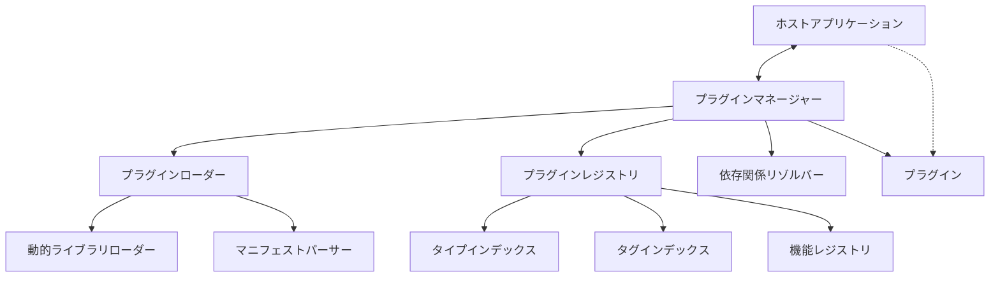
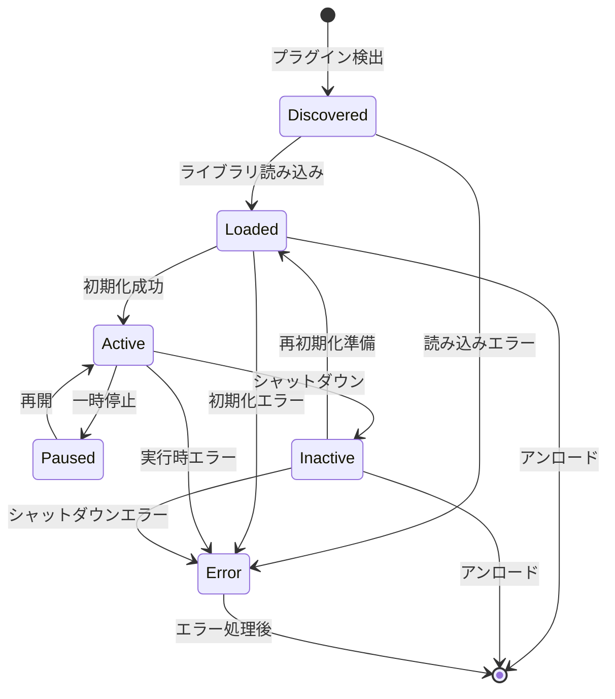
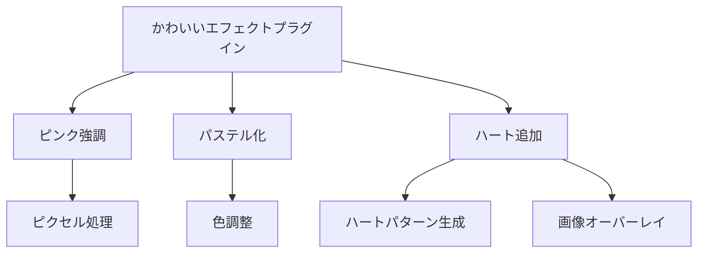
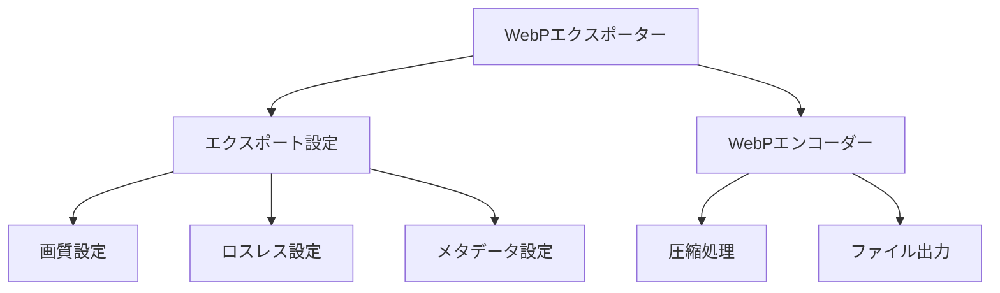
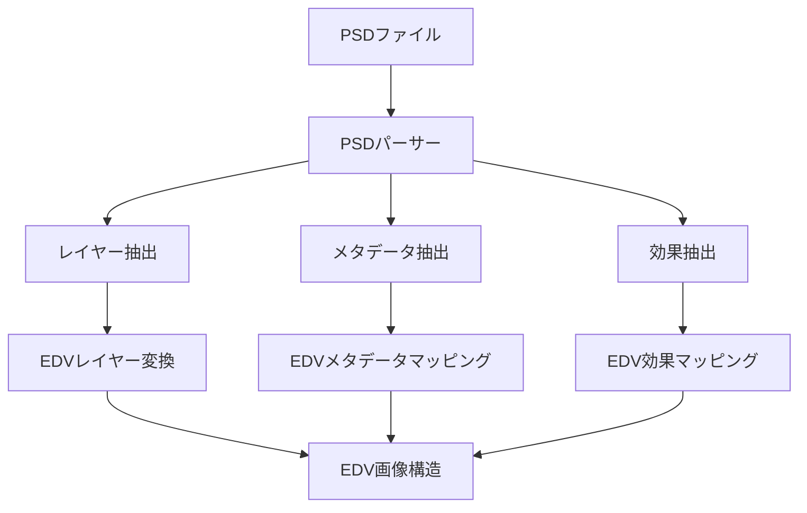
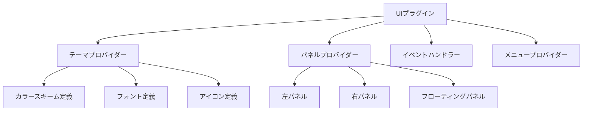

# プラグインシステム

EDVは強力なプラグインシステムを提供し、アプリケーションの機能を拡張できます。このドキュメントではプラグインシステムの設計と使用方法について説明します。

**最終更新日: 2025年4月1日 09:29:51**

## 概要

EDVプラグインシステムは、アプリケーションの機能を拡張するための柔軟なフレームワークを提供します。プラグインはアプリケーションのコア機能に影響を与えることなく、新しい機能を追加したり、既存の機能を拡張したりすることができます。

プラグインシステムは以下の特徴を持っています：

- 🔌 動的なプラグインの読み込みと初期化
- 🧩 多様なプラグインタイプのサポート
- 🔒 セキュリティモデルによる安全なプラグイン実行
- 🔄 ホットリロード（プラグインの動的な再読み込み）
- 📋 依存関係管理と実行順序の制御
- 🏷️ タグベースのプラグイン検索システム
- 🌐 機能ベースのプラグイン間通信

## プラグインタイプ

EDVは以下のプラグインタイプをサポートしています：

1. **エフェクトプラグイン** - ビデオやオーディオにエフェクトを適用
2. **エクスポータープラグイン** - 新しい出力フォーマットをサポート
3. **インポータープラグイン** - 新しい入力フォーマットをサポート
4. **UIプラグイン** - ユーザーインターフェースをカスタマイズ
5. **カスタムプラグイン** - その他のカスタム機能

## アーキテクチャ

プラグインシステムは以下のコンポーネントで構成されています：

- **プラグインマネージャー**: プラグインのライフサイクルを管理
- **プラグインローダー**: プラグインバイナリの読み込みと解析
- **プラグインレジストリ**: プラグインの登録と検索
- **プラグインホスト**: ホストアプリケーションとプラグインの通信を仲介



## プラグインのライフサイクル

プラグインは以下のライフサイクル状態を持ちます：



1. **検出済み（Discovered）** - プラグインが検出され、マニフェストが読み込まれた状態
2. **読み込み済み（Loaded）** - プラグインライブラリが読み込まれた状態
3. **アクティブ（Active）** - プラグインが初期化され、使用可能な状態
4. **一時停止（Paused）** - プラグインが一時的に停止された状態
5. **非アクティブ（Inactive）** - プラグインがシャットダウンされたが、まだアンロードされていない状態
6. **エラー（Error）** - エラーが発生した状態

## プラグインマニフェスト

各プラグインは`plugin.toml`マニフェストファイルを含む必要があります。このファイルはプラグインのメタデータと設定を定義します：

```toml
[plugin]
id = "com.example.my-plugin"
name = "サンプルプラグイン"
version = "1.0.0"
author = "開発者名"
description = "これはサンプルプラグインです"
type = "effect"
api_version = "1.0"
entry_point = "create_plugin"

[dependencies]
"com.example.other-plugin" = { min-version = "0.5.0", required = true }
"com.example.optional-plugin" = { min-version = "1.0.0", required = false }

[capabilities]
has_settings_ui = true
supports_hot_reload = true
supports_async = false
supports_gpu = true
thread_safe = true
```

## セキュリティモデル

EDVプラグインシステムは細かく設定可能な権限モデルを提供します：

- **ファイルシステムアクセス**: 読み取り/書き込み権限の制限
- **ネットワークアクセス**: アウトバウンド接続の制限
- **UIアクセス**: UIコンポーネントへのアクセス制限
- **リソース使用**: CPUとメモリ使用量の制限

プラグインの安全性を確保するために、サンドボックス化された実行環境を提供しています。

## サンプルプラグイン

EDVには以下のサンプルプラグインが含まれています：

### 1. かわいいエフェクトプラグイン



かわいいエフェクトプラグインは、画像にパステルカラーとハートエフェクトを適用する簡単なエフェクトプラグインです。

### 2. WebPエクスポータープラグイン



WebPエクスポーターは、画像をWebP形式でエクスポートするためのプラグインです。品質設定やロスレス圧縮オプションなどをサポートしています。

### 3. PSDインポータープラグイン



PSDインポータープラグインは、Adobe Photoshopファイル形式（`.psd`）をEDVに読み込むためのプラグインです。レイヤー構造やエフェクトを保持したままインポートできます。

### 4. カスタムパネルUIプラグイン



カスタムパネルUIプラグインは、EDVのユーザーインターフェースをカスタマイズし、新しいパネル、テーマ、および機能を追加するためのプラグインです。

## プラグイン開発ガイド

プラグイン開発者向けのガイドラインは以下のドキュメントを参照してください：

- [プラグイン基本設計](./01_プラグイン基本設計.md)
- [プラグインインターフェース](./02_プラグインインターフェース.md)
- [プラグインライフサイクル](./03_プラグインライフサイクル.md)
- [プラグインセキュリティ](./04_プラグインセキュリティ.md)
- [プラグイン開発ガイド](./05_プラグイン開発ガイド.md)

## サンプルプラグインのドキュメント

以下のドキュメントで各サンプルプラグインの詳細を確認できます：

- [かわいいエフェクトプラグイン](./examples/01_kawaii_effect.md)
- [WebPエクスポータープラグイン](./examples/02_webp_exporter.md)
- [PSDインポータープラグイン](./examples/03_importer_plugin.md)
- [カスタムパネルUIプラグイン](./examples/04_ui_plugin.md)
- [サンプルプラグイン集](./examples/index.md)

## プラグインの配置とディレクトリ構造

EDVは以下のディレクトリからプラグインを読み込みます：

1. **システムプラグインディレクトリ**
   - Linux: `/usr/lib/edv/plugins`, `/usr/local/lib/edv/plugins`
   - macOS: `/Library/Application Support/EDV/Plugins`, `/usr/local/lib/edv/plugins`
   - Windows: `C:\Program Files\EDV\Plugins`, `C:\Program Files (x86)\EDV\Plugins`

2. **ユーザープラグインディレクトリ**
   - Linux: `~/.local/share/EDV/plugins`
   - macOS: `~/Library/Application Support/EDV/plugins`
   - Windows: `%APPDATA%\EDV\plugins`

各プラグインは以下の構造を持つべきです：

```
plugin-directory/
├── plugin.toml           # プラグインマニフェスト
├── libplugin.so          # プラグインライブラリ（Linux）
├── plugin.dll            # プラグインライブラリ（Windows）
├── plugin.dylib          # プラグインライブラリ（macOS）
├── assets/               # リソースファイル（オプション）
│   ├── images/
│   ├── data/
│   └── ...
└── doc/                  # ドキュメント（オプション）
    ├── README.md
    └── ...
```

## プラグインのインターフェース実装

プラグインを開発するには、プラグインの種類に応じた特定のトレイトを実装する必要があります：


## API安定性

プラグインAPIは互換性のあるバージョン間では安定しています。APIバージョンは`major.minor`形式で表され、以下の互換性ルールに従います：

- **メジャーバージョンの変更**: 互換性のない変更（既存のプラグインは更新が必要）
- **マイナーバージョンの変更**: 後方互換性のある機能追加（既存のプラグインは影響なし）

## 今後の予定

現在、プラグインシステムの以下の機能が開発中、または計画中です：

- ✅ プラグイン間の依存関係解決とトポロジカルソート
- ✅ タグベースのプラグイン検索
- ✅ セキュリティモデルの実装
- ✅ ホットリロードサポート
- ✅ サンプルプラグインの実装（エフェクト、エクスポーター、インポーター、UI）
- ✅ プラグイン開発ガイドの執筆
- 🔄 プラグインマーケットプレイスの検討
- 🔄 プラグインテスト自動化フレームワークの開発
- 📅 プラグイン配布システムの設計
- 📅 プラグインバージョン管理と更新メカニズムの実装

プラグインシステムに関するフィードバックや質問は、GitHub Issuesを通じてお寄せください。

## コミュニティプラグイン

EDVは活発なプラグイン開発コミュニティを持っています。コミュニティによって開発されたプラグインは以下で見つけることができます：

- [EDVプラグインディレクトリ](https://edv.example.com/plugins)
- [GitHubトピック: edv-plugin](https://github.com/topics/edv-plugin)

独自のプラグインを開発して共有することを歓迎します！ 