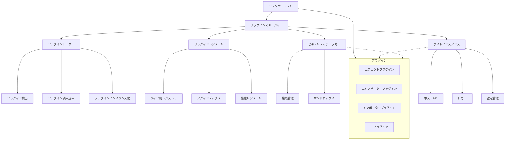
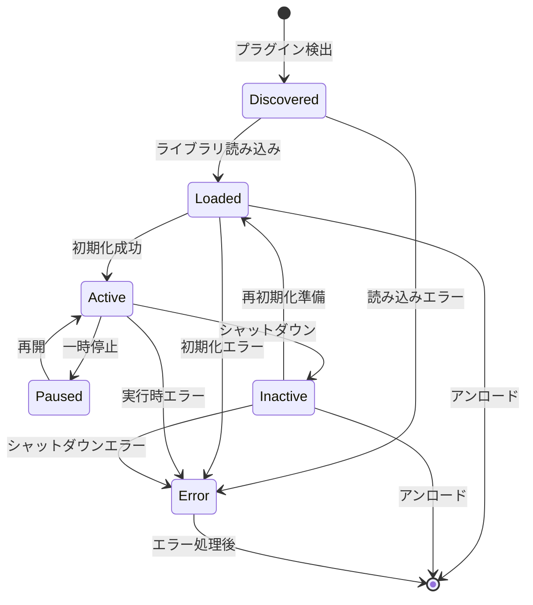
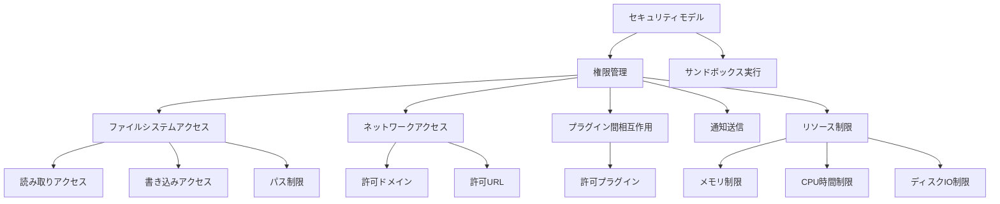
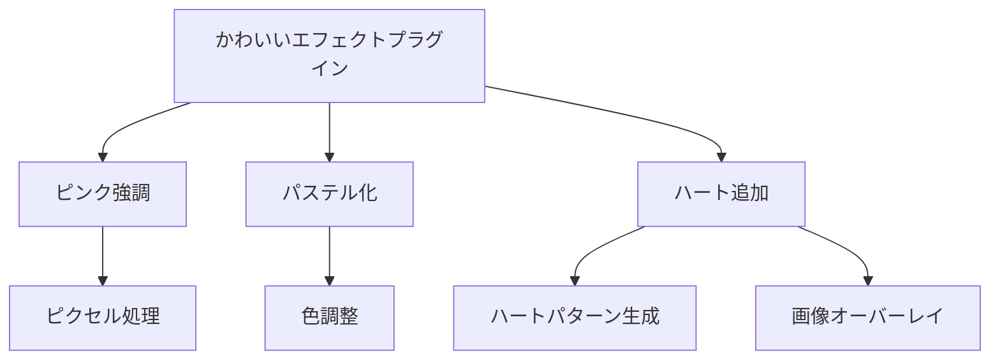
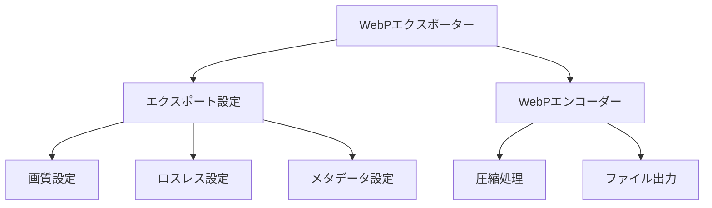
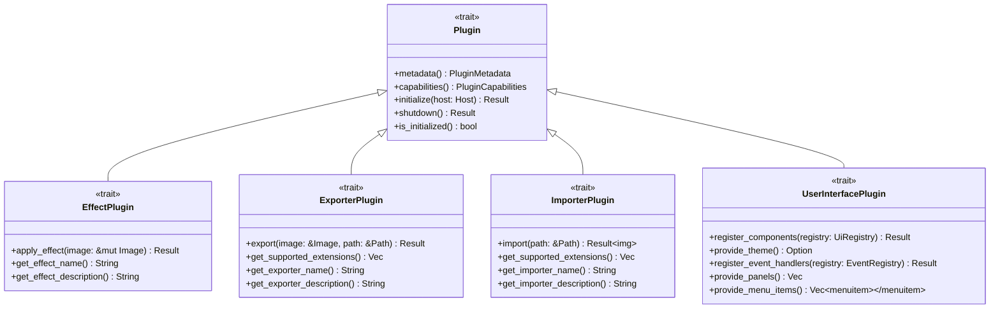

# プラグインシステム

EDVは強力なプラグインシステムを提供し、アプリケーションの機能を拡張できます。このドキュメントではプラグインシステムの設計と使用方法について説明します。

**最終更新日: 2025年4月1日 09:09:32**

## 概要

EDVプラグインシステムは、アプリケーションの機能を拡張するための柔軟なフレームワークを提供します。プラグインはアプリケーションのコア機能に影響を与えることなく、新しい機能を追加したり、既存の機能を拡張したりすることができます。

プラグインシステムは以下の特徴を持っています：

- 🔌 動的なプラグインの読み込みと初期化
- 🧩 多様なプラグインタイプのサポート
- 🔒 セキュリティモデルによる安全なプラグイン実行
- 🔄 ホットリロード（プラグインの動的な再読み込み）
- 📋 依存関係管理と実行順序の制御
- 🏷️ タグベースのプラグイン検索システム
- 🌐 機能ベースのプラグイン間通信

## プラグインタイプ

EDVは以下のプラグインタイプをサポートしています：

1. **エフェクトプラグイン** - ビデオやオーディオにエフェクトを適用
2. **エクスポータープラグイン** - 新しい出力フォーマットをサポート
3. **インポータープラグイン** - 新しい入力フォーマットをサポート
4. **UIプラグイン** - ユーザーインターフェースをカスタマイズ
5. **カスタムプラグイン** - その他のカスタム機能

## アーキテクチャ

プラグインシステムは以下のコンポーネントで構成されています：



### プラグインマネージャー

プラグインマネージャーはプラグインシステムの中央コーディネーターとして機能し、以下の責務を持ちます：

- プラグインの検出、読み込み、初期化、シャットダウン、アンロードの管理
- プラグインの依存関係解決と初期化順序の制御
- プラグインのライフサイクルイベントの管理
- ホットリロードのサポート
- プラグイン情報の取得とクエリ

### プラグインローダー

プラグインローダーはプラグインの検出と読み込みを担当します：

- プラグインディレクトリのスキャンとプラグインの検出
- プラグインマニフェストの解析と検証
- 動的ライブラリのロードと初期化
- プラグインのインスタンス化と依存関係チェック

### プラグインレジストリ

プラグインレジストリはプラグインの登録と検索を提供します：

- プラグインタイプによるインデックス作成
- タグベースの検索機能
- 機能ベースのプラグイン検索
- プラグイン間の機能共有の調整

### セキュリティチェッカー

セキュリティチェッカーはプラグインの安全な実行を確保します：

- 権限モデルの実装
- ファイルシステムアクセスの制限
- ネットワークアクセスの制御
- リソース使用量の監視
- プラグイン間の相互作用の管理

### ホストインスタンス

ホストインスタンスはプラグインとアプリケーション間のインターフェースを提供します：

- アプリケーションサービスへのアクセス
- ロギング機能
- 設定の保存と読み込み
- イベント通知システム
- プラグイン間通信のサポート

## プラグインのライフサイクル

プラグインのライフサイクルは以下の状態で構成されています：



1. **検出済み（Discovered）** - プラグインが検出され、マニフェストが読み込まれた状態
2. **読み込み済み（Loaded）** - プラグインライブラリが読み込まれた状態
3. **アクティブ（Active）** - プラグインが初期化され、使用可能な状態
4. **一時停止（Paused）** - プラグインが一時的に停止された状態
5. **非アクティブ（Inactive）** - プラグインがシャットダウンされたが、まだアンロードされていない状態
6. **エラー（Error）** - エラーが発生した状態

## プラグインマニフェスト

各プラグインは`plugin.toml`マニフェストファイルを含む必要があります。このファイルはプラグインのメタデータと設定を定義します：

```toml
[plugin]
id = "com.example.my-plugin"
name = "サンプルプラグイン"
version = "1.0.0"
author = "開発者名"
description = "これはサンプルプラグインです"
type = "effect"
api_version = "1.0"
entry_point = "create_plugin"

[dependencies]
"com.example.other-plugin" = { min-version = "0.5.0", required = true }
"com.example.optional-plugin" = { min-version = "1.0.0", required = false }

[capabilities]
has_settings_ui = true
supports_hot_reload = true
supports_async = false
supports_gpu = true
thread_safe = true
```

## セキュリティモデル

EDVプラグインシステムは細かく設定可能な権限モデルを提供します：



権限はプラグインごとに設定でき、ユーザーは追加の権限をプラグインに付与するかどうかを選択できます。

## サンプルプラグイン

プラグインシステムには参考実装として以下のサンプルプラグインが含まれています：

### かわいいエフェクトプラグイン

ビデオにパステルカラーやハートエフェクトを追加するエフェクトプラグインです。



### WebPエクスポータープラグイン

画像をWebP形式でエクスポートするプラグインです。



## プラグイン開発ガイド

プラグイン開発者向けのガイドラインは以下のドキュメントを参照してください：

- [エフェクトプラグイン開発ガイド](./01_effect_plugin_guide.md)
- [エクスポータープラグイン開発ガイド](./02_exporter_plugin_guide.md)
- [インポータープラグイン開発ガイド](./03_importer_plugin_guide.md)
- [UIプラグイン開発ガイド](./04_ui_plugin_guide.md)
- [カスタムプラグイン開発ガイド](./05_custom_plugin_guide.md)

## プラグインの配置とディレクトリ構造

EDVは以下のディレクトリからプラグインを読み込みます：

1. **システムプラグインディレクトリ**
   - Linux: `/usr/lib/edv/plugins`, `/usr/local/lib/edv/plugins`
   - macOS: `/Library/Application Support/EDV/Plugins`, `/usr/local/lib/edv/plugins`
   - Windows: `C:\Program Files\EDV\Plugins`, `C:\Program Files (x86)\EDV\Plugins`

2. **ユーザープラグインディレクトリ**
   - Linux: `~/.local/share/EDV/plugins`
   - macOS: `~/Library/Application Support/EDV/plugins`
   - Windows: `%APPDATA%\EDV\plugins`

各プラグインは以下の構造を持つべきです：

```
plugin-directory/
├── plugin.toml           # プラグインマニフェスト
├── libplugin.so          # プラグインライブラリ（Linux）
├── plugin.dll            # プラグインライブラリ（Windows）
├── plugin.dylib          # プラグインライブラリ（macOS）
├── assets/               # リソースファイル（オプション）
│   ├── images/
│   ├── data/
│   └── ...
└── doc/                  # ドキュメント（オプション）
    ├── README.md
    └── ...
```

## プラグインのインターフェース実装

プラグインを開発するには、プラグインの種類に応じた特定のトレイトを実装する必要があります：



## API安定性

プラグインAPIは互換性のあるバージョン間では安定しています。APIバージョンは`major.minor`形式で表され、以下の互換性ルールに従います：

- **メジャーバージョンの変更**: 互換性のない変更（既存のプラグインは更新が必要）
- **マイナーバージョンの変更**: 後方互換性のある機能追加（既存のプラグインは影響なし）

## 今後の予定

現在、プラグインシステムの以下の機能が開発中、または計画中です：

- ✅ プラグイン間の依存関係解決とトポロジカルソート
- ✅ タグベースのプラグイン検索
- ✅ セキュリティモデルの実装
- ✅ ホットリロードサポート
- ✅ サンプルプラグインの実装（エフェクト、エクスポーター）
- 🔄 プラグイン開発ガイドの執筆
- 🔄 プラグインマーケットプレイスの検討
- 📅 UIプラグインのサンプル実装
- 📅 インポータープラグインのサンプル実装

プラグインシステムに関するフィードバックや質問は、GitHub Issuesを通じてお寄せください。 