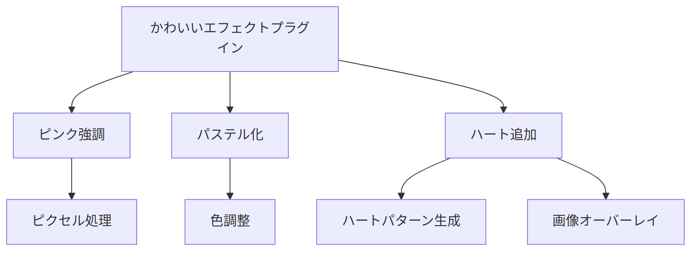

# かわいいエフェクトプラグイン実装例

このドキュメントでは、EDVプラグインシステムを使用して実装された「かわいいエフェクト」プラグインの構造と使用方法について説明します。

**最終更新日: 2025年4月1日 09:09:32**

## 概要

「かわいいエフェクト」プラグインは、画像や動画にパステルカラーエフェクトやハートのオーバーレイを適用するエフェクトプラグインのサンプル実装です。このプラグインはEDVプラグインシステムの基本的な使い方を示すと同時に、実用的なエフェクトを提供します。



## 機能

「かわいいエフェクト」プラグインは以下の機能を提供します：

1. **ピンク強調** - 画像内のピンク色の要素を強調します
2. **パステル化** - 画像全体をパステルカラートーンに変換します
3. **ハート追加** - ランダムな位置に可愛いハートを画像に追加します

## 設定オプション

プラグインには以下の設定オプションがあります：

| 設定名 | タイプ | デフォルト値 | 説明 |
|--------|--------|--------------|------|
| `pink_intensity` | float | 0.5 | ピンク強調の強さ（0.0〜1.0） |
| `add_hearts` | bool | true | ハートを追加するかどうか |
| `pastel_level` | float | 0.7 | パステル化の強さ（0.0〜1.0） |

## 実装詳細

プラグインの基本構造は以下の通りです：

```rust
pub struct KawaiiEffectPlugin {
    // プラグインのメタデータ
    metadata: PluginMetadata,
    // プラグインの機能
    capabilities: PluginCapabilities,
    // プラグインの設定
    settings: Mutex<HashMap<String, String>>,
    // ホストへの参照
    host: Option<Arc<dyn Host>>,
    // プラグインの初期化状態
    initialized: bool,
}
```

### メタデータの設定

プラグインの初期化では、以下のようにメタデータを設定します：

```rust
let metadata = PluginMetadata {
    id: "com.example.kawaii-effect".to_string(),
    name: "Kawaii Effect".to_string(),
    version: "1.0.0".to_string(),
    author: "Example Developer".to_string(),
    description: "画像をかわいくするエフェクトプラグイン".to_string(),
    plugin_type: PluginType::Effect,
    api_version: "1.0".to_string(),
};
```

### エフェクト適用ロジック

プラグインのコアロジックは `apply_effect` メソッドに実装されています。このメソッドは3つの主要なエフェクト処理を適用します：

```rust
fn apply_effect(&self, image: &mut Image) -> Result<(), String> {
    if !self.initialized {
        return Err("プラグインが初期化されていません".to_string());
    }

    // 1. ピンク強調
    self.enhance_pink(image);
    
    // 2. パステル化
    self.apply_pastel(image);
    
    // 3. ハート追加（設定で有効な場合）
    if self.get_setting_as_bool("add_hearts", true) {
        self.add_heart_overlay(image);
    }
    
    Ok(())
}
```

#### ピンク強調処理

ピンク色の要素を強調する処理は、以下のように実装されています：

```rust
fn enhance_pink(&self, image: &mut Image) {
    let pink_intensity = self.get_setting_as_f32("pink_intensity", 0.5);
    
    for y in 0..image.height() {
        for x in 0..image.width() {
            let pixel = image.get_pixel(x, y);
            
            // ピンク色の検出（赤が強く、緑が中程度、青が中程度以上）
            if pixel.r > 200 && pixel.g > 100 && pixel.g < 180 && pixel.b > 100 && pixel.b < 200 {
                // ピンク色の強調
                let new_r = u8::min(255, (pixel.r as f32 * (1.0 + pink_intensity * 0.3)) as u8);
                let new_g = u8::max(0, (pixel.g as f32 * (1.0 - pink_intensity * 0.1)) as u8);
                let new_b = u8::min(255, (pixel.b as f32 * (1.0 + pink_intensity * 0.2)) as u8);
                
                image.set_pixel(x, y, Pixel::new(new_r, new_g, new_b, pixel.a));
            }
        }
    }
}
```

#### パステル化処理

画像をパステルカラーに変換する処理は、以下のように実装されています：

```rust
fn apply_pastel(&self, image: &mut Image) {
    let pastel_level = self.get_setting_as_f32("pastel_level", 0.7);
    
    for y in 0..image.height() {
        for x in 0..image.width() {
            let pixel = image.get_pixel(x, y);
            
            // パステル化（各色チャンネルを明るく、彩度を下げる）
            // パステルカラーの数式: 新色 = 元の色 + (255 - 元の色) * パステルレベル
            let new_r = (pixel.r as f32 + (255.0 - pixel.r as f32) * pastel_level) as u8;
            let new_g = (pixel.g as f32 + (255.0 - pixel.g as f32) * pastel_level) as u8;
            let new_b = (pixel.b as f32 + (255.0 - pixel.b as f32) * pastel_level) as u8;
            
            image.set_pixel(x, y, Pixel::new(new_r, new_g, new_b, pixel.a));
        }
    }
}
```

#### ハート追加処理

画像にランダムなハートを追加する処理は以下のように実装されています：

```rust
fn add_heart_overlay(&self, image: &mut Image) {
    let width = image.width();
    let height = image.height();
    
    // 画像サイズに応じたハート数を決定
    let heart_count = ((width * height) as f32 / 50000.0).round() as i32;
    let max_heart_size = ((width.min(height) as f32) * 0.05) as i32;
    
    // ランダムな位置にハートを描画
    let mut rng = rand::thread_rng();
    for _ in 0..heart_count {
        let x = rng.gen_range(0..width) as i32;
        let y = rng.gen_range(0..height) as i32;
        let size = rng.gen_range(max_heart_size / 3..=max_heart_size);
        
        self.draw_heart(image, x, y, size);
    }
}

fn draw_heart(&self, image: &mut Image, center_x: i32, center_y: i32, size: i32) {
    // ハート形状の数式を使用して描画
    // x^2 + (y - (x^2)^(1/3))^2 = 1 のハート形状を使用
    
    let heart_color = Pixel::new(255, 105, 180, 200); // ピンク色（半透明）
    
    for dy in -size..size {
        for dx in -size..size {
            // ハート形状の内部かどうかをチェック
            let x = dx as f32 / size as f32;
            let y = dy as f32 / size as f32;
            
            if (x*x + (y - 0.25 * (x*x).powf(1.0/3.0)).powi(2)) < 0.3 {
                let px = center_x + dx;
                let py = center_y + dy;
                
                // 画像の範囲内かチェック
                if px >= 0 && px < image.width() as i32 && py >= 0 && py < image.height() as i32 {
                    // 既存のピクセルとブレンド
                    let existing = image.get_pixel(px as u32, py as u32);
                    let blended = blend_pixels(existing, heart_color);
                    image.set_pixel(px as u32, py as u32, blended);
                }
            }
        }
    }
}

// ピクセルをアルファブレンド
fn blend_pixels(bg: Pixel, fg: Pixel) -> Pixel {
    let alpha = fg.a as f32 / 255.0;
    let new_r = (bg.r as f32 * (1.0 - alpha) + fg.r as f32 * alpha) as u8;
    let new_g = (bg.g as f32 * (1.0 - alpha) + fg.g as f32 * alpha) as u8;
    let new_b = (bg.b as f32 * (1.0 - alpha) + fg.b as f32 * alpha) as u8;
    
    Pixel::new(new_r, new_g, new_b, bg.a)
}
```

### Plugin トレイトの実装

プラグインは `Plugin` トレイトを実装して、基本的なプラグイン機能を提供します：

```rust
impl Plugin for KawaiiEffectPlugin {
    fn metadata(&self) -> &PluginMetadata {
        &self.metadata
    }

    fn capabilities(&self) -> &PluginCapabilities {
        &self.capabilities
    }

    fn initialize(&mut self, host: Arc<dyn Host>) -> Result<(), String> {
        info!("🌟 かわいいエフェクトプラグインを初期化中...");
        self.host = Some(host.clone());
        
        // ホストから保存された設定を読み込む
        if let Some(saved_settings) = host.load_plugin_settings(&self.metadata.id) {
            let mut settings = self.settings.lock().unwrap();
            for (key, value) in saved_settings {
                settings.insert(key, value);
            }
        }
        
        self.initialized = true;
        info!("✓ かわいいエフェクトプラグインの初期化が完了しました");
        Ok(())
    }

    fn shutdown(&mut self) -> Result<(), String> {
        info!("💤 かわいいエフェクトプラグインをシャットダウンします...");
        
        // 設定を保存
        if let Some(host) = &self.host {
            let settings = self.settings.lock().unwrap();
            host.save_plugin_settings(&self.metadata.id, settings.clone());
        }
        
        self.initialized = false;
        info!("👋 かわいいエフェクトプラグインのシャットダウンが完了しました");
        Ok(())
    }

    fn is_initialized(&self) -> bool {
        self.initialized
    }
}
```

### EffectPlugin トレイトの実装

さらに、`EffectPlugin` トレイトを実装してエフェクトプラグインの機能を提供します：

```rust
impl EffectPlugin for KawaiiEffectPlugin {
    fn apply_effect(&self, image: &mut Image) -> Result<(), String> {
        // 前述の実装
    }

    fn get_effect_name(&self) -> String {
        "かわいいエフェクト".to_string()
    }

    fn get_effect_description(&self) -> String {
        "画像にパステルカラーとハートを追加してかわいく変身させます✨".to_string()
    }
}
```

### SettingsAccess トレイトの実装

プラグインは設定へのアクセスを提供するために `SettingsAccess` トレイトも実装しています：

```rust
impl SettingsAccess for KawaiiEffectPlugin {
    fn get_settings(&self) -> HashMap<String, String> {
        self.settings.lock().unwrap().clone()
    }

    fn update_settings(&self, new_settings: HashMap<String, String>) -> Result<(), String> {
        let mut settings = self.settings.lock().unwrap();
        
        // 設定値の検証
        for (key, value) in &new_settings {
            if key == "pink_intensity" || key == "pastel_level" {
                if let Ok(level) = value.parse::<f32>() {
                    if level < 0.0 || level > 1.0 {
                        return Err(format!("{}の値は0.0から1.0の範囲で指定してください", key));
                    }
                } else {
                    return Err(format!("{}の値は数値で指定してください", key));
                }
            }
        }
        
        // 設定を更新
        for (key, value) in new_settings {
            settings.insert(key, value);
        }
        
        // 設定を保存
        if let Some(host) = &self.host {
            host.save_plugin_settings(&self.metadata.id, settings.clone());
        }
        
        Ok(())
    }
}
```

### プラグインのエントリーポイント

プラグインの作成と取得のためのエントリーポイント関数は以下のように定義されています：

```rust
#[no_mangle]
pub extern "C" fn create_plugin() -> Box<dyn Plugin> {
    Box::new(KawaiiEffectPlugin::new())
}
```

## プラグインの使用方法

### プラグインのインストール

1. プラグインファイル（`libkawaii_effect.so`、`kawaii_effect.dll`、または `kawaii_effect.dylib`）とマニフェストファイル（`plugin.toml`）をユーザープラグインディレクトリに配置します。
2. EDVを起動すると、プラグインが自動的に検出され、読み込まれます。

### エフェクトの適用

1. EDVエディターで画像や動画を開きます。
2. エフェクトパネルで「かわいいエフェクト」を選択します。
3. 必要に応じて設定を調整します。
4. 「適用」ボタンをクリックしてエフェクトを適用します。

## 設定例

以下はプラグインの設定例です：

```toml
# 強いピンク強調、ハートあり、強いパステル化
pink_intensity = "0.8"
add_hearts = "true"
pastel_level = "0.9"
```

```toml
# 弱いピンク強調、ハートなし、弱いパステル化
pink_intensity = "0.3"
add_hearts = "false"
pastel_level = "0.4"
```

## テスト

プラグインには以下のユニットテストが含まれています：

```rust
#[cfg(test)]
mod tests {
    use super::*;
    
    #[test]
    fn test_plugin_metadata() {
        let plugin = KawaiiEffectPlugin::new();
        assert_eq!(plugin.metadata().id, "com.example.kawaii-effect");
        assert_eq!(plugin.metadata().plugin_type, PluginType::Effect);
    }
    
    #[test]
    fn test_plugin_capabilities() {
        let plugin = KawaiiEffectPlugin::new();
        assert!(plugin.capabilities().thread_safe);
        assert!(!plugin.capabilities().gpu_accelerated);
    }
    
    #[test]
    fn test_settings_access() {
        let plugin = KawaiiEffectPlugin::new();
        
        // デフォルト設定を確認
        let settings = plugin.get_settings();
        assert_eq!(settings.get("pink_intensity"), Some(&"0.5".to_string()));
        assert_eq!(settings.get("add_hearts"), Some(&"true".to_string()));
        assert_eq!(settings.get("pastel_level"), Some(&"0.7".to_string()));
        
        // 設定を更新
        let mut new_settings = HashMap::new();
        new_settings.insert("pink_intensity".to_string(), "0.8".to_string());
        new_settings.insert("add_hearts".to_string(), "false".to_string());
        plugin.update_settings(new_settings).unwrap();
        
        // 更新された設定を確認
        let updated_settings = plugin.get_settings();
        assert_eq!(updated_settings.get("pink_intensity"), Some(&"0.8".to_string()));
        assert_eq!(updated_settings.get("add_hearts"), Some(&"false".to_string()));
        assert_eq!(updated_settings.get("pastel_level"), Some(&"0.7".to_string()));
    }
}
```

## まとめ

「かわいいエフェクト」プラグインは、EDVプラグインシステムを使用して高品質なビジュアルエフェクトを実装する方法を示しています。このプラグインのコードは、エフェクトプラグインを開発するための参考として活用できます。

プラグインシステムの詳細やその他のプラグインタイプの実装については、プラグイン開発ガイドを参照してください。 