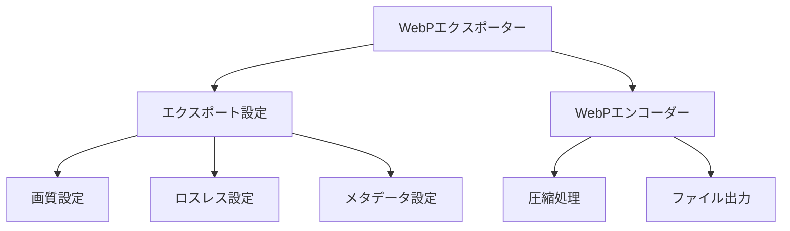

# WebPエクスポータープラグイン実装例

このドキュメントでは、EDVプラグインシステムを使用して実装された「WebPエクスポーター」プラグインの構造と使用方法について説明します。

**最終更新日: 2025年4月1日 09:09:32**

## 概要

「WebPエクスポーター」プラグインは、画像をWebP形式でエクスポートするための機能を提供するエクスポータープラグインのサンプル実装です。このプラグインはEDVプラグインシステムの基本的な使い方を示すと同時に、実用的なエクスポート機能を提供します。



## 機能

「WebPエクスポーター」プラグインは以下の機能を提供します：

1. **WebP形式エクスポート** - 画像をWebP形式で保存します
2. **画質設定** - ロッシー圧縮の品質を調整できます（0〜100）
3. **ロスレス圧縮** - 情報を失わない圧縮方式を選択できます
4. **メタデータ設定** - メタデータを含めるかどうかを制御できます

## 設定オプション

プラグインには以下の設定オプションがあります：

| 設定名 | タイプ | デフォルト値 | 説明 |
|--------|--------|--------------|------|
| `quality` | integer | 90 | 圧縮画質（0〜100、ロッシー圧縮時のみ有効） |
| `lossless` | boolean | false | ロスレス圧縮を使用するかどうか |
| `metadata_enabled` | boolean | true | メタデータを保持するかどうか |

## 実装詳細

プラグインの基本構造は以下の通りです：

```rust
pub struct WebpExporterPlugin {
    /// プラグインのメタデータ
    metadata: PluginMetadata,
    /// プラグインの機能
    capabilities: PluginCapabilities,
    /// プラグインの設定
    settings: Mutex<HashMap<String, String>>,
    /// ホストへの参照
    host: Option<Arc<dyn Host>>,
    /// プラグインの初期化状態
    initialized: bool,
}
```

### メタデータの設定

プラグインの初期化では、以下のようにメタデータを設定します：

```rust
let metadata = PluginMetadata {
    id: "com.example.webp-exporter".to_string(),
    name: "WebP Exporter".to_string(),
    version: "1.0.0".to_string(),
    author: "Example Developer".to_string(),
    description: "画像をWebP形式でエクスポートするプラグイン".to_string(),
    plugin_type: PluginType::Exporter,
    api_version: "1.0".to_string(),
};
```

### WebPエンコード設定の生成

WebP形式のエンコード設定を構築するメソッドは以下のように実装されています：

```rust
fn create_webp_config(&self) -> webp::WebPConfig {
    let mut config = webp::WebPConfig::new().unwrap();
    
    // 品質設定（0〜100）
    let quality = self.get_setting_as_f32("quality", 90.0);
    config.quality = quality;
    
    // ロスレス設定
    let lossless = self.get_setting_as_bool("lossless", false);
    config.lossless = if lossless { 1 } else { 0 };
    
    // メタデータ設定
    let metadata_enabled = self.get_setting_as_bool("metadata_enabled", true);
    
    // その他の設定
    config.method = 6; // 圧縮メソッド（0は高速/低品質、6は低速/高品質）
    config.target_size = 0; // 出力サイズを指定しない（0 = 無制限）
    config.target_PSNR = 0.0; // PSNRを指定しない
    config.segments = 4; // セグメント数
    config.sns_strength = 50; // 空間ノイズシェーピングの強さ
    config.filter_strength = 60; // フィルターの強さ
    config.filter_sharpness = 0; // フィルターシャープネス
    config.filter_type = 1; // フィルタータイプ
    config.autofilter = 1; // 自動フィルター設定
    config.alpha_compression = 1; // アルファチャンネル圧縮
    config.alpha_filtering = 1; // アルファチャンネルフィルタリング
    config.alpha_quality = 90; // アルファチャンネル品質
    config.pass = 1; // エンコードパス数
    
    config
}
```

### 設定値取得のヘルパーメソッド

プラグインには、設定値を取得するためのヘルパーメソッドが実装されています：

```rust
fn get_setting(&self, key: &str, default: &str) -> String {
    let settings = self.settings.lock().unwrap();
    settings.get(key).cloned().unwrap_or_else(|| default.to_string())
}

fn get_setting_as_i32(&self, key: &str, default: i32) -> i32 {
    let value = self.get_setting(key, &default.to_string());
    value.parse::<i32>().unwrap_or(default)
}

fn get_setting_as_f32(&self, key: &str, default: f32) -> f32 {
    let value = self.get_setting(key, &default.to_string());
    value.parse::<f32>().unwrap_or(default)
}

fn get_setting_as_bool(&self, key: &str, default: bool) -> bool {
    let value = self.get_setting(key, &default.to_string());
    value.parse::<bool>().unwrap_or(default)
}
```

### Plugin トレイトの実装

プラグインは `Plugin` トレイトを実装して、基本的なプラグイン機能を提供します：

```rust
impl Plugin for WebpExporterPlugin {
    fn metadata(&self) -> &PluginMetadata {
        &self.metadata
    }

    fn capabilities(&self) -> &PluginCapabilities {
        &self.capabilities
    }

    fn initialize(&mut self, host: Arc<dyn Host>) -> Result<(), String> {
        info!("🌟 WebPエクスポーターを初期化中...");
        self.host = Some(host.clone());
        
        // ホストから保存された設定を読み込む
        if let Some(saved_settings) = host.load_plugin_settings(&self.metadata.id) {
            let mut settings = self.settings.lock().unwrap();
            for (key, value) in saved_settings {
                settings.insert(key, value);
            }
        }
        
        self.initialized = true;
        info!("✓ WebPエクスポーターの初期化が完了しました");
        Ok(())
    }

    fn shutdown(&mut self) -> Result<(), String> {
        info!("💤 WebPエクスポーターをシャットダウンします...");
        
        // 設定を保存
        if let Some(host) = &self.host {
            let settings = self.settings.lock().unwrap();
            host.save_plugin_settings(&self.metadata.id, settings.clone());
        }
        
        self.initialized = false;
        info!("👋 WebPエクスポーターのシャットダウンが完了しました");
        Ok(())
    }

    fn is_initialized(&self) -> bool {
        self.initialized
    }
}
```

### ExporterPlugin トレイトの実装

`ExporterPlugin` トレイトを実装して、エクスポート機能を提供します：

```rust
impl ExporterPlugin for WebpExporterPlugin {
    fn export(&self, image: &Image, path: &Path) -> Result<(), String> {
        if !self.initialized {
            return Err("プラグインが初期化されていません".to_string());
        }

        info!("🖼️ WebP形式で画像をエクスポートしています: {}", path.display());
        
        // ファイルを開く
        let file = File::create(path).map_err(|e| {
            format!("ファイルの作成に失敗しました: {}", e)
        })?;
        
        let buffer = BufWriter::new(file);
        
        // WebPエンコード設定
        let config = self.create_webp_config();
        
        // 画像データを準備
        let (width, height) = image.dimensions();
        let rgba = image.as_raw();
        
        // WebPエンコードと書き込み
        // 注: 実際の実装では、WebPエンコーディングライブラリを使用します
        // 以下は例示的な実装です
        
        // 実際のエンコードと保存処理
        // let encoder = webp::Encoder::new(rgba, width, height, webp::PixelFormat::RGBA);
        // let memory = encoder.encode(&config).map_err(|e| format!("エンコードに失敗しました: {}", e))?;
        // buffer.write_all(memory.as_bytes()).map_err(|e| {
        //     format!("ファイルへの書き込みに失敗しました: {}", e)
        // })?;
        
        info!("✓ WebP形式での画像エクスポートが完了しました");
        Ok(())
    }

    fn get_supported_extensions(&self) -> Vec<String> {
        vec!["webp".to_string()]
    }

    fn get_exporter_name(&self) -> String {
        "WebP形式".to_string()
    }

    fn get_exporter_description(&self) -> String {
        "WebP形式で画像をエクスポートします。高圧縮かつ高品質なウェブ用画像形式です。".to_string()
    }
}
```

### SettingsAccess トレイトの実装

プラグインは設定へのアクセスを提供するために `SettingsAccess` トレイトも実装しています：

```rust
impl SettingsAccess for WebpExporterPlugin {
    fn get_settings(&self) -> HashMap<String, String> {
        self.settings.lock().unwrap().clone()
    }

    fn update_settings(&self, new_settings: HashMap<String, String>) -> Result<(), String> {
        let mut settings = self.settings.lock().unwrap();
        
        // 設定を更新
        for (key, value) in new_settings {
            // 品質パラメータの妥当性チェック
            if key == "quality" {
                if let Ok(quality) = value.parse::<i32>() {
                    if quality < 0 || quality > 100 {
                        return Err("品質設定は0〜100の範囲で指定してください".to_string());
                    }
                } else {
                    return Err("品質設定は整数値で指定してください".to_string());
                }
            }
            
            settings.insert(key, value);
        }
        
        // 設定を保存
        if let Some(host) = &self.host {
            host.save_plugin_settings(&self.metadata.id, settings.clone());
        }
        
        Ok(())
    }
}
```

### プラグインのエントリーポイント

プラグインの作成と取得のためのエントリーポイント関数は以下のように定義されています：

```rust
#[no_mangle]
pub extern "C" fn create_plugin() -> Box<dyn Plugin> {
    Box::new(WebpExporterPlugin::new())
}
```

## WebP形式について

WebP形式は、Googleが開発した画像ファイル形式で、以下の特徴があります：

1. **高効率圧縮** - JPEGと比較して30-40%程度のファイルサイズ削減が可能
2. **ロスレス透過性** - アルファチャンネルをサポート
3. **アニメーション** - GIFの置き換えとして使用可能
4. **メタデータ** - ICCプロファイル、Exifなどのサポート

## プラグインの使用方法

### プラグインのインストール

1. プラグインファイル（`libwebp_exporter.so`、`webp_exporter.dll`、または `webp_exporter.dylib`）とマニフェストファイル（`plugin.toml`）をユーザープラグインディレクトリに配置します。
2. EDVを起動すると、プラグインが自動的に検出され、読み込まれます。

### 画像のエクスポート

1. EDVエディターで画像や動画を編集します。
2. 「ファイル」→「エクスポート」メニューから「WebP形式」を選択します。
3. 必要に応じて設定を調整します。
4. 保存先を選択し、「エクスポート」ボタンをクリックします。

## 設定例

以下はプラグインの設定例です：

```toml
# 高品質設定（ロッシー）
quality = "95"
lossless = "false"
metadata_enabled = "true"
```

```toml
# ロスレス設定
quality = "90"
lossless = "true"
metadata_enabled = "false"
```

## テスト

プラグインには以下のユニットテストが含まれています：

```rust
#[cfg(test)]
mod tests {
    use super::*;
    
    #[test]
    fn test_plugin_metadata() {
        let plugin = WebpExporterPlugin::new();
        assert_eq!(plugin.metadata().id, "com.example.webp-exporter");
        assert_eq!(plugin.metadata().plugin_type, PluginType::Exporter);
    }
    
    #[test]
    fn test_get_supported_extensions() {
        let plugin = WebpExporterPlugin::new();
        let extensions = plugin.get_supported_extensions();
        assert_eq!(extensions.len(), 1);
        assert_eq!(extensions[0], "webp");
    }
    
    #[test]
    fn test_settings() {
        let plugin = WebpExporterPlugin::new();
        
        // デフォルト設定を確認
        let settings = plugin.get_settings();
        assert_eq!(settings.get("quality"), Some(&"90".to_string()));
        assert_eq!(settings.get("lossless"), Some(&"false".to_string()));
        
        // 品質設定を変更
        let mut new_settings = HashMap::new();
        new_settings.insert("quality".to_string(), "75".to_string());
        plugin.update_settings(new_settings).unwrap();
        
        let updated_settings = plugin.get_settings();
        assert_eq!(updated_settings.get("quality"), Some(&"75".to_string()));
        
        // 無効な品質設定
        let mut invalid_settings = HashMap::new();
        invalid_settings.insert("quality".to_string(), "101".to_string());
        let result = plugin.update_settings(invalid_settings);
        assert!(result.is_err());
    }
}
```

## WebP実装の技術的詳細

WebPエンコードの実装では、以下の技術的考慮点があります：

1. **libwebp** - 実際の実装ではGoogleのlibwebpライブラリを使用します
2. **設定パラメータ** - WebPは様々なエンコード設定をサポートしています：
   - method: 圧縮アルゴリズムの複雑さ（0=速い/低品質, 6=遅い/高品質）
   - segments: パーティショニングの複雑さ（1-4）
   - sns_strength: 空間ノイズシェーピング（0-100）
   - filter_strength: フィルタリングの強さ（0-100）
3. **最適化** - 最適なエンコード設定は使用ケースによって異なります

## まとめ

「WebPエクスポーター」プラグインは、EDVプラグインシステムを使用してファイルエクスポート機能を拡張する方法を示しています。このプラグインのコードは、エクスポータープラグインを開発するための参考として活用できます。

プラグインシステムの詳細やその他のプラグインタイプの実装については、プラグイン開発ガイドを参照してください。 