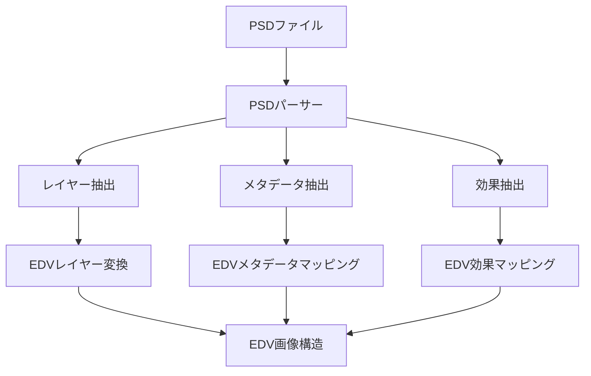

# PSDインポータープラグイン

**最終更新日: 2025年4月1日 09:29:51**

## 概要 🖼️

PSDインポータープラグインは、Adobe Photoshopファイル形式（`.psd`）をEDVに読み込むための機能を提供します。レイヤー構造、テキスト、効果などの要素を保持しながらPSDファイルをインポートし、EDVの編集環境で利用できるようにします。



## 特徴 ✨

- PSDファイル形式の完全サポート（Photoshop CC 2024までのバージョン）
- レイヤー階層の保持とEDVレイヤーへの変換
- レイヤースタイルとブレンドモードのサポート
- テキストレイヤーの編集可能インポート
- スマートオブジェクトの基本サポート
- 調整レイヤーのEDV効果への変換
- 16ビットおよび32ビット画像のサポート
- ICCプロファイルとカラーマネジメントの保持

## 実装例 💻

### プラグインの基本構造

```rust
use std::path::Path;
use edv_plugin_api::{Plugin, PluginMetadata, PluginCapabilities, PluginHost};
use edv_plugin_api::importer::{ImporterPlugin, ImportOptions, ImportError};
use edv_plugin_api::image::{Image, Layer, TextLayer, AdjustmentLayer};

/// PSDファイルをインポートするためのプラグイン
pub struct PsdImporterPlugin {
    metadata: PluginMetadata,
    capabilities: PluginCapabilities,
    settings: Arc<Mutex<HashMap<String, String>>>,
    host: Option<Arc<dyn PluginHost>>,
    initialized: bool,
}

impl PsdImporterPlugin {
    /// 新しいPSDインポータープラグインを作成
    pub fn new() -> Self {
        let metadata = PluginMetadata {
            id: "com.edv.psd-importer".to_string(),
            name: "PSD Importer".to_string(),
            version: (1, 0, 0),
            author: "EDV Team".to_string(),
            description: "Import Adobe Photoshop (PSD) files".to_string(),
            plugin_type: PluginType::Importer,
            api_version: (1, 0),
            tags: vec!["psd".to_string(), "photoshop".to_string(), "import".to_string()],
        };
        
        let capabilities = PluginCapabilities {
            has_settings_ui: true,
            supports_hot_reload: true,
            supports_async: true,
            gpu_accelerated: false,
            thread_safe: true,
        };
        
        let mut settings = HashMap::new();
        settings.insert("preserve_text_layers".to_string(), "true".to_string());
        settings.insert("import_smart_objects".to_string(), "true".to_string());
        settings.insert("flatten_groups".to_string(), "false".to_string());
        settings.insert("import_hidden_layers".to_string(), "true".to_string());
        
        PsdImporterPlugin {
            metadata,
            capabilities,
            settings: Arc::new(Mutex::new(settings)),
            host: None,
            initialized: false,
        }
    }
    
    /// PSDファイルのヘッダーを検証
    fn validate_psd_header(&self, data: &[u8]) -> bool {
        // PSDファイルは "8BPS" の4バイトシグネチャで始まる
        if data.len() < 4 {
            return false;
        }
        
        &data[0..4] == b"8BPS"
    }
    
    /// レイヤー情報を抽出
    fn extract_layers(&self, psd_data: &[u8], options: &ImportOptions) -> Result<Vec<Layer>, ImportError> {
        // 実際の実装はより複雑になりますが、例としてシンプルな処理を記載
        // ここではPSDパース用のライブラリを使用することを想定しています
        
        let preserve_text = self.settings.lock().unwrap()
            .get("preserve_text_layers")
            .map(|v| v == "true")
            .unwrap_or(true);
            
        let import_hidden = self.settings.lock().unwrap()
            .get("import_hidden_layers")
            .map(|v| v == "true")
            .unwrap_or(true);
            
        // レイヤー抽出処理（実際の実装ではPSDライブラリを使用）
        // ...
        
        Ok(vec![]) // ダミー実装
    }
}

impl Plugin for PsdImporterPlugin {
    fn metadata(&self) -> &PluginMetadata {
        &self.metadata
    }
    
    fn capabilities(&self) -> &PluginCapabilities {
        &self.capabilities
    }
    
    fn initialize(&mut self, host: Arc<dyn PluginHost>) -> Result<(), String> {
        self.host = Some(host.clone());
        
        // 設定を読み込む
        if let Some(saved_settings) = host.load_plugin_settings(&self.metadata.id) {
            let mut settings = self.settings.lock().unwrap();
            for (key, value) in saved_settings {
                settings.insert(key, value);
            }
        }
        
        self.initialized = true;
        Ok(())
    }
    
    fn shutdown(&mut self) -> Result<(), String> {
        self.initialized = false;
        Ok(())
    }
    
    fn is_initialized(&self) -> bool {
        self.initialized
    }
}

impl ImporterPlugin for PsdImporterPlugin {
    fn get_supported_extensions(&self) -> Vec<String> {
        vec!["psd".to_string()]
    }
    
    fn get_importer_name(&self) -> String {
        "Adobe Photoshop Document Importer".to_string()
    }
    
    fn get_importer_description(&self) -> String {
        "Imports Adobe Photoshop (.psd) files with layer support".to_string()
    }
    
    fn can_import_file(&self, file_path: &Path) -> bool {
        if let Some(ext) = file_path.extension() {
            return ext.to_string_lossy().to_lowercase() == "psd";
        }
        false
    }
    
    fn import(&self, file_path: &Path, options: &ImportOptions) -> Result<Image, ImportError> {
        if !self.is_initialized() {
            return Err(ImportError::NotInitialized);
        }
        
        // ファイルを読み込む
        let file_data = match std::fs::read(file_path) {
            Ok(data) => data,
            Err(e) => return Err(ImportError::IoError(e.to_string())),
        };
        
        // PSDヘッダーの検証
        if !self.validate_psd_header(&file_data) {
            return Err(ImportError::InvalidFormat("Not a valid PSD file".to_string()));
        }
        
        // PSDデータを解析する（実際の実装ではライブラリを使用）
        let layers = match self.extract_layers(&file_data, options) {
            Ok(layers) => layers,
            Err(e) => return Err(e),
        };
        
        // メタデータを抽出
        let metadata = HashMap::new(); // 実際の実装ではPSDからメタデータを抽出
        
        // EDV画像オブジェクトを作成
        let image = Image::new(
            options.width.unwrap_or(0),
            options.height.unwrap_or(0),
            layers,
            metadata,
        );
        
        Ok(image)
    }
    
    fn get_import_progress(&self) -> f32 {
        // 現在のインポート進捗を返す（0.0〜1.0）
        // 非同期インポートの場合に使用
        0.0 // ダミー実装
    }
}

impl SettingsAccess for PsdImporterPlugin {
    fn get_settings(&self) -> HashMap<String, String> {
        self.settings.lock().unwrap().clone()
    }

    fn update_settings(&self, new_settings: HashMap<String, String>) -> Result<(), String> {
        let mut settings = self.settings.lock().unwrap();
        
        // 設定を更新
        for (key, value) in new_settings {
            settings.insert(key, value);
        }
        
        // 設定を保存
        if let Some(host) = &self.host {
            host.save_plugin_settings(&self.metadata.id, settings.clone());
        }
        
        Ok(())
    }
}

// プラグインファクトリ関数
#[no_mangle]
pub extern "C" fn create_plugin() -> Box<dyn Plugin> {
    Box::new(PsdImporterPlugin::new())
}
```

## 設定オプション ⚙️

PSDインポータープラグインは、以下の設定オプションをサポートしています：

| 設定キー | デフォルト値 | 説明 |
|---------|------------|------|
| `preserve_text_layers` | `true` | テキストレイヤーを編集可能なテキストとして保持するかどうか |
| `import_smart_objects` | `true` | スマートオブジェクトをインポートするかどうか |
| `flatten_groups` | `false` | グループレイヤーを平坦化するかどうか |
| `import_hidden_layers` | `true` | 非表示レイヤーをインポートするかどうか |

## インポートプロセス 🔄

PSDファイルのインポートプロセスは以下の手順で行われます：

1. **ファイル検証**: PSDファイルヘッダーを検証し、サポートされているバージョンであることを確認
2. **基本情報の抽出**: 画像サイズ、色深度、カラーモードなどの基本情報を取得
3. **レイヤー抽出**: レイヤーデータとレイヤー構造を解析
4. **特殊レイヤー処理**:
   - テキストレイヤーの処理
   - 調整レイヤーの処理
   - スマートオブジェクトの処理
5. **EDVオブジェクトへの変換**: 抽出したデータをEDVの内部形式に変換
6. **メタデータ・追加情報の処理**: ICCプロファイル、ガイドなどの追加情報を処理

## PSD形式の特徴と制限事項 📋

**サポートされている機能**:
- レイヤー構造とグループ
- レイヤーの不透明度とブレンドモード
- レイヤーマスク
- 調整レイヤー（主要なものをサポート）
- テキストレイヤー（基本的なスタイリングをサポート）
- スマートオブジェクト（ラスタライズドビュー）
- ICCプロファイル

**制限事項**:
- 一部の高度なレイヤースタイルはサポートされていないか、単純化される場合があります
- 一部のPhotoshopフィルターの効果は近似値に変換される場合があります
- スマートオブジェクトの編集機能はサポートされていません
- テキストレイヤーの一部の高度な書式設定は失われる場合があります

## インストールと使用方法 📦

### インストール

1. `psd_importer`プラグインファイルをプラグインディレクトリに配置します：
   ```
   <プラグインディレクトリ>/psd_importer/
   ├── plugin.toml
   ├── libpsd_importer.so    # Linux
   ├── psd_importer.dll      # Windows
   └── libpsd_importer.dylib # macOS
   ```

2. EDVを再起動すると、プラグインが自動的に読み込まれます。

### 使用方法

1. EDVで「ファイル」→「インポート」メニューを選択します。
2. ファイル選択ダイアログで「Photoshopドキュメント (*.psd)」フィルタを選択します。
3. インポートするPSDファイルを選択します。
4. インポートオプションダイアログで必要な設定を調整します。
5. 「インポート」ボタンをクリックします。

## テスト 🧪

プラグインには以下のユニットテストが含まれています：

```rust
#[cfg(test)]
mod tests {
    use super::*;
    use std::path::PathBuf;
    
    #[test]
    fn test_supported_extensions() {
        let plugin = PsdImporterPlugin::new();
        let extensions = plugin.get_supported_extensions();
        assert_eq!(extensions, vec!["psd".to_string()]);
    }
    
    #[test]
    fn test_can_import_file() {
        let plugin = PsdImporterPlugin::new();
        let valid_path = PathBuf::from("test.psd");
        let invalid_path = PathBuf::from("test.jpg");
        
        assert!(plugin.can_import_file(&valid_path));
        assert!(!plugin.can_import_file(&invalid_path));
    }
    
    #[test]
    fn test_validate_psd_header() {
        let plugin = PsdImporterPlugin::new();
        let valid_header = b"8BPS\x00\x01\x00\x00\x00\x00\x00\x00";
        let invalid_header = b"JPEG\x00\x01\x00\x00";
        
        assert!(plugin.validate_psd_header(valid_header));
        assert!(!plugin.validate_psd_header(invalid_header));
    }
    
    #[test]
    fn test_settings() {
        let plugin = PsdImporterPlugin::new();
        let settings = plugin.get_settings();
        
        assert_eq!(settings.get("preserve_text_layers"), Some(&"true".to_string()));
        assert_eq!(settings.get("flatten_groups"), Some(&"false".to_string()));
        
        let mut new_settings = HashMap::new();
        new_settings.insert("preserve_text_layers".to_string(), "false".to_string());
        
        plugin.update_settings(new_settings).unwrap();
        let updated_settings = plugin.get_settings();
        
        assert_eq!(updated_settings.get("preserve_text_layers"), Some(&"false".to_string()));
        assert_eq!(updated_settings.get("flatten_groups"), Some(&"false".to_string()));
    }
}
```

## トラブルシューティング 🔧

**問題**: 大きなPSDファイルのインポートに失敗する
- **解決策**: EDVのメモリ設定を確認し、必要に応じて増やしてください。また、プラグイン設定で「flatten_groups」を「true」に設定すると、メモリ使用量を削減できる場合があります。

**問題**: テキストレイヤーのフォントが正しく表示されない
- **解決策**: インポートしたPSDファイルで使用されているフォントがシステムにインストールされていることを確認してください。見つからないフォントは代替フォントで表示されます。

**問題**: 一部のレイヤー効果が欠落している
- **解決策**: サポートされていない高度なレイヤー効果は、EDVでは表示されません。このような場合は、PSDファイルでこれらの効果を適用した状態でレイヤーをラスタライズすることを検討してください。

## 今後の予定 🚀

- アニメーションタイムラインのサポート
- より多くの調整レイヤータイプのサポート
- スマートオブジェクトの編集機能の強化
- パスとベクター形状のサポート改善
- 3Dレイヤー要素の基本サポート

## 関連リソース 📚

- [Adobe Photoshop File Format Specification](https://www.adobe.com/devnet-apps/photoshop/fileformatashtml/)
- [EDVプラグイン開発ガイド](../05_プラグイン開発ガイド.md)
- [画像処理ライブラリドキュメント](../../04_画像処理/README.md) 