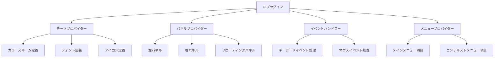

# カスタムパネルUIプラグイン

**最終更新日: 2025年4月1日 09:29:51**

## 概要 🎨

カスタムパネルUIプラグインは、EDVのユーザーインターフェースをカスタマイズし、新しいパネル、テーマ、および機能を追加するためのプラグインです。このプラグインは、EDVの標準的なUIを拡張し、ユーザーワークフローを向上させるカスタム機能を提供します。



## 特徴 ✨

- カスタムテーマの提供（ダークモード、ライトモード、パステルモード）
- 新しいツールパネルの追加（クイックアクセスツール、お気に入り機能）
- プロパティパネルの拡張（追加情報、カスタムコントロール）
- カスタムメニュー項目の追加
- キーボードショートカットとマウスジェスチャーのカスタマイズ
- エディターUIのレイアウトプリセット
- 国際化（i18n）サポート

## 実装例 💻

### プラグインの基本構造

```rust
use std::collections::HashMap;
use std::sync::{Arc, Mutex};
use edv_plugin_api::{Plugin, PluginMetadata, PluginCapabilities, PluginHost, PluginType};
use edv_plugin_api::ui::{
    UserInterfacePlugin, UiRegistry, UiTheme, EventRegistry, PanelDefinition, 
    MenuItem, PanelLocation, ThemeColors, ThemeVariant
};

/// EDVのUIをカスタマイズするためのプラグイン
pub struct CustomPanelUiPlugin {
    metadata: PluginMetadata,
    capabilities: PluginCapabilities,
    settings: Arc<Mutex<HashMap<String, String>>>,
    host: Option<Arc<dyn PluginHost>>,
    initialized: bool,
    current_theme: String,
}

impl CustomPanelUiPlugin {
    /// 新しいUIプラグインを作成
    pub fn new() -> Self {
        let metadata = PluginMetadata {
            id: "com.edv.custom-panel-ui".to_string(),
            name: "Custom Panel UI".to_string(),
            version: (1, 0, 0),
            author: "EDV Team".to_string(),
            description: "Provides custom panels and themes for EDV".to_string(),
            plugin_type: PluginType::UserInterface,
            api_version: (1, 0),
            tags: vec!["ui".to_string(), "theme".to_string(), "panel".to_string()],
        };
        
        let capabilities = PluginCapabilities {
            has_settings_ui: true,
            supports_hot_reload: true,
            supports_async: false,
            gpu_accelerated: false,
            thread_safe: true,
        };
        
        let mut settings = HashMap::new();
        settings.insert("theme".to_string(), "pastel".to_string());
        settings.insert("show_quick_panel".to_string(), "true".to_string());
        settings.insert("show_favorites_panel".to_string(), "true".to_string());
        settings.insert("panel_location".to_string(), "right".to_string());
        
        CustomPanelUiPlugin {
            metadata,
            capabilities,
            settings: Arc::new(Mutex::new(settings)),
            host: None,
            initialized: false,
            current_theme: "pastel".to_string(),
        }
    }
    
    /// テーマカラーを取得
    fn get_theme_colors(&self, variant: ThemeVariant) -> ThemeColors {
        let theme_name = self.settings.lock().unwrap()
            .get("theme")
            .cloned()
            .unwrap_or_else(|| "pastel".to_string());
        
        match theme_name.as_str() {
            "pastel" => match variant {
                ThemeVariant::Dark => ThemeColors {
                    primary: "#FF9BE8".to_string(),
                    secondary: "#B28DFF".to_string(),
                    background: "#2D2B37".to_string(),
                    surface: "#3A3845".to_string(),
                    text: "#FFFFFF".to_string(),
                    text_secondary: "#DDDDDD".to_string(),
                    error: "#FF6B6B".to_string(),
                    warning: "#FFDA7B".to_string(),
                    success: "#7BFF89".to_string(),
                    info: "#7BDDFF".to_string(),
                },
                ThemeVariant::Light => ThemeColors {
                    primary: "#FF7BCB".to_string(),
                    secondary: "#9D7BFF".to_string(),
                    background: "#F5F5F7".to_string(),
                    surface: "#FFFFFF".to_string(),
                    text: "#333333".to_string(),
                    text_secondary: "#666666".to_string(),
                    error: "#FF4D4D".to_string(),
                    warning: "#FFCC00".to_string(),
                    success: "#00CC66".to_string(),
                    info: "#33B5FF".to_string(),
                },
            },
            "classic" => match variant {
                ThemeVariant::Dark => ThemeColors {
                    primary: "#3498DB".to_string(),
                    secondary: "#9B59B6".to_string(),
                    background: "#2C3E50".to_string(),
                    surface: "#34495E".to_string(),
                    text: "#FFFFFF".to_string(),
                    text_secondary: "#EEEEEE".to_string(),
                    error: "#E74C3C".to_string(),
                    warning: "#F39C12".to_string(),
                    success: "#2ECC71".to_string(),
                    info: "#3498DB".to_string(),
                },
                ThemeVariant::Light => ThemeColors {
                    primary: "#2980B9".to_string(),
                    secondary: "#8E44AD".to_string(),
                    background: "#ECF0F1".to_string(),
                    surface: "#FFFFFF".to_string(),
                    text: "#2C3E50".to_string(),
                    text_secondary: "#7F8C8D".to_string(),
                    error: "#C0392B".to_string(),
                    warning: "#D35400".to_string(),
                    success: "#27AE60".to_string(),
                    info: "#2980B9".to_string(),
                },
            },
            // デフォルトはパステルテーマ
            _ => match variant {
                ThemeVariant::Dark => ThemeColors {
                    primary: "#FF9BE8".to_string(),
                    secondary: "#B28DFF".to_string(),
                    background: "#2D2B37".to_string(),
                    surface: "#3A3845".to_string(),
                    text: "#FFFFFF".to_string(),
                    text_secondary: "#DDDDDD".to_string(),
                    error: "#FF6B6B".to_string(),
                    warning: "#FFDA7B".to_string(),
                    success: "#7BFF89".to_string(),
                    info: "#7BDDFF".to_string(),
                },
                ThemeVariant::Light => ThemeColors {
                    primary: "#FF7BCB".to_string(),
                    secondary: "#9D7BFF".to_string(),
                    background: "#F5F5F7".to_string(),
                    surface: "#FFFFFF".to_string(),
                    text: "#333333".to_string(),
                    text_secondary: "#666666".to_string(),
                    error: "#FF4D4D".to_string(),
                    warning: "#FFCC00".to_string(),
                    success: "#00CC66".to_string(),
                    info: "#33B5FF".to_string(),
                },
            },
        }
    }
}

impl Plugin for CustomPanelUiPlugin {
    fn metadata(&self) -> &PluginMetadata {
        &self.metadata
    }
    
    fn capabilities(&self) -> &PluginCapabilities {
        &self.capabilities
    }
    
    fn initialize(&mut self, host: Arc<dyn PluginHost>) -> Result<(), String> {
        self.host = Some(host.clone());
        
        // 設定を読み込む
        if let Some(saved_settings) = host.load_plugin_settings(&self.metadata.id) {
            let mut settings = self.settings.lock().unwrap();
            for (key, value) in saved_settings {
                settings.insert(key, value);
            }
        }
        
        // 現在のテーマを設定から読み込む
        if let Some(theme) = self.settings.lock().unwrap().get("theme").cloned() {
            self.current_theme = theme;
        }
        
        self.initialized = true;
        Ok(())
    }
    
    fn shutdown(&mut self) -> Result<(), String> {
        self.initialized = false;
        Ok(())
    }
    
    fn is_initialized(&self) -> bool {
        self.initialized
    }
}

impl UserInterfacePlugin for CustomPanelUiPlugin {
    fn register_components(&self, registry: &mut UiRegistry) -> Result<(), String> {
        // コンポーネントを登録
        registry.register_component("quick_access_panel", "QuickAccessPanel");
        registry.register_component("favorites_panel", "FavoritesPanel");
        registry.register_component("theme_selector", "ThemeSelector");
        
        Ok(())
    }
    
    fn provide_theme(&self) -> Option<UiTheme> {
        let theme_name = self.settings.lock().unwrap()
            .get("theme")
            .cloned()
            .unwrap_or_else(|| "pastel".to_string());
        
        Some(UiTheme {
            name: theme_name.clone(),
            author: "EDV Team".to_string(),
            description: format!("{} theme for EDV", theme_name),
            dark_variant: self.get_theme_colors(ThemeVariant::Dark),
            light_variant: self.get_theme_colors(ThemeVariant::Light),
            fonts: HashMap::from([
                ("main".to_string(), "Roboto".to_string()),
                ("heading".to_string(), "Montserrat".to_string()),
                ("monospace".to_string(), "Fira Code".to_string()),
            ]),
            icons: "custom_icons".to_string(),
        })
    }
    
    fn register_event_handlers(&self, registry: &mut EventRegistry) -> Result<(), String> {
        // イベントハンドラーを登録
        registry.register_keyboard_handler("toggle_quick_access", "Alt+Q");
        registry.register_keyboard_handler("toggle_favorites", "Alt+F");
        registry.register_keyboard_handler("next_theme", "Ctrl+Alt+T");
        
        Ok(())
    }
    
    fn provide_panels(&self) -> Vec<PanelDefinition> {
        let mut panels = Vec::new();
        
        let show_quick_panel = self.settings.lock().unwrap()
            .get("show_quick_panel")
            .map(|v| v == "true")
            .unwrap_or(true);
            
        let show_favorites_panel = self.settings.lock().unwrap()
            .get("show_favorites_panel")
            .map(|v| v == "true")
            .unwrap_or(true);
            
        let panel_location_str = self.settings.lock().unwrap()
            .get("panel_location")
            .cloned()
            .unwrap_or_else(|| "right".to_string());
            
        let panel_location = match panel_location_str.as_str() {
            "left" => PanelLocation::Left,
            "right" => PanelLocation::Right,
            "bottom" => PanelLocation::Bottom,
            "floating" => PanelLocation::Floating,
            _ => PanelLocation::Right,
        };
        
        if show_quick_panel {
            panels.push(PanelDefinition {
                id: "quick_access_panel".to_string(),
                title: "Quick Access".to_string(),
                component: "QuickAccessPanel".to_string(),
                location: panel_location.clone(),
                width: 250,
                height: 400,
                icon: "quick_access_icon".to_string(),
                order: 0,
            });
        }
        
        if show_favorites_panel {
            panels.push(PanelDefinition {
                id: "favorites_panel".to_string(),
                title: "Favorites".to_string(),
                component: "FavoritesPanel".to_string(),
                location: panel_location,
                width: 250,
                height: 300,
                icon: "favorites_icon".to_string(),
                order: 1,
            });
        }
        
        panels
    }
    
    fn provide_menu_items(&self) -> Vec<MenuItem> {
        vec![
            MenuItem {
                id: "theme_menu".to_string(),
                label: "Themes".to_string(),
                parent: Some("view_menu".to_string()),
                icon: Some("theme_icon".to_string()),
                shortcut: Some("Ctrl+Alt+T".to_string()),
                children: vec![
                    MenuItem {
                        id: "theme_pastel".to_string(),
                        label: "Pastel Theme".to_string(),
                        parent: Some("theme_menu".to_string()),
                        icon: Some("pastel_icon".to_string()),
                        shortcut: None,
                        children: vec![],
                        action: Some("set_theme:pastel".to_string()),
                        enabled: true,
                        checked: self.current_theme == "pastel",
                    },
                    MenuItem {
                        id: "theme_classic".to_string(),
                        label: "Classic Theme".to_string(),
                        parent: Some("theme_menu".to_string()),
                        icon: Some("classic_icon".to_string()),
                        shortcut: None,
                        children: vec![],
                        action: Some("set_theme:classic".to_string()),
                        enabled: true,
                        checked: self.current_theme == "classic",
                    },
                ],
                action: None,
                enabled: true,
                checked: false,
            },
            MenuItem {
                id: "panels_menu".to_string(),
                label: "Panels".to_string(),
                parent: Some("view_menu".to_string()),
                icon: Some("panels_icon".to_string()),
                shortcut: None,
                children: vec![
                    MenuItem {
                        id: "toggle_quick_access".to_string(),
                        label: "Quick Access Panel".to_string(),
                        parent: Some("panels_menu".to_string()),
                        icon: Some("quick_access_icon".to_string()),
                        shortcut: Some("Alt+Q".to_string()),
                        children: vec![],
                        action: Some("toggle_panel:quick_access_panel".to_string()),
                        enabled: true,
                        checked: self.settings.lock().unwrap()
                            .get("show_quick_panel")
                            .map(|v| v == "true")
                            .unwrap_or(true),
                    },
                    MenuItem {
                        id: "toggle_favorites".to_string(),
                        label: "Favorites Panel".to_string(),
                        parent: Some("panels_menu".to_string()),
                        icon: Some("favorites_icon".to_string()),
                        shortcut: Some("Alt+F".to_string()),
                        children: vec![],
                        action: Some("toggle_panel:favorites_panel".to_string()),
                        enabled: true,
                        checked: self.settings.lock().unwrap()
                            .get("show_favorites_panel")
                            .map(|v| v == "true")
                            .unwrap_or(true),
                    },
                ],
                action: None,
                enabled: true,
                checked: false,
            },
        ]
    }
    
    fn handle_action(&self, action: &str) -> Result<(), String> {
        if action.starts_with("set_theme:") {
            let theme = action.split(':').nth(1).unwrap_or("pastel");
            let mut settings = self.settings.lock().unwrap();
            settings.insert("theme".to_string(), theme.to_string());
            
            if let Some(host) = &self.host {
                host.save_plugin_settings(&self.metadata.id, settings.clone());
                host.notify("Theme changed. Restart required for full effect.", "info");
            }
            
            return Ok(());
        }
        
        if action.starts_with("toggle_panel:") {
            let panel_id = action.split(':').nth(1).unwrap_or("");
            let setting_key = match panel_id {
                "quick_access_panel" => "show_quick_panel",
                "favorites_panel" => "show_favorites_panel",
                _ => return Err(format!("Unknown panel: {}", panel_id)),
            };
            
            let mut settings = self.settings.lock().unwrap();
            let current_value = settings.get(setting_key)
                .map(|v| v == "true")
                .unwrap_or(true);
            
            settings.insert(setting_key.to_string(), (!current_value).to_string());
            
            if let Some(host) = &self.host {
                host.save_plugin_settings(&self.metadata.id, settings.clone());
                host.refresh_ui();
            }
            
            return Ok(());
        }
        
        Err(format!("Unknown action: {}", action))
    }
}

impl SettingsAccess for CustomPanelUiPlugin {
    fn get_settings(&self) -> HashMap<String, String> {
        self.settings.lock().unwrap().clone()
    }

    fn update_settings(&self, new_settings: HashMap<String, String>) -> Result<(), String> {
        let mut settings = self.settings.lock().unwrap();
        
        // 設定を更新
        for (key, value) in new_settings {
            settings.insert(key, value);
        }
        
        // 設定を保存
        if let Some(host) = &self.host {
            host.save_plugin_settings(&self.metadata.id, settings.clone());
            
            // UIの更新が必要な場合はリフレッシュ
            if new_settings.contains_key("show_quick_panel") || 
               new_settings.contains_key("show_favorites_panel") ||
               new_settings.contains_key("panel_location") {
                host.refresh_ui();
            }
        }
        
        Ok(())
    }
}

// プラグインファクトリ関数
#[no_mangle]
pub extern "C" fn create_plugin() -> Box<dyn Plugin> {
    Box::new(CustomPanelUiPlugin::new())
}
```

## UI構成要素 🖌️

### クイックアクセスパネル

クイックアクセスパネルは、頻繁に使用するツールや機能に素早くアクセスするための便利なパネルです。

- 最近使用したツールのリスト
- よく使用する効果のプリセット
- プロジェクト内のクイックナビゲーション
- カスタマイズ可能なショートカットボタン

### お気に入りパネル

お気に入りパネルは、ユーザーがお気に入りとしてマークしたリソースやツールを管理するためのパネルです。

- お気に入りのエフェクト
- お気に入りのプリセット
- お気に入りのブラシやツール
- お気に入りのファイル

### テーマセレクター

テーマセレクターを使用して、EDVの外観を完全にカスタマイズできます。

- ダークモード/ライトモードの切り替え
- プリセットテーマの選択（パステル、クラシック）
- カスタムカラーの設定
- フォント設定のカスタマイズ

## 設定オプション ⚙️

UIプラグインは、以下の設定オプションをサポートしています：

| 設定キー | デフォルト値 | 説明 |
|---------|------------|------|
| `theme` | `pastel` | 使用するテーマ（`pastel`または`classic`） |
| `show_quick_panel` | `true` | クイックアクセスパネルを表示するかどうか |
| `show_favorites_panel` | `true` | お気に入りパネルを表示するかどうか |
| `panel_location` | `right` | パネルの配置位置（`left`、`right`、`bottom`、`floating`） |

## キーボードショートカット ⌨️

プラグインは以下のキーボードショートカットを提供します：

| ショートカット | 機能 |
|-------------|------|
| `Alt+Q` | クイックアクセスパネルの表示/非表示を切り替え |
| `Alt+F` | お気に入りパネルの表示/非表示を切り替え |
| `Ctrl+Alt+T` | テーマセレクターを開く |

## テーマのカスタマイズ 🎭

### パステルテーマ

パステルテーマは、ソフトでカラフルな色調を使用した明るいテーマです。

**ダークバリアント**:
- 主要色: `#FF9BE8`（ピンク）
- 二次色: `#B28DFF`（パープル）
- 背景色: `#2D2B37`（ダークパープル）
- サーフェス色: `#3A3845`（ダークグレー）

**ライトバリアント**:
- 主要色: `#FF7BCB`（ピンク）
- 二次色: `#9D7BFF`（パープル）
- 背景色: `#F5F5F7`（ライトグレー）
- サーフェス色: `#FFFFFF`（ホワイト）

### クラシックテーマ

クラシックテーマは、プロフェッショナルでモダンなルックアンドフィールを提供します。

**ダークバリアント**:
- 主要色: `#3498DB`（ブルー）
- 二次色: `#9B59B6`（パープル）
- 背景色: `#2C3E50`（ダークブルー）
- サーフェス色: `#34495E`（ダークグレー）

**ライトバリアント**:
- 主要色: `#2980B9`（ブルー）
- 二次色: `#8E44AD`（パープル）
- 背景色: `#ECF0F1`（ライトグレー）
- サーフェス色: `#FFFFFF`（ホワイト）

## インストールと使用方法 📦

### インストール

1. `custom_panel_ui`プラグインファイルをプラグインディレクトリに配置します：
   ```
   <プラグインディレクトリ>/custom_panel_ui/
   ├── plugin.toml
   ├── libcustom_panel_ui.so    # Linux
   ├── custom_panel_ui.dll      # Windows
   └── libcustom_panel_ui.dylib # macOS
   ├── assets/
   │   ├── icons/               # カスタムアイコン
   │   └── fonts/               # カスタムフォント
   ```

2. EDVを再起動すると、プラグインが自動的に読み込まれます。

### 使用方法

1. EDVを起動すると、右側にクイックアクセスパネルとお気に入りパネルが表示されます。
2. 「表示」→「テーマ」メニューからテーマを変更できます。
3. 「表示」→「パネル」メニューからパネルの表示/非表示を切り替えることができます。
4. キーボードショートカット（`Alt+Q`、`Alt+F`、`Ctrl+Alt+T`）を使用して、パネルの表示/非表示を切り替えることができます。

## テスト 🧪

UIプラグインには以下のユニットテストが含まれています：

```rust
#[cfg(test)]
mod tests {
    use super::*;
    
    #[test]
    fn test_theme_creation() {
        let plugin = CustomPanelUiPlugin::new();
        let theme = plugin.provide_theme().unwrap();
        
        assert_eq!(theme.name, "pastel");
        assert_eq!(theme.author, "EDV Team");
        assert!(theme.description.contains("theme for EDV"));
    }
    
    #[test]
    fn test_panel_creation() {
        let plugin = CustomPanelUiPlugin::new();
        let panels = plugin.provide_panels();
        
        assert_eq!(panels.len(), 2);
        assert!(panels.iter().any(|p| p.id == "quick_access_panel"));
        assert!(panels.iter().any(|p| p.id == "favorites_panel"));
    }
    
    #[test]
    fn test_menu_items() {
        let plugin = CustomPanelUiPlugin::new();
        let menu_items = plugin.provide_menu_items();
        
        assert_eq!(menu_items.len(), 2);
        assert!(menu_items.iter().any(|m| m.id == "theme_menu"));
        assert!(menu_items.iter().any(|m| m.id == "panels_menu"));
    }
    
    #[test]
    fn test_settings() {
        let plugin = CustomPanelUiPlugin::new();
        let settings = plugin.get_settings();
        
        assert_eq!(settings.get("theme"), Some(&"pastel".to_string()));
        assert_eq!(settings.get("show_quick_panel"), Some(&"true".to_string()));
        
        let mut new_settings = HashMap::new();
        new_settings.insert("theme".to_string(), "classic".to_string());
        
        plugin.update_settings(new_settings).unwrap();
        let updated_settings = plugin.get_settings();
        
        assert_eq!(updated_settings.get("theme"), Some(&"classic".to_string()));
        assert_eq!(updated_settings.get("show_quick_panel"), Some(&"true".to_string()));
    }
}
```

## トラブルシューティング 🔧

**問題**: テーマが適用されない
- **解決策**: EDVを再起動して、テーマの変更を完全に適用してください。または、「表示」→「テーマ」→「テーマをリロード」を選択してください。

**問題**: パネルが表示されない
- **解決策**: 「表示」→「パネル」メニューからパネルが有効になっていることを確認してください。または、キーボードショートカット（`Alt+Q`、`Alt+F`）を使用して表示を切り替えてください。

**問題**: カスタムパネルのパフォーマンスが低下する
- **解決策**: 設定からパネルの数を減らすか、パネルのサイズを小さくしてみてください。また、EDVのパフォーマンス設定で「UIアニメーション」を無効にすることも検討してください。

## 今後の予定 🚀

- より多くのテーマバリアントの追加（ネオン、ミニマリスト、自然）
- カスタムワークスペースレイアウトのサポート
- ドッキング可能なパネルとフローティングウィンドウの強化
- タッチスクリーンとペンタブレットのためのUIモード
- カスタムツールバーとコンテキストメニューの拡張
- ユーザー定義のショートカットとジェスチャー

## 関連リソース 📚

- [EDVプラグイン開発ガイド](../05_プラグイン開発ガイド.md)
- [UIコンポーネントライブラリドキュメント](../../05_ユーザーインターフェース/README.md)
- [テーマとスタイリングガイド](../../05_ユーザーインターフェース/02_テーマとスタイリング.md) 