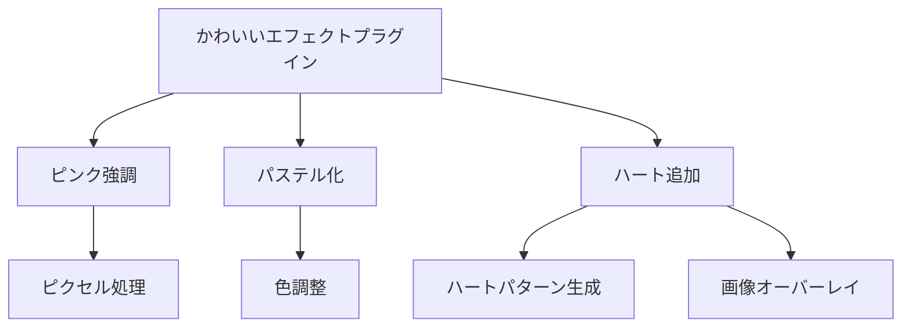
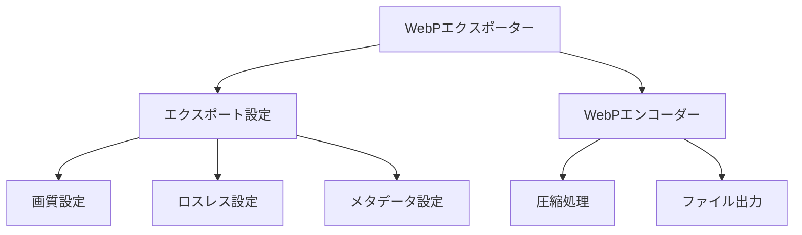

# EDVプラグインサンプル集

このディレクトリには、EDVプラグインシステムの使用方法を示すサンプルプラグインの実装例が含まれています。これらのサンプルは、独自のプラグイン開発の参考として使用できます。

**最終更新日: 2025年4月1日 09:26:53**

## サンプル一覧

| プラグイン名 | タイプ | 説明 | ドキュメント |
|------------|------|------|------------|
| Kawaii Effect | エフェクト | パステルカラーとハートエフェクトを適用するプラグイン | [詳細](./01_kawaii_effect.md) |
| WebP Exporter | エクスポーター | 画像をWebP形式でエクスポートするプラグイン | [詳細](./02_webp_exporter.md) |
| PSD Importer | インポーター | Photoshopファイルをインポートするプラグイン | 準備中 |
| Custom Panel UI | UI | カスタムパネルとテーマを提供するプラグイン | 準備中 |

## サンプルプラグインの機能

### Kawaii Effect



かわいいエフェクトプラグインは、以下の機能を提供します：

- 画像内のピンク色の要素を強調
- 画像全体にパステルカラー効果を適用
- ランダムな位置にハートを追加

このプラグインは、エフェクトプラグインの基本実装と、設定管理、リソース管理の方法を示しています。

### WebP Exporter



WebPエクスポータープラグインは、以下の機能を提供します：

- 画像をWebP形式でエクスポート
- 品質設定（0〜100）
- ロスレス圧縮オプション
- メタデータ保持設定

このプラグインは、エクスポータープラグインの基本実装と、ファイル出力、設定管理の方法を示しています。

## サンプルプラグインの使用方法

### プラグインのビルド方法

1. リポジトリをクローン：
   ```bash
   git clone https://github.com/edv-dev/plugin-examples.git
   cd plugin-examples
   ```

2. 特定のサンプルをビルド：
   ```bash
   cd kawaii-effect
   cargo build --release
   ```

3. ビルドされたプラグインをEDVプラグインディレクトリにコピー：
   ```bash
   mkdir -p ~/.local/share/EDV/plugins/kawaii-effect
   cp target/release/libkawaii_effect.so ~/.local/share/EDV/plugins/kawaii-effect/
   cp plugin.toml ~/.local/share/EDV/plugins/kawaii-effect/
   cp -r assets ~/.local/share/EDV/plugins/kawaii-effect/
   ```

### プラグインのインストール方法

各プラグインのインストール方法については、個別のドキュメントを参照してください。一般的には以下の手順でインストールします：

1. ビルドされたプラグインファイル（`.so`、`.dll`、または `.dylib`）を取得
2. プラグインマニフェスト（`plugin.toml`）を取得
3. 必要なリソースファイルを取得
4. これらのファイルをEDVプラグインディレクトリに配置：
   - Linux: `~/.local/share/EDV/plugins/[プラグイン名]/`
   - macOS: `~/Library/Application Support/EDV/plugins/[プラグイン名]/`
   - Windows: `%APPDATA%\EDV\plugins\[プラグイン名]\`
5. EDVを起動または再起動

## サンプルコードのライセンス

サンプルプラグインのコードは、MIT/Apache-2.0デュアルライセンスで提供されています。商用、非商用を問わず、自由に利用、改変、再配布が可能です。

## 貢献方法

サンプルプラグインの改善や新しいサンプルプラグインの追加に興味がある場合は、GitHub上で以下の手順でプルリクエストを送信してください：

1. リポジトリをフォークする
2. 新しいブランチを作成する：`git checkout -b my-new-plugin`
3. 変更をコミットする：`git commit -am 'Add new plugin example'`
4. ブランチをプッシュする：`git push origin my-new-plugin`
5. プルリクエストを送信する

## その他のリソース

- [EDVプラグイン開発ガイド](../05_プラグイン開発ガイド.md)
- [プラグイン基本設計](../01_プラグイン基本設計.md)
- [プラグインインターフェース](../02_プラグインインターフェース.md)
- [プラグインライフサイクル](../03_プラグインライフサイクル.md)
- [プラグインセキュリティ](../04_プラグインセキュリティ.md) 