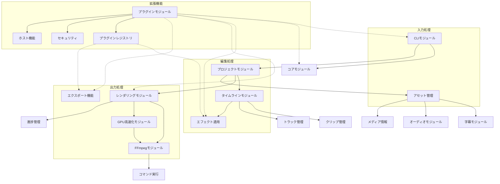
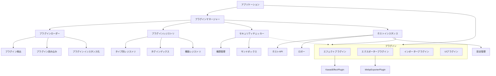

# edv - 技術ドキュメントコレクション

このディレクトリはedvプロジェクトの技術ドキュメントを含んでいます。開発者向けの詳細な仕様書、設計文書、実装ガイドラインが含まれています。

**最終更新日: 2025年4月1日 09:09:32**

## 最近の更新

- 🎉 **プラグインシステムの基本実装完了**（プラグインローダー、マネージャー、レジストリ、ホスト機能、サンプルプラグイン実装）
- 🔌 **サンプルプラグインの作成**（KawaiiEffect、WebPエクスポーター）
- ✨ **GPU高速化サポートの実装完了**（FFmpegハードウェアアクセラレーション統合、動的なGPU検出、最適化されたレンダリングパイプライン）
- 🔄 レンダリングパイプラインの進捗追跡機能を強化（RenderStageとSharedProgressTrackerの改善）
- 🚀 FFmpegコマンド実行クラスのパフォーマンス最適化（メモリ使用効率の向上とエラーハンドリングの改善）
- 🛠️ エラー型の整理と統一
- 🔒 バッファ処理とバリデーションのセキュリティ向上

## ドキュメント構造

```mermaid
mindmap
  root((技術ドキュメント))
    実装計画
      アーキテクチャ設計
      技術スタック選定理由
      コーディング規約
      実装ロードマップ
    開発フェーズ
      フェーズ1:::done(基盤構築)
      フェーズ2:::done(機能拡張)
      フェーズ3:::done(高度な機能)
      フェーズ4:::current(最適化と拡張)
      リリース計画
    モジュール仕様
      アーキテクチャ概要
      各モジュール詳細設計
      APIリファレンス
      インターフェース定義
      データフロー
    テスト戦略
      テストアプローチ
      テスト環境
      テストケース
      CI/CD統合
    APIドキュメント
      パブリックインターフェース
      利用例
      拡張ポイント
    プラグインシステム
      設計:::done
      ライフサイクル:::done
      セキュリティ:::done
      開発ガイド:::done

  classDef done fill:#9f9,stroke:#6c6,color:#000
  classDef current fill:#ff9,stroke:#c96,color:#000
```

## フェーズ進捗状況

```mermaid
journey
  title edv開発進捗
  section フェーズ1: 基盤構築
    プロジェクト構造: 10: done
    FFmpeg統合: 10: done
    コアビデオ操作: 10: done
    CLIフレームワーク: 10: done
  section フェーズ2: 機能拡張
    オーディオ処理: 10: done
    字幕サポート: 10: done
    タイムライン編集: 10: done
    エラー処理強化: 10: done
  section フェーズ3: 高度な機能
    高度なフィルター: 10: done
    マルチトラック編集: 10: done
    バッチ処理: 10: done
    プロジェクト管理: 10: done
  section フェーズ4: 最適化と拡張
    パフォーマンス最適化: 10: done
    GPU高速化: 10: done
    プラグインシステム: 10: done
    品質保証: 5: active
```

## セクション概要

### 01_実装計画/

実装計画と全体設計に関連するドキュメントを含んでいます。このセクションではプロジェクトの技術的な基盤と方向性を定義しています。

- **アーキテクチャ設計**: システム全体のアーキテクチャと設計原則
- **技術スタック**: 選択された技術とライブラリの根拠
- **コーディング規約**: プロジェクト全体に適用されるコーディング標準
- **実装ロードマップ**: 主要機能の実装順序と優先事項

### 02_開発フェーズ/

開発フェーズとマイルストーンに関連するドキュメントを含んでいます。このセクションではプロジェクトの段階と各フェーズの目標を定義しています。

- **フェーズ1**: 基盤モジュールとコア機能の実装 ✅
- **フェーズ2**: 拡張機能と高度な処理の実装 ✅
- **フェーズ3**: 高度な機能とマルチトラックサポート ✅
- **フェーズ4**: パフォーマンス最適化とGPU高速化（現在のフェーズ）🔄
- **リリース計画**: バージョン管理とリリースサイクル

### 03_モジュール/

各モジュールの詳細な仕様とAPI設計を含んでいます。このセクションは、モジュールを実装および統合する開発者のための主要な参照資料です。

```mermaid
graph TD
    Core[00_アーキテクチャ概要] --> CLI[01_CLIモジュール]
    Core --> CoreMod[02_コアモジュール]
    Core --> Process[03_処理モジュール]
    Core --> Project[04_プロジェクトモジュール]
    Core --> Asset[05_アセットモジュール]
    Core --> Util[06_ユーティリティモジュール]
    Core --> Subtitle[07_字幕モジュール]
    Core --> Audio[08_オーディオモジュール]
    Core --> FFmpeg[09_FFmpegモジュール]
    Core --> GPU[10_GPU高速化モジュール]
    Core --> Plugin[11_プラグインモジュール]
    
    Project --> Timeline[タイムライン管理]
    Project --> Render[レンダリング]
    Project --> Serial[シリアル化]
    
    FFmpeg --> Cmd[コマンド構築]
    FFmpeg --> Exec[実行管理]
    
    GPU --> Detection[GPU検出]
    GPU --> Bench[ベンチマーク]
    GPU --> Accel[高速化適用]
    
    Plugin --> Manager[プラグイン管理]
    Plugin --> API[プラグインAPI]
    Plugin --> Loading[プラグイン読み込み]
    Plugin --> Registry[プラグインレジストリ]
    Plugin --> Security[セキュリティ]
    Plugin --> Host[ホスト機能]
    Plugin --> Examples[サンプル実装]
    
    Examples --> KawaiiEffect[かわいいエフェクト]
    Examples --> WebpExporter[WebPエクスポーター]
```



### 04_テスト/

テスト戦略とテストケースの仕様を含んでいます。このセクションでは品質保証プロセスとテスト方法論を定義しています。

- **テストアプローチ**: ユニットテスト、統合テスト、システムテストのアプローチ
- **テスト環境**: テスト環境の構成と要件
- **テストケース**: 主要機能のテストケース
- **自動テスト**: CI/CDパイプラインとテスト自動化
- **パフォーマンステスト**: パフォーマンスとGPU加速テスト（追加）

### 05_APIドキュメント/

APIリファレンスと利用例を含んでいます。このセクションはライブラリとしてedvを利用する開発者のための主要な参照資料です。

- **API概要**: 全体のAPI構造と設計思想
- **モジュールAPI**: 各モジュールが提供するパブリックAPI
- **インターフェース定義**: 主要なインターフェースとデータ型
- **利用例**: 一般的なユースケースのコード例
- **GPU高速化API**: GPU高速化機能のインターフェースと設定（追加）

### 06_プラグインシステム/

プラグインシステムの設計と開発ガイドラインを含んでいます。このセクションは、プラグイン開発者のための主要な参照資料です。

- **プラグイン基本設計**: プラグインシステムのアーキテクチャと基本設計 ✅
- **プラグインAPI**: プラグイン開発に必要なインターフェースの定義 ✅
- **プラグインのライフサイクル**: プラグインの読み込み、初期化、実行、アンロードの流れ ✅
- **セキュリティモデル**: プラグインの実行におけるセキュリティ考慮事項 ✅
- **開発ガイド**: プラグイン開発者向けのガイドライン 🔄
- **サンプルプラグイン**: 参考実装としてのサンプルプラグイン集 ✅

## 主要モジュール間のデータフロー



## プラグインシステムアーキテクチャ



## オンラインドキュメント

📚 **APIドキュメント**はGitHub Pagesで公開されています: [https://eda3.github.io/edv/](https://eda3.github.io/edv/)

オンラインドキュメントには以下が含まれています:
- 完全なAPIリファレンス
- モジュール構造
- インターフェース定義
- 利用例

## ドキュメント更新ガイドライン

技術ドキュメントはプロジェクト資産としてコードと同様に重要です。ドキュメントを更新する際は、以下のガイドラインに従ってください：

1. **コードとの同期**: 重要なコード変更を行う際は、対応するドキュメントを更新する
2. **Mermaidダイアグラム**: 複雑な概念と関係を視覚化するためにMermaidダイアグラムを使用する
3. **コミットメッセージ**: ドキュメント更新のコミットメッセージには `docs: ` プレフィックスを使用する
4. **レビュー**: コードレビューの一部としてドキュメントレビューを含める
5. **APIドキュメント**: APIを変更した場合は、RustDocコメントとGitHub Pagesの両方を更新する

## 表記と書式

ドキュメントは一貫したスタイルで書かれるべきです：

- **見出し**: トピック階層を表現するために適切な見出しレベルを使用する
- **コードブロック**: コード例は言語指定のコードブロックで囲む
- **相互参照**: 関連ドキュメントへのリンクを提供する
- **ダイアグラム**: Mermaidダイアグラムを使用して複雑な概念を説明する
- **APIリファレンス**: Rustdocスタイルのコメントでコードを文書化する

## 貢献

技術ドキュメントへの貢献を歓迎します。新しいドキュメントや既存のドキュメントの更新はプルリクエストを通じて提出してください。 