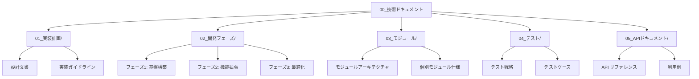

# edv - 技術ドキュメントコレクション

このディレクトリはedvプロジェクトの技術ドキュメントを含んでいます。開発者向けの詳細な仕様書、設計文書、実装ガイドラインが含まれています。

**最終更新日: 2025年4月1日**

## 最近の更新

- レンダリングパイプラインの進捗追跡機能を強化（RenderStageとSharedProgressTrackerの改善）
- FFmpegコマンド実行クラスのパフォーマンス最適化（メモリ使用効率の向上とエラーハンドリングの改善）
- エラー型の整理と統一
- バッファ処理とバリデーションのセキュリティ向上

## ディレクトリ構造

## セクション概要

### 01_実装計画/

実装計画と全体設計に関連するドキュメントを含んでいます。このセクションではプロジェクトの技術的な基盤と方向性を定義しています。

- **アーキテクチャ設計**: システム全体のアーキテクチャと設計原則
- **技術スタック**: 選択された技術とライブラリの根拠
- **コーディング規約**: プロジェクト全体に適用されるコーディング標準
- **実装ロードマップ**: 主要機能の実装順序と優先事項

### 02_開発フェーズ/

開発フェーズとマイルストーンに関連するドキュメントを含んでいます。このセクションではプロジェクトの段階と各フェーズの目標を定義しています。

- **フェーズ1**: 基盤モジュールとコア機能の実装
- **フェーズ2**: 拡張機能と高度な処理の実装
- **フェーズ3**: パフォーマンス最適化と使いやすさの向上（現在のフェーズ）
- **リリース計画**: バージョン管理とリリースサイクル

### 03_モジュール/

各モジュールの詳細な仕様とAPI設計を含んでいます。このセクションは、モジュールを実装および統合する開発者のための主要な参照資料です。

- **00_アーキテクチャ概要.md**: モジュール間の関係と全体アーキテクチャ
- **01_CLIモジュール.md**: コマンドラインインターフェースモジュール
- **02_コアモジュール.md**: コア機能モジュール
- **03_処理モジュール.md**: 処理モジュール
- **04_プロジェクトモジュール.md**: プロジェクト管理モジュール
- **05_アセットモジュール.md**: アセット管理モジュール
- **06_ユーティリティモジュール.md**: ユーティリティモジュール
- **07_字幕モジュール.md**: 字幕処理モジュール
- **08_オーディオモジュール.md**: オーディオ処理モジュール
- **09_FFmpegモジュール.md**: FFmpeg統合モジュール

### 04_テスト/

テスト戦略とテストケースの仕様を含んでいます。このセクションでは品質保証プロセスとテスト方法論を定義しています。

- **テストアプローチ**: ユニットテスト、統合テスト、システムテストのアプローチ
- **テスト環境**: テスト環境の構成と要件
- **テストケース**: 主要機能のテストケース
- **自動テスト**: CI/CDパイプラインとテスト自動化

### 05_APIドキュメント/

APIリファレンスと利用例を含んでいます。このセクションはライブラリとしてedvを利用する開発者のための主要な参照資料です。

- **API概要**: 全体のAPI構造と設計思想
- **モジュールAPI**: 各モジュールが提供するパブリックAPI
- **インターフェース定義**: 主要なインターフェースとデータ型
- **利用例**: 一般的なユースケースのコード例

## オンラインドキュメント

📚 **APIドキュメント**はGitHub Pagesで公開されています: [https://eda3.github.io/edv/](https://eda3.github.io/edv/)

オンラインドキュメントには以下が含まれています:
- 完全なAPIリファレンス
- モジュール構造
- インターフェース定義
- 利用例

## ドキュメント更新ガイドライン

技術ドキュメントはプロジェクト資産としてコードと同様に重要です。ドキュメントを更新する際は、以下のガイドラインに従ってください：

1. **コードとの同期**: 重要なコード変更を行う際は、対応するドキュメントを更新する
2. **Mermaidダイアグラム**: 複雑な概念と関係を視覚化するためにMermaidダイアグラムを使用する
3. **コミットメッセージ**: ドキュメント更新のコミットメッセージには `docs: ` プレフィックスを使用する
4. **レビュー**: コードレビューの一部としてドキュメントレビューを含める
5. **APIドキュメント**: APIを変更した場合は、RustDocコメントとGitHub Pagesの両方を更新する

## 表記と書式

ドキュメントは一貫したスタイルで書かれるべきです：

- **見出し**: トピック階層を表現するために適切な見出しレベルを使用する
- **コードブロック**: コード例は言語指定のコードブロックで囲む
- **相互参照**: 関連ドキュメントへのリンクを提供する
- **ダイアグラム**: Mermaidダイアグラムを使用して複雑な概念を説明する
- **APIリファレンス**: Rustdocスタイルのコメントでコードを文書化する

## 貢献

技術ドキュメントへの貢献を歓迎します。新しいドキュメントや既存のドキュメントの更新はプルリクエストを通じて提出してください。 