# edv - ユーザーガイド

このディレクトリには、edvビデオ編集ツールの使用方法に関する包括的なユーザーガイドが含まれています。初心者からの基本的な使い方から、高度な機能の活用まで、段階的に説明しています。

## ガイドの構成

```mermaid
flowchart TD
    Root["01_ユーザーガイド"] --> Basic["01_はじめに/"]
    Root --> Features["02_基本機能/"]
    Root --> Advanced["03_高度な機能/"]
    Root --> Workflow["04_ワークフロー/"]
    Root --> Troubleshooting["05_トラブルシューティング/"]
    
    Basic --> Installation["インストール"]
    Basic --> Interface["インターフェースの基本"]
    Basic --> FirstProject["最初のプロジェクト作成"]
    
    Features --> Trimming["動画のトリミング"]
    Features --> Concat["動画の結合"]
    Features --> Audio["基本オーディオ編集"]
    Features --> Export["出力設定"]
    
    Advanced --> MultiTrack["マルチトラック編集"]
    Advanced --> Effects["エフェクトとフィルター"]
    Advanced --> Masks["マスキング機能"]
    Advanced --> Blending["ブレンドモード"]
    
    Workflow --> Templates["プロジェクトテンプレート"]
    Workflow --> Batch["バッチ処理"]
    Workflow --> Automation["編集の自動化"]
    
    Troubleshooting --> Common["よくある問題"]
    Troubleshooting --> Performance["パフォーマンス最適化"]
    Troubleshooting --> FFmpeg["FFmpeg関連の問題"]
```

## 使い方

このユーザーガイドは以下の方法で使用できます：

1. **順を追って学習**: 01_はじめにから始めて、順番に進んでいく
2. **必要な機能を探す**: 目次から特定の機能やトピックを直接参照する
3. **トラブルシューティング**: 問題が発生した場合は05_トラブルシューティングセクションを参照

## 更新情報

_最終更新日: 2025年3月31日_

- マルチトラック編集に関する詳細なチュートリアルを追加
- ブレンドモードとマスキング機能のセクションを拡充
- バッチ処理のサンプルとベストプラクティスを追加

## 貢献

ユーザーガイドへの改善提案や追加コンテンツの提案は大歓迎です。プロジェクトのIssueやPull Requestを通じてご連絡ください。 