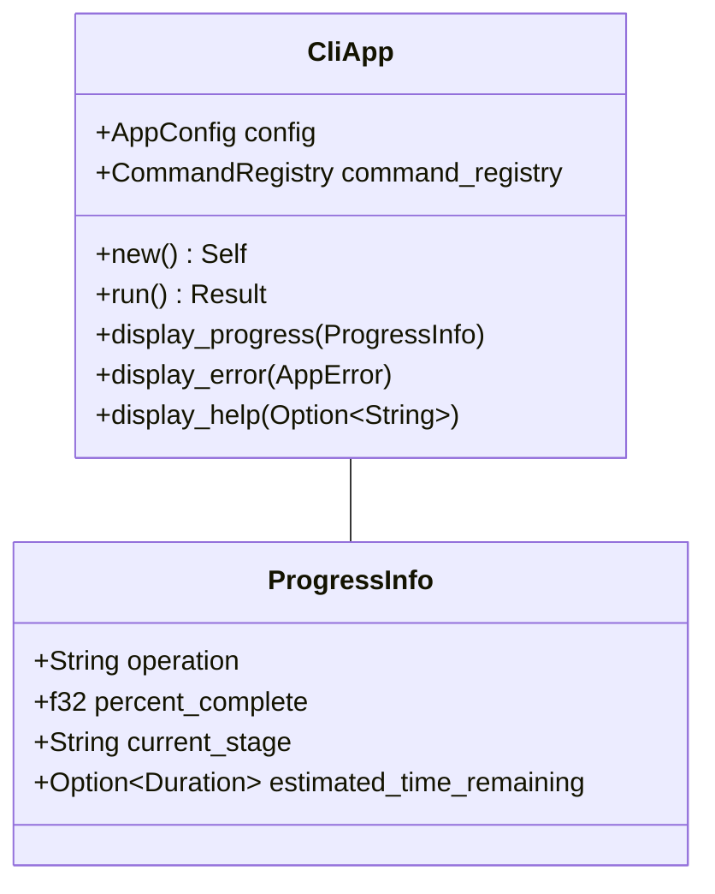
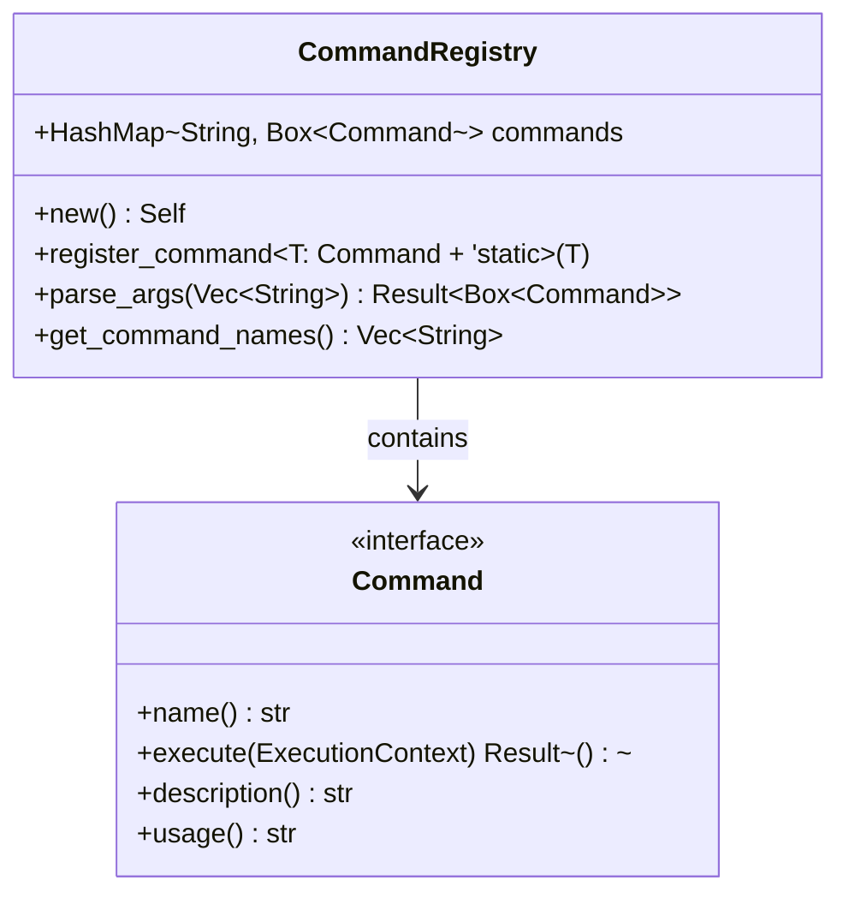
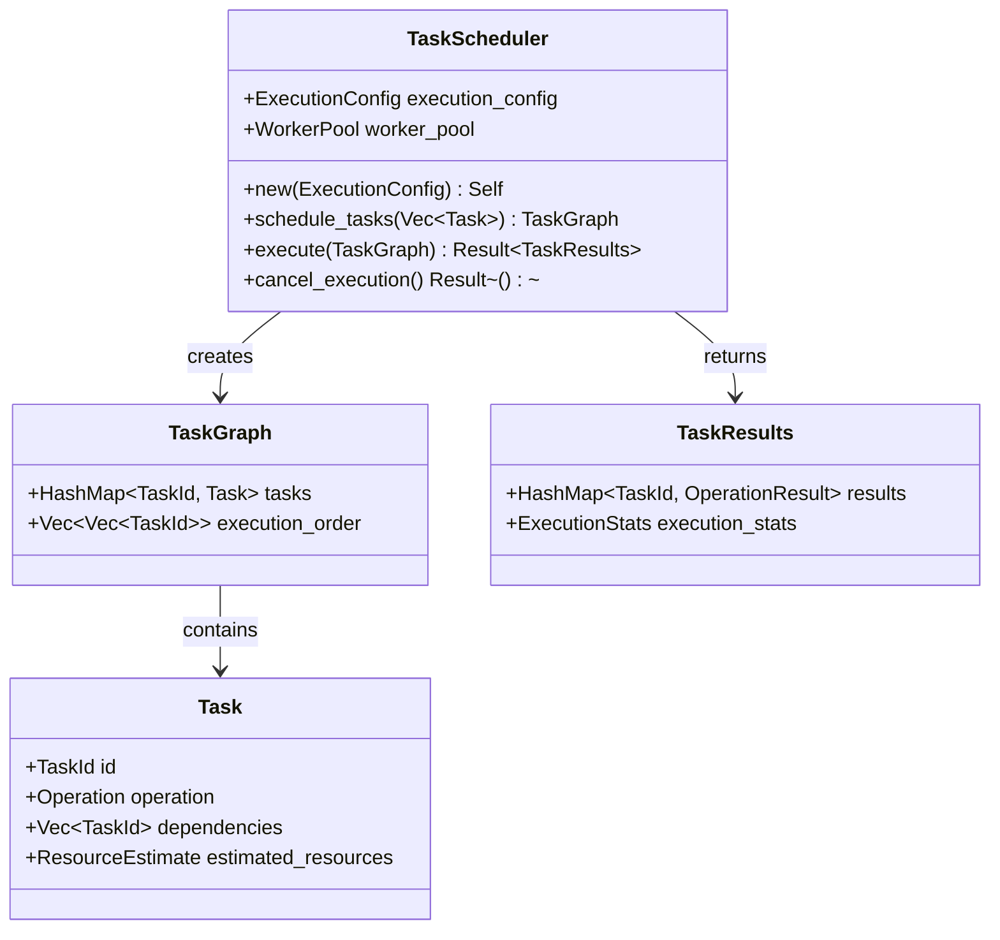
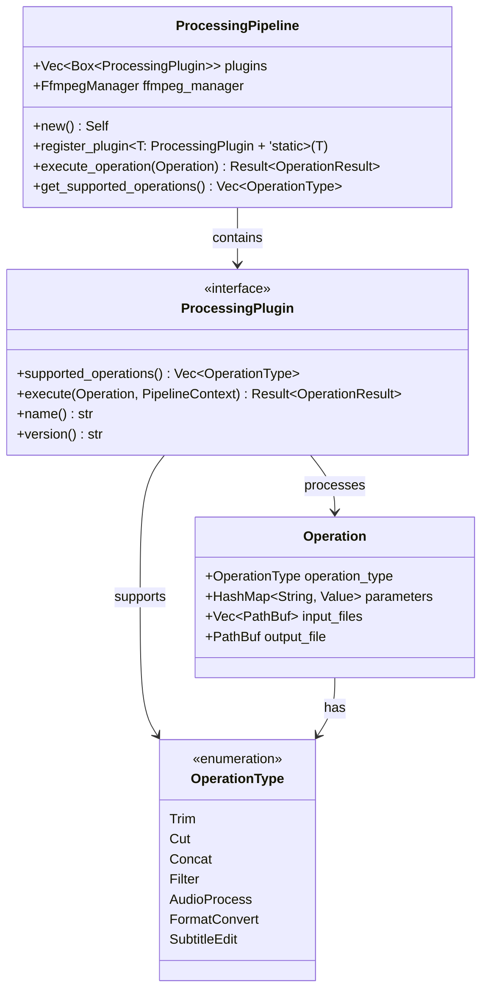
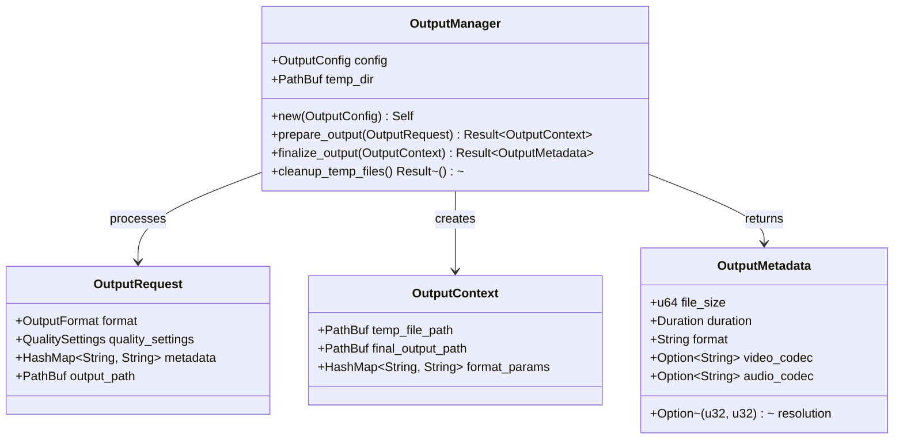
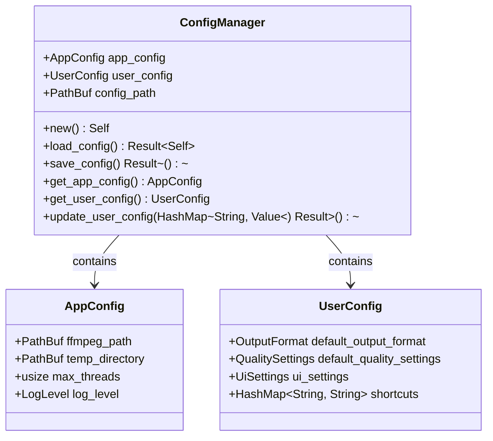
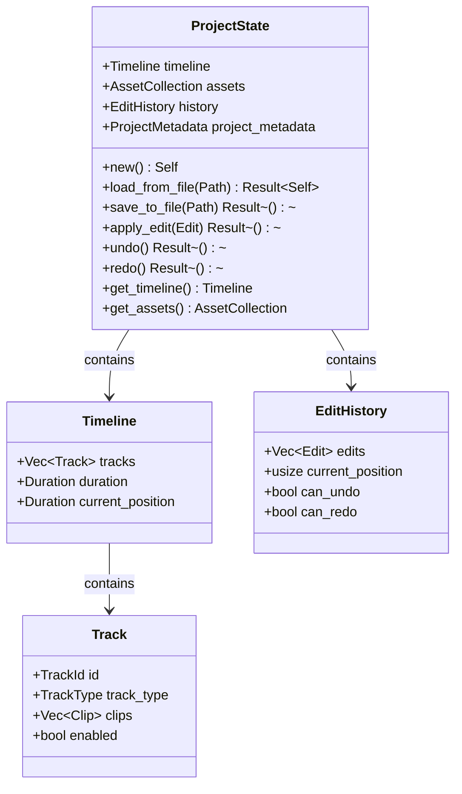
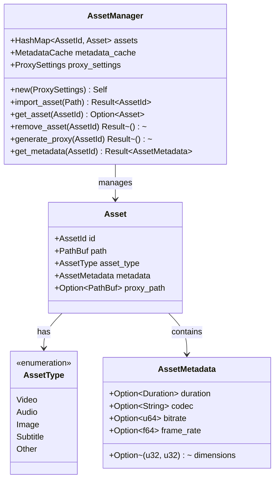

# Rust製CLIベース動画編集ソフト 詳細設計書1（ブラックボックステストレベル）

## 1. モジュール詳細設計

### 1.1 CLI Frontend モジュール

#### 1.1.1 責務
- ユーザーからのコマンド入力受付
- ヘルプメッセージとドキュメントの表示
- 処理進捗の表示
- エラーメッセージの整形と表示

#### 1.1.2 インターフェース仕様


#### 1.1.3 入出力仕様
**入力**:
- コマンドライン引数
- 標準入力からのキー入力（進捗中断など）

**出力**:
- 標準出力への進捗表示
- 標準エラー出力へのエラーメッセージ
- ファイルシステムへの処理結果出力

#### 1.1.4 テスト条件
- 無効なコマンドに対するエラーメッセージの表示確認
- ヘルプコマンド実行時の適切なヘルプ情報表示
- 長時間処理実行時の進捗表示の正確性
- キー入力による処理中断機能の動作確認
- 各サブコマンドのヘルプ表示の整合性

### 1.2 Command Parser モジュール

#### 1.2.1 責務
- コマンドライン引数の解析
- 引数検証とエラーレポート
- コマンドオブジェクトの生成

#### 1.2.2 インターフェース仕様


#### 1.2.3 入出力仕様
**入力**:
- コマンドライン引数ベクター

**出力**:
- パース済みコマンドオブジェクト
- 引数エラー情報

#### 1.2.4 テスト条件
- 有効なコマンド組み合わせの正常解析
- 無効な引数に対する適切なエラーメッセージ
- 複合コマンドの正確な解析
- 引数の型変換の正確性（時間指定、数値指定など）
- ショートオプションとロングオプションの同等動作
- 必須引数の未指定検出

### 1.3 Task Scheduler モジュール

#### 1.3.1 責務
- タスクの依存関係解析
- 効率的な実行順序の決定
- 並列実行可能タスクの識別と分配
- リソース使用管理

#### 1.3.2 インターフェース仕様


#### 1.3.3 入出力仕様
**入力**:
- タスクリスト
- 実行設定（並列度、優先度など）

**出力**:
- 実行結果
- 実行統計情報

#### 1.3.4 テスト条件
- 依存関係を持つタスクの正しい順序付け
- 並列実行における適切なCPUコア利用
- メモリ制限を超えないスケジューリング
- 循環依存の検出と報告
- キャンセル操作に対する適切な応答
- タスク失敗時の残りのタスク処理方針

### 1.4 Processing Pipeline モジュール

#### 1.4.1 責務
- 具体的な動画処理操作の実行
- 処理プラグインの管理
- 処理状態の監視と報告

#### 1.4.2 インターフェース仕様


#### 1.4.3 入出力仕様
**入力**:
- 操作指定（種類、パラメータ）
- 入力ファイル
- 出力指定

**出力**:
- 処理結果ファイル
- 処理メタデータ
- エラー情報

#### 1.4.4 テスト条件
- 各処理操作の正確な実行
- 無効なパラメータに対する適切なエラーハンドリング
- 処理の中断と再開機能
- 大きなファイルでのメモリ使用効率
- プラグイン機能の拡張性
- FFmpegとの連携の安定性

### 1.5 Output Manager モジュール

#### 1.5.1 責務
- 出力形式の管理
- 一時ファイルの管理
- 出力品質設定の適用
- メタデータの保存

#### 1.5.2 インターフェース仕様


#### 1.5.3 入出力仕様
**入力**:
- 出力リクエスト（形式、品質設定）
- 処理済み一時ファイル

**出力**:
- 最終出力ファイル
- メタデータ情報

#### 1.5.4 テスト条件
- 様々な出力形式での正確な変換
- 一時ファイルの適切な生成と削除
- 出力パスにファイルが既に存在する場合の処理
- メタデータの正確な保存
- ディスク容量不足時の適切なエラー処理
- 大きなファイルの効率的な処理

### 1.6 Config Manager モジュール

#### 1.6.1 責務
- アプリケーション設定の読み込みと保存
- ユーザー設定の管理
- デフォルト値の提供

#### 1.6.2 インターフェース仕様


#### 1.6.3 入出力仕様
**入力**:
- 設定ファイルパス
- 設定更新リクエスト

**出力**:
- 読み込み済み設定
- 保存結果

#### 1.6.4 テスト条件
- 設定ファイルの正確な読み込み
- 無効な設定値のバリデーション
- 設定ファイルの保存と再読み込み
- デフォルト値の適用
- 設定が存在しない場合の処理
- 設定変更の即時反映

### 1.7 Project State モジュール

#### 1.7.1 責務
- プロジェクト状態の管理
- 編集履歴のトラッキング
- Undo/Redo機能の提供
- プロジェクトファイルの読み書き

#### 1.7.2 インターフェース仕様


#### 1.7.3 入出力仕様
**入力**:
- 編集操作
- プロジェクトファイルパス

**出力**:
- 更新されたプロジェクト状態
- 保存されたプロジェクトファイル

#### 1.7.4 テスト条件
- 編集操作の正確な適用
- Undo/Redoの正確な動作
- プロジェクトファイルの保存と読み込み
- 破損したプロジェクトファイルの処理
- 大規模プロジェクトでのパフォーマンス
- 並行編集時の整合性

### 1.8 Asset Manager モジュール

#### 1.8.1 責務
- プロジェクトアセットの管理
- アセットメタデータの抽出と管理
- アセットのインポート機能
- アセットのプロキシ生成と管理

#### 1.8.2 インターフェース仕様


#### 1.8.3 入出力仕様
**入力**:
- アセットファイルパス
- インポート設定

**出力**:
- インポート済みアセット情報
- プロキシファイル

#### 1.8.4 テスト条件
- 様々な形式のアセットの正確なインポート
- メタデータの正確な抽出
- プロキシ生成の品質と効率
- 存在しないアセットの処理
- 大量のアセット管理時のパフォーマンス
- 外部で変更されたアセットの更新検出

## 2. ユースケース詳細

### 2.1 基本的な動画編集ユースケース

#### 2.1.1 動画トリミング（trim）

**コマンド例**:
```bash
videdit trim --start 01:30 --end 03:45 input.mp4 -o output.mp4
```

**処理フロー**:
1. 入力検証（ファイル存在確認、時間フォーマット）
2. トリミングタスク生成
3. FFmpegへのコマンド変換
4. 処理実行と進捗表示
5. 出力ファイル生成

**期待結果**:
- 指定時間範囲で正確にトリミングされた動画
- 元の動画品質を維持
- 進捗の正確な表示
- エラー時の適切なメッセージ

**テスト条件**:
- 様々な時間フォーマット指定（HH:MM:SS.mmm, 秒数指定）
- 範囲外の時間指定への対応
- 再エンコードの有無オプション
- キーフレームでの正確なカット

#### 2.1.2 動画結合（concat）

**コマンド例**:
```bash
videdit concat video1.mp4 video2.mp4 video3.mp4 -o combined.mp4
```

**処理フロー**:
1. 入力ファイル検証（存在確認、形式チェック）
2. 結合タスク生成
3. FFmpegへのコマンド変換
4. 処理実行と進捗表示
5. 出力ファイル生成

**期待結果**:
- 順序通りに結合された単一の動画
- シームレスな結合（可能な場合）
- 入力ファイルの品質保持
- 進捗の正確な表示

**テスト条件**:
- 異なる形式のファイル結合
- 異なる解像度のファイル結合
- 大量のファイル結合（10以上）
- 再エンコードなしオプションの挙動確認
- リストファイルからの入力

#### 2.1.3 部分削除（cut）

**コマンド例**:
```bash
videdit cut --ranges 00:30-01:45,02:15-03:30 input.mp4 -o output.mp4
```

**処理フロー**:
1. 入力検証（ファイル存在確認、範囲フォーマット）
2. 削除範囲の解析と変換
3. 部分抽出と結合タスクの生成
4. FFmpegへのコマンド変換
5. 処理実行と進捗表示
6. 出力ファイル生成

**期待結果**:
- 指定範囲が正確に削除された動画
- 残りの部分がシームレスに接続
- 元の動画品質を維持
- 進捗の正確な表示

**テスト条件**:
- 複数範囲指定の正確な処理
- 範囲重複の検出と処理
- 範囲の境界値テスト（動画の先頭や末尾に近い位置）
- 再エンコードの有無による品質とパフォーマンスの違い

#### 2.1.4 速度調整（speed）

**コマンド例**:
```bash
videdit speed --factor 0.5 input.mp4 -o slow.mp4
videdit speed --factor 2.0 input.mp4 -o fast.mp4
```

**処理フロー**:
1. 入力検証（ファイル存在確認、速度係数の範囲）
2. 速度調整タスク生成
3. FFmpegへのコマンド変換（適切なフィルター選択）
4. 処理実行と進捗表示
5. 出力ファイル生成

**期待結果**:
- 指定係数で正確に速度調整された動画
- 音声の適切な処理（オプションによる）
- 品質の維持

**テスト条件**:
- 極端な速度設定（0.1x, 10x）のハンドリング
- 音声処理オプションの効果（--keep-audio, --mute）
- フレームレート保持オプションの効果
- 部分的な速度変更（タイムライン上）

### 2.2 フィルターとエフェクトユースケース

#### 2.2.1 カラー調整（color）

**コマンド例**:
```bash
videdit filter color --brightness 10 --contrast 1.2 --saturation 1.5 input.mp4 -o enhanced.mp4
```

**処理フロー**:
1. 入力検証（ファイル存在確認、パラメータ範囲）
2. カラー調整タスク生成
3. FFmpegフィルターグラフ生成
4. 処理実行と進捗表示
5. 出力ファイル生成

**期待結果**:
- 指定されたパラメータで正確に調整された動画
- 元の解像度とフレームレートの維持
- 進捗の正確な表示

**テスト条件**:
- パラメータの組み合わせテスト
- 極端な値のハンドリング

### 2.5 字幕処理ユースケース

#### 2.5.1 字幕追加（add）

**コマンド例**:
```bash
videdit subtitle add --file subtitles.srt input.mp4 -o output.mp4
videdit subtitle add --file subtitles.srt --burn input.mp4 -o output.mp4
```

**処理フロー**:
1. 入力検証（ファイル存在確認、字幕フォーマット）
2. 字幕追加タスク生成
3. FFmpegコマンド生成
4. 処理実行と進捗表示
5. 出力ファイル生成

**期待結果**:
- 正確に字幕が追加された動画
- 字幕の選択可否（ストリーム追加）または
- 画像として焼き込まれた字幕（--burn オプション）

**テスト条件**:
- 様々な字幕形式のサポート（SRT, VTT, ASS）
- 字幕エンコーディングオプションの効果
- スタイル設定オプションの効果（--font, --size, --color）
- 複数言語字幕の追加

#### 2.5.2 字幕抽出（extract）

**コマンド例**:
```bash
videdit subtitle extract input.mp4 -o subtitles.srt
videdit subtitle extract --stream 2 --format vtt input.mp4 -o subtitles.vtt
```

**処理フロー**:
1. 入力検証（ファイル存在確認、ストリーム指定）
2. 字幕抽出タスク生成
3. FFmpegコマンド生成
4. 処理実行
5. 出力ファイル生成

**期待結果**:
- 正確に抽出された字幕ファイル
- 指定形式での出力
- 適切なエンコーディング

**テスト条件**:
- 様々な字幕ストリームタイプからの抽出
- 出力形式変換の正確性
- 字幕のないファイルへの適切な対応
- 複数ストリームの扱い

### 2.6 バッチ処理ユースケース

#### 2.6.1 一括処理（batch）

**コマンド例**:
```bash
videdit batch convert --format mp4 --codec h264 ./input_dir/ -o ./output_dir/
videdit batch filter color --brightness 10 --contrast 1.2 ./input_dir/ -o ./output_dir/
```

**処理フロー**:
1. 入力ディレクトリのスキャン
2. 対象ファイルのフィルタリング
3. 各ファイルに対する処理タスク生成
4. 並列実行制御
5. 処理実行と進捗表示
6. 出力ファイル生成

**期待結果**:
- すべての対象ファイルに一貫した処理の適用
- 効率的な並列処理
- 詳細な進捗表示
- エラーファイルの適切な処理

**テスト条件**:
- 大量のファイル（100+）への処理
- 異なるフォーマットのファイルの混在
- エラーハンドリング（一部のファイルが破損している場合）
- 処理の中断と再開

#### 2.6.2 テンプレート適用（template）

**コマンド例**:
```bash
videdit template save my_process.template
videdit template apply my_process.template ./input_dir/ -o ./output_dir/
```

**処理フロー**:
1. テンプレート読み込み
2. 入力ディレクトリのスキャン
3. テンプレートに基づく処理タスク生成
4. 並列実行制御
5. 処理実行と進捗表示
6. 出力ファイル生成

**期待結果**:
- テンプレートに定義された処理の正確な適用
- 効率的な並列処理
- 詳細な進捗表示
- パラメータのオーバーライド処理

**テスト条件**:
- 複雑なテンプレートの処理
- パラメータ変数のオーバーライド
- テンプレートの互換性検証
- エラーからの回復

## 3. 非機能要件テスト仕様

### 3.1 パフォーマンステスト

#### 3.1.1 処理速度テスト
- **目的**: 様々な操作の処理速度を測定し、ベンチマークと比較する
- **方法**: 標準テストファイルセットを用意し、各操作の処理時間を計測
- **基準**: 同等のFFmpegコマンドライン処理と比較して80%以上の速度効率
- **テスト項目**:
  - 各基本操作（トリミング、結合、フィルター適用等）
  - バッチ処理の並列化効率
  - ハードウェアアクセラレーション有効/無効時の速度比較

#### 3.1.2 リソース使用効率テスト
- **目的**: CPU、メモリ、ディスク使用効率を測定
- **方法**: 様々なサイズの動画での処理中のリソースモニタリング
- **基準**:
  - CPU使用率: 設定された並列度に基づく適切な使用率
  - メモリ使用: 4GB以下の動画処理で2GBまでのメモリ使用
  - ディスク I/O: バッファリングによる効率的な使用
- **テスト項目**:
  - 処理中のメモリリーク検出
  - 並列処理時のCPUコア分配効率
  - 一時ファイル管理の効率

### 3.2 安定性テスト

#### 3.2.1 長時間実行テスト
- **目的**: 長時間の連続使用での安定性を確認
- **方法**: バッチ処理を8時間以上連続実行
- **基準**: クラッシュなく処理を完了
- **テスト項目**:
  - リソース使用の経時変化
  - エラー回復と継続処理
  - 処理速度の一貫性

#### 3.2.2 エラー回復テスト
- **目的**: 様々なエラー状況からの回復能力を確認
- **方法**: 意図的なエラー条件を作り出し、回復をテスト
- **基準**: 適切なエラーメッセージと必要に応じた処理継続
- **テスト項目**:
  - 破損ファイルへの対応
  - ディスク容量不足への対応
  - 外部リソース（FFmpeg）の異常終了への対応
  - ユーザーによる中断と再開

### 3.3 互換性テスト

#### 3.3.1 フォーマット互換性テスト
- **目的**: サポートされるべき全フォーマットでの動作確認
- **方法**: 各フォーマットのサンプルファイルを用いたテスト
- **基準**: 正常な読み込みと処理、出力品質の検証
- **テスト項目**:
  - 入力フォーマット（MP4, MKV, AVI, MOV, WebM, etc.）
  - 出力フォーマット（MP4, MKV, WebM, GIF, etc.）
  - 様々なコーデック（H.264, H.265, VP9, AV1, etc.）
  - 特殊なメタデータを含むファイル

#### 3.3.2 プラットフォーム互換性テスト
- **目的**: サポート対象OS全てでの動作確認
- **方法**: 各プラットフォームでの標準操作セットの実行
- **基準**: 全プラットフォームでの同一動作と結果の一貫性
- **テスト項目**:
  - Linux（Ubuntu, Debian, CentOS）
  - macOS（最新および前バージョン）
  - Windows（10, 11）
  - パスの扱いの違いへの対応
  - OS特有の制限への対応

### 3.4 ユーザビリティテスト

#### 3.4.1 コマンドインターフェーステスト
- **目的**: コマンドの直感性と一貫性を評価
- **方法**: ユーザーテストシナリオの実行と評価
- **基準**: ヘルプなしで基本コマンドが実行できること
- **テスト項目**:
  - コマンド構文の一貫性
  - エラーメッセージの明確さ
  - ヘルプテキストの有用性
  - オプションの名前とショートカットの直感性

#### 3.4.2 進捗表示テスト
- **目的**: 進捗情報の正確さと有用性を評価
- **方法**: 様々な長さの処理での進捗表示をモニタリング
- **基準**: 残り時間予測の±15%以内の精度
- **テスト項目**:
  - 進捗パーセンテージの正確さ
  - 残り時間予測の精度
  - マルチステップ処理での段階表示
  - 処理速度情報の表示

## 4. インターフェース検証

### 4.1 コマンドライン引数構文

#### 4.1.1 グローバルオプション
```
--verbose, -v            詳細出力モード
--quiet, -q              静音モード
--config <file>          設定ファイル指定
--temp-dir <dir>         一時ディレクトリ指定
--log-file <file>        ログファイル指定
--threads <num>          使用スレッド数
--help, -h               ヘルプ表示
--version                バージョン表示
```

#### 4.1.2 共通オプション
```
--output, -o <file>      出力ファイル指定
--overwrite              既存ファイル上書き
--no-overwrite           上書き禁止
--format <format>        出力フォーマット指定
--quality <value>        品質設定（1-100）
--metadata <key=value>   メタデータ設定
```

#### 4.1.3 テスト条件
- オプションの組み合わせの有効性
- 短縮形と長形式の同等動作
- 無効なオプション組み合わせの検出
- オプション値の型チェック
- 必須オプションの検証

### 4.2 エラーメッセージとログ

#### 4.2.1 エラーカテゴリ
- **入力エラー**: ファイル不存在、アクセス権限、破損ファイル
- **パラメータエラー**: 無効な引数、範囲外の値、無効な組み合わせ
- **処理エラー**: FFmpeg実行エラー、処理中断、リソース不足
- **出力エラー**: 書き込み権限、ディスク容量不足、パス不正

#### 4.2.2 エラーメッセージ形式
```
ERROR [category]: 明確なエラー内容
詳細説明（複数行可）
推奨される解決方法
```

#### 4.2.3 テスト条件
- 各エラー状況での適切なメッセージ表示
- 詳細モードでの追加情報表示
- エラーコードの一貫性
- ログファイルへの出力正確性

### 4.3 進捗表示

#### 4.3.1 標準進捗形式
```
[操作名] [ファイル名] [進捗率]% [経過時間]/[予測合計時間] [現在フレーム]/[合計フレーム]
```

#### 4.3.2 多段階処理進捗形式
```
[全体進捗率]% 進行中: [現在操作] ([操作進捗率]%)
```

#### 4.3.3 テスト条件
- 進捗表示の更新頻度の適切さ
- 複数段階処理での明確な進捗表示
- 残り時間予測の精度
- 端末幅に応じた表示調整

## 5. 互換性マトリックス

### 5.1 サポート対象OS

| OS | バージョン | サポートレベル | 特記事項 |
|----|------------|--------------|----------|
| Ubuntu | 20.04 LTS, 22.04 LTS | 完全 | 推奨環境 |
| Debian | 11, 12 | 完全 | |
| CentOS/RHEL | 8, 9 | 標準 | |
| Fedora | 最新2バージョン | 標準 | |
| macOS | 12+, 13+ | 完全 | Intel/ARM対応 |
| Windows | 10, 11 | 標準 | WSL2推奨 |

### 5.2 サポート入力フォーマット

| フォーマット | コンテナ | ビデオコーデック | オーディオコーデック | テスト優先度 |
|------------|--------|----------------|-------------------|-----------|
| MP4 | MP4 | H.264, H.265 | AAC, MP3 | 高 |
| MOV | QuickTime | H.264, ProRes | AAC, PCM | 高 |
| MKV | Matroska | H.264, H.265, VP9 | AAC, FLAC, Opus | 高 |
| AVI | AVI | MJPEG, DivX | MP3, PCM | 中 |
| WebM | WebM | VP8, VP9 | Opus, Vorbis | 中 |
| TS | MPEG-TS | MPEG-2, H.264 | MP2, AAC | 中 |
| FLV | Flash | H.264 | AAC, MP3 | 低 |
| GIF | GIF | GIF | なし | 低 |

### 5.3 サポート出力フォーマット

| フォーマット | コンテナ | ビデオコーデック | オーディオコーデック | テスト優先度 |
|------------|--------|----------------|-------------------|-----------|
| MP4 | MP4 | H.264, H.265 | AAC | 高 |
| MKV | Matroska | H.264, H.265, VP9 | AAC, FLAC, Opus | 高 |
| WebM | WebM | VP8, VP9 | Opus, Vorbis | 中 |
| GIF | GIF | GIF | なし | 中 |
| MP3 | MP3 | なし | MP3 | 中 |
| WAV | WAV | なし | PCM | 低 |
| OGG | OGG | なし | Vorbis, Opus | 低 |

## 6. テスト方法と環境

### 6.1 テスト環境

#### 6.1.1 標準テスト環境
- **OS**: Ubuntu 22.04 LTS
- **CPU**: Intel Core i7/AMD Ryzen 7以上（8コア/16スレッド）
- **メモリ**: 16GB以上
- **ストレージ**: SSD 100GB以上空き
- **FFmpeg**: 5.0以上

#### 6.1.2 最小テスト環境
- **OS**: Ubuntu 20.04 LTS
- **CPU**: Intel Core i3/AMD Ryzen 3以上（4コア）
- **メモリ**: 4GB
- **ストレージ**: HDD 50GB以上空き
- **FFmpeg**: 4.2以上

#### 6.1.3 クロスプラットフォームテスト環境
- 5.1に記載の各OS環境

### 6.2 テストデータセット

#### 6.2.1 標準テストファイル
- 短尺ファイル（30秒、様々な解像度とフレームレート）
- 中尺ファイル（5分、様々な解像度とフレームレート）
- 長尺ファイル（30分以上、標準解像度）
- 高解像度ファイル（4K, 8K）
- 高フレームレートファイル（60fps, 120fps）
- HDRファイル（HDR10, HLG）

#### 6.2.2 エッジケーステストファイル
- 非常に大きなファイル（>4GB）
- 非標準アスペクト比
- 可変フレームレート
- 非標準メタデータ
- 破損ファイル（部分的に読み取り可能）
- 複数音声トラック
- 複数字幕トラック

### 6.3 テスト自動化

#### 6.3.1 自動テストスクリプト
- 基本機能テスト
- クロスプラットフォームテスト
- パフォーマンステスト
- 回帰テスト

#### 6.3.2 CI/CD連携
- GitHub Actionsでの自動テスト
- マトリックスビルドとテスト
- テストカバレッジレポート
- パフォーマンスベンチマーク監視
- プリセット使用（--preset vivid）の正確な適用
- 異なる色空間の入力に対する一貫した結果

#### 2.2.2 エフェクト適用（effect）

**コマンド例**:
```bash
videdit filter effect --type blur --strength 5 input.mp4 -o blurred.mp4
videdit filter effect --type sharpen --strength 2 input.mp4 -o sharp.mp4
```

**処理フロー**:
1. 入力検証（ファイル存在確認、エフェクトタイプ、パラメータ）
2. エフェクト適用タスク生成
3. FFmpegフィルターグラフ生成
4. 処理実行と進捗表示
5. 出力ファイル生成

**期待結果**:
- 指定エフェクトが正確に適用された動画
- パラメータに応じた適切な強度
- 元の動画品質の維持

**テスト条件**:
- サポートされるすべてのエフェクトタイプのテスト
- パラメータ範囲のテスト
- 複数エフェクトの連鎖適用
- 処理時間と品質のトレードオフ

#### 2.2.3 トランジション（transition）

**コマンド例**:
```bash
videdit filter transition --type fade --duration 2.5 video1.mp4 video2.mp4 -o transition.mp4
```

**処理フロー**:
1. 入力検証（ファイル存在確認、トランジションタイプ、パラメータ）
2. トランジションタスク生成
3. FFmpegフィルターグラフ生成
4. 処理実行と進捗表示
5. 出力ファイル生成

**期待結果**:
- 滑らかなトランジションで結合された動画
- 指定された長さと種類のトランジション
- 元の動画品質の維持

**テスト条件**:
- 各トランジションタイプの視覚的検証
- 長さの異なるトランジション
- 解像度の異なる入力ファイルへの適用
- 音声トランジションの適用（オプション）

### 2.3 音声処理ユースケース

#### 2.3.1 音量調整（volume）

**コマンド例**:
```bash
videdit audio volume --level 0.8 input.mp4 -o output.mp4
videdit audio volume --db -3 input.mp4 -o output.mp4
```

**処理フロー**:
1. 入力検証（ファイル存在確認、音量パラメータ）
2. 音量調整タスク生成
3. FFmpegオーディオフィルター生成
4. 処理実行と進捗表示
5. 出力ファイル生成

**期待結果**:
- 指定レベルに正確に調整された音声
- ビデオストリームの維持
- クリッピングの防止（オプションによる）

**テスト条件**:
- 係数指定と dB 指定の両方のテスト
- 極端な値のハンドリング
- ノーマライズオプションの効果
- 動的範囲圧縮オプションの効果

#### 2.3.2 音声抽出（extract）

**コマンド例**:
```bash
videdit audio extract input.mp4 -o audio.mp3
videdit audio extract --format aac --bitrate 256k input.mp4 -o audio.aac
```

**処理フロー**:
1. 入力検証（ファイル存在確認、フォーマットパラメータ）
2. 音声抽出タスク生成
3. FFmpegコマンド生成
4. 処理実行と進捗表示
5. 出力ファイル生成

**期待結果**:
- 正確に抽出された音声ファイル
- 指定形式とビットレートの適用
- 元の音質の維持

**テスト条件**:
- 様々な出力形式のテスト（MP3, AAC, FLAC, WAV）
- ビットレート指定の効果
- 音声のないファイルへの適切な対応
- マルチチャンネル音声の処理

#### 2.3.3 音声置換（replace）

**コマンド例**:
```bash
videdit audio replace --audio audio.mp3 input.mp4 -o output.mp4
```

**処理フロー**:
1. 入力検証（ファイル存在確認、音声フォーマット）
2. 音声置換タスク生成
3. FFmpegコマンド生成
4. 処理実行と進捗表示
5. 出力ファイル生成

**期待結果**:
- 元の音声が指定したファイルで置換された動画
- ビデオストリームの維持
- 適切な長さの調整（オプションによる）

**テスト条件**:
- 動画より長い/短い音声の処理（--fit, --loop, --trim オプション）
- 異なる形式の音声ファイルとの互換性
- マルチチャンネル音声の処理
- 音声レベルの自動調整オプション

### 2.4 フォーマット変換ユースケース

#### 2.4.1 基本変換（convert）

**コマンド例**:
```bash
videdit convert --format mp4 input.mkv -o output.mp4
videdit convert --codec h264 --preset slow --crf 18 input.mp4 -o high_quality.mp4
```

**処理フロー**:
1. 入力検証（ファイル存在確認、フォーマットパラメータ）
2. 変換タスク生成
3. FFmpegコマンド生成
4. 処理実行と進捗表示
5. 出力ファイル生成

**期待結果**:
- 指定形式に正確に変換された動画
- 指定コーデックとパラメータの適用
- 品質/サイズのバランス調整

**テスト条件**:
- 様々な形式間の変換テスト
- コーデックオプションの効果
- プリセット設定の効果
- ハードウェアアクセラレーションオプションの効果

#### 2.4.2 解像度変更（resize）

**コマンド例**:
```bash
videdit convert resize --size 1280x720 input.mp4 -o output.mp4
videdit convert resize --preset 480p input.mp4 -o output.mp4
```

**処理フロー**:
1. 入力検証（ファイル存在確認、サイズパラメータ）
2. リサイズタスク生成
3. FFmpegフィルターグラフ生成
4. 処理実行と進捗表示
5. 出力ファイル生成

**期待結果**:
- 指定サイズに正確にリサイズされた動画
- アスペクト比の適切な処理（オプションによる）
- 画質の最適化

**テスト条件**:
- 様々なサイズ指定方法のテスト（絶対値、プリセット、比率）
- アスペクト比オプションの効果（--keep-aspect, --stretch, --crop, --pad）
- スケーリングアルゴリズムオプションの効果
- 極端な値のハンドリング