# Rust製CLIベース動画編集ソフト 詳細設計書2（ホワイトボックステストレベル）

## 1. プロジェクト構造とモジュール分割

### 1.1 ディレクトリ構造

```
edv/
├── Cargo.toml
├── Cargo.lock
├── src/
│   ├── main.rs             # エントリーポイント
│   ├── cli/                # CLI関連モジュール
│   │   ├── mod.rs
│   │   ├── app.rs          # アプリケーションエントリ
│   │   ├── commands/       # コマンド実装
│   │   │   ├── mod.rs
│   │   │   ├── trim.rs
│   │   │   ├── concat.rs
│   │   │   ├── filter.rs
│   │   │   └── ...
│   │   └── progress.rs     # 進捗表示機能
│   ├── core/               # コア機能
│   │   ├── mod.rs
│   │   ├── config.rs       # 設定管理
│   │   ├── error.rs        # エラー型
│   │   └── context.rs      # 実行コンテキスト
│   ├── processing/         # 処理パイプライン
│   │   ├── mod.rs
│   │   ├── pipeline.rs     # パイプライン実装
│   │   ├── scheduler.rs    # タスクスケジューラ
│   │   ├── operations/     # 操作実装
│   │   │   ├── mod.rs
│   │   │   ├── trim.rs
│   │   │   ├── concat.rs
│   │   │   ├── filter.rs
│   │   │   └── ...
│   │   └── ffmpeg.rs       # FFmpeg連携
│   ├── project/            # プロジェクト管理
│   │   ├── mod.rs
│   │   ├── state.rs        # プロジェクト状態
│   │   ├── timeline.rs     # タイムライン
│   │   ├── history.rs      # 履歴管理
│   │   └── serialization.rs # シリアライズ処理
│   ├── asset/              # アセット管理
│   │   ├── mod.rs
│   │   ├── manager.rs      # アセットマネージャ
│   │   ├── metadata.rs     # メタデータ抽出
│   │   └── proxy.rs        # プロキシ生成
│   └── util/               # ユーティリティ
│       ├── mod.rs
│       ├── time.rs         # 時間変換
│       ├── fs.rs           # ファイル操作
│       └── format.rs       # フォーマット変換
├── tests/                  # 統合テスト
│   ├── cli_tests.rs
│   ├── processing_tests.rs
│   ├── project_tests.rs
│   └── ...
└── benches/                # ベンチマーク
    ├── processing_bench.rs
    └── ...
```

### 1.2 主要クレート（依存ライブラリ）

- **CLI関連**: clap, indicatif, console, dialoguer
- **動画処理関連**: ffmpeg-next, rust-ffmpeg-sys
- **並列処理/非同期**: rayon, tokio, futures
- **シリアライゼーション**: serde, serde_json, serde_yaml
- **エラー処理**: thiserror, anyhow
- **ロギングと診断**: log, env_logger, tracing
- **ユーティリティ**: chrono, tempfile, uuid, regex, lazy_static
- **テスト用**: criterion, assert_cmd, predicates

## 2. モジュールクラス構造

### 2.1 全体クラス図

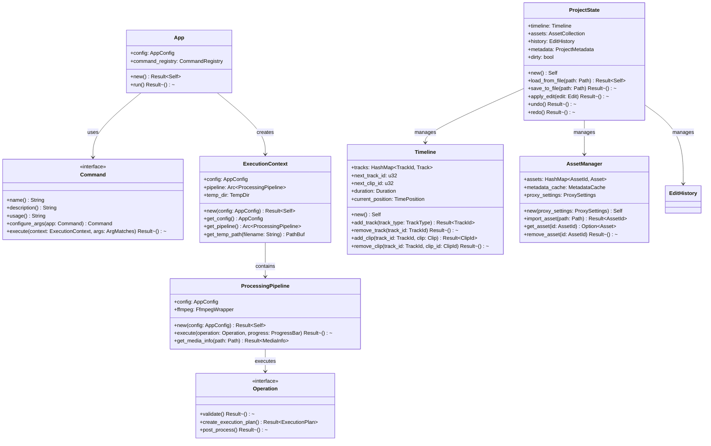

### 2.2 コマンド実装構造

```mermaid
classDiagram
    class Command {
        <<interface>>
        +name() String
        +description() String
        +usage() String
        +configure_args(app: Command) Command
        +execute(context: ExecutionContext, args: ArgMatches) Result~()~
    }
    
    class TrimCommand {
        +new() Self
        +name() String
        +description() String
        +usage() String
        +configure_args(app: Command) Command
        +execute(context: ExecutionContext, args: ArgMatches) Result~()~
    }
    
    class ConcatCommand {
        +new() Self
        +name() String
        +description() String
        +usage() String
        +configure_args(app: Command) Command
        +execute(context: ExecutionContext, args: ArgMatches) Result~()~
    }
    
    class FilterCommand {
        +new() Self
        +name() String
        +description() String
        +usage() String
        +configure_args(app: Command) Command
        +execute(context: ExecutionContext, args: ArgMatches) Result~()~
    }
    
    class AudioCommand {
        +new() Self
        +name() String
        +description() String
        +usage() String
        +configure_args(app: Command) Command
        +execute(context: ExecutionContext, args: ArgMatches) Result~()~
    }
    
    class ConvertCommand {
        +new() Self
        +name() String
        +description() String
        +usage() String
        +configure_args(app: Command) Command
        +execute(context: ExecutionContext, args: ArgMatches) Result~()~
    }
    
    class SubtitleCommand {
        +new() Self
        +name() String
        +description() String
        +usage() String
        +configure_args(app: Command) Command
        +execute(context: ExecutionContext, args: ArgMatches) Result~()~
    }
    
    class ProjectCommand {
        +new() Self
        +name() String
        +description() String
        +usage() String
        +configure_args(app: Command) Command
        +execute(context: ExecutionContext, args: ArgMatches) Result~()~
    }
    
    class BatchCommand {
        +new() Self
        +name() String
        +description() String
        +usage() String
        +configure_args(app: Command) Command
        +execute(context: ExecutionContext, args: ArgMatches) Result~()~
    }
    
    Command <|-- TrimCommand
    Command <|-- ConcatCommand
    Command <|-- FilterCommand
    Command <|-- AudioCommand
    Command <|-- ConvertCommand
    Command <|-- SubtitleCommand
    Command <|-- ProjectCommand
    Command <|-- BatchCommand
```

### 2.3 処理パイプライン構造

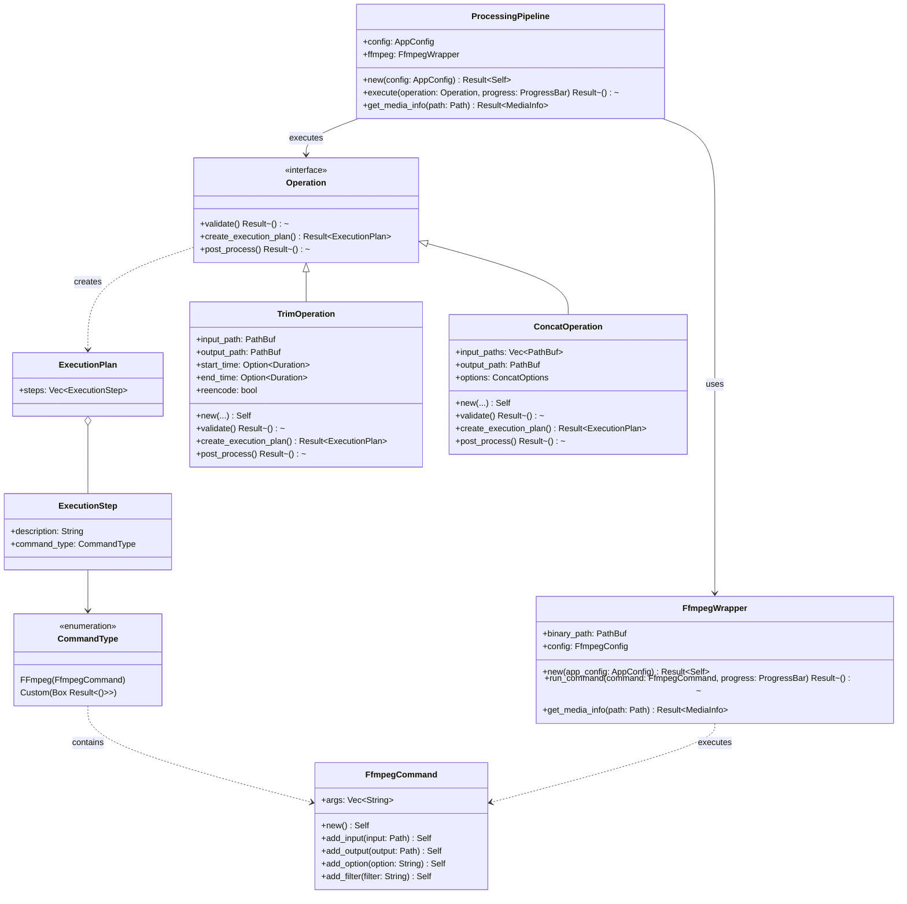

### 2.4 プロジェクト管理構造

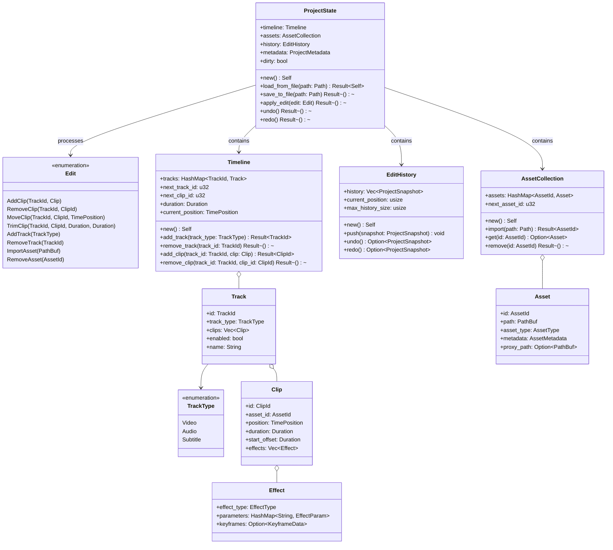

### 2.5 設定管理構造

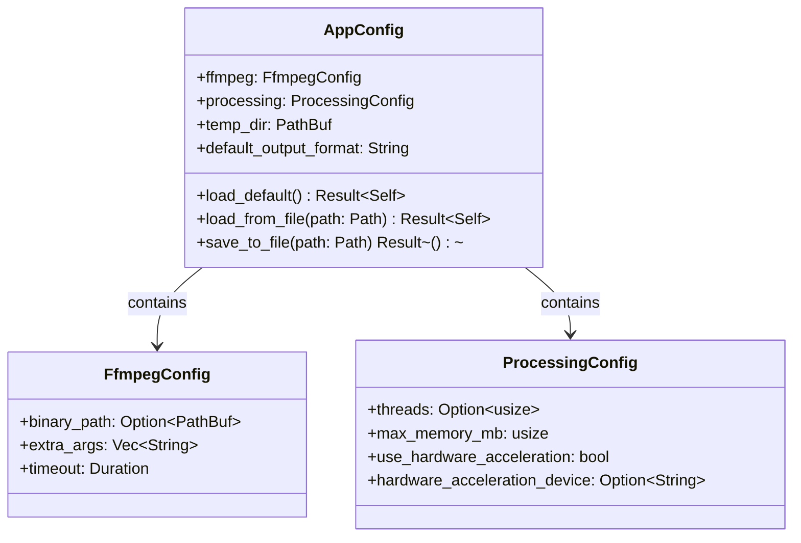

### 2.6 エラー処理構造

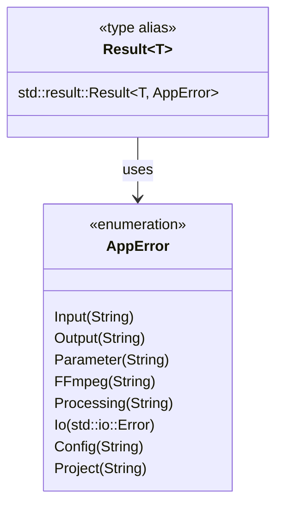

## 3. モジュール間の相互作用

### 3.1 基本的なコマンド実行フロー

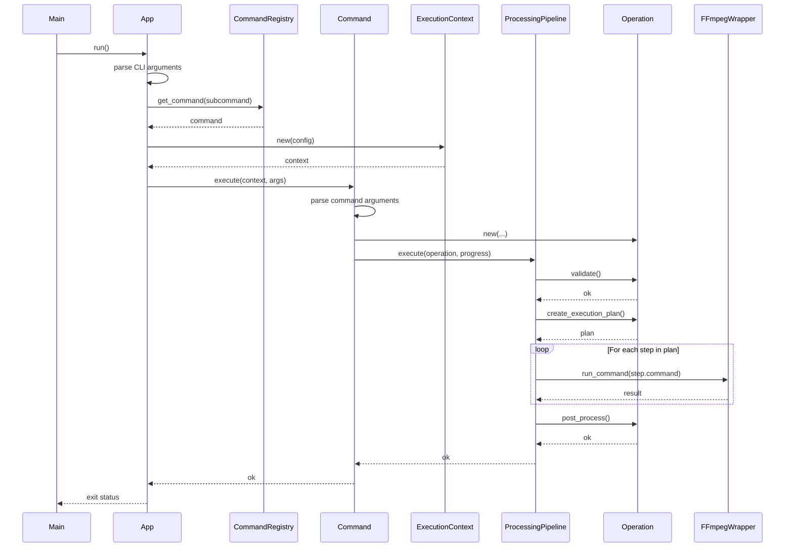

### 3.2 プロジェクト編集フロー

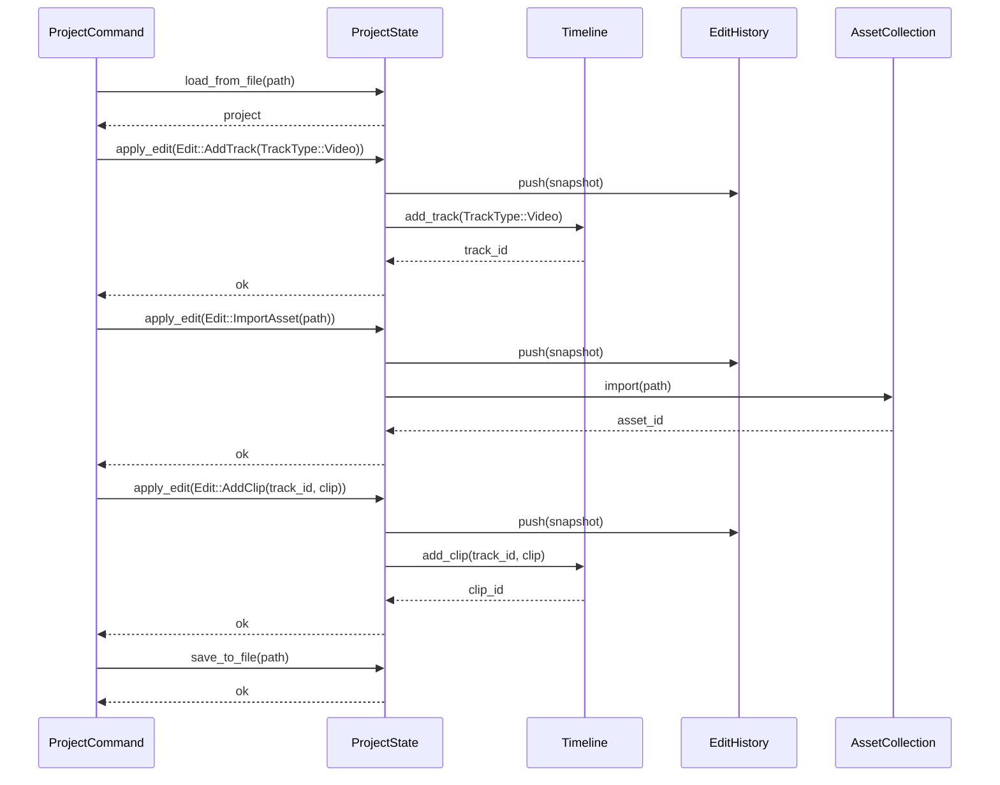

### 3.3 バッチ処理フロー

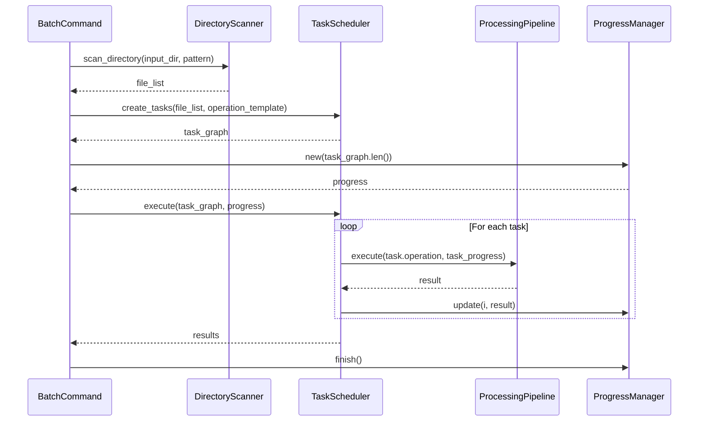

## 4. データモデル詳細

### 4.1 プロジェクトデータモデル

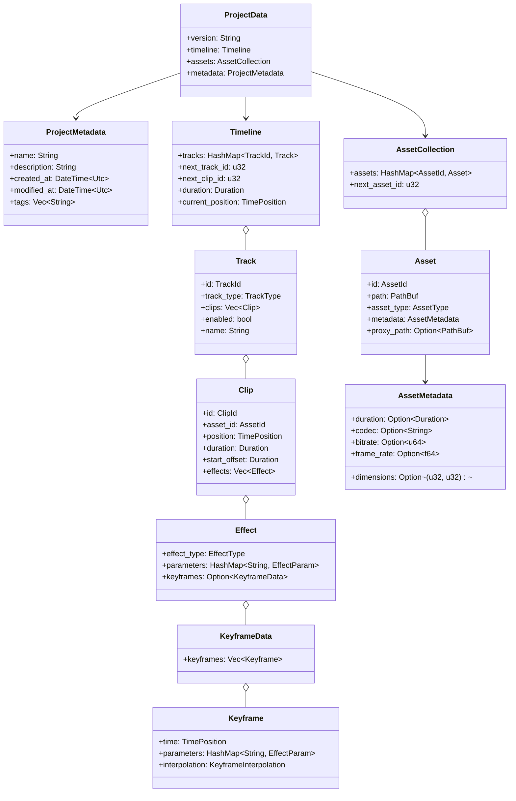

### 4.2 設定データモデル

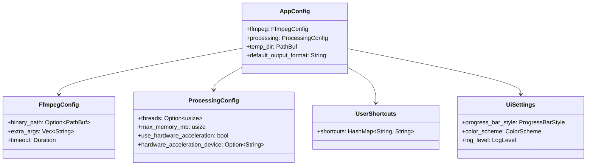

## 5. 処理パイプラインの詳細

### 5.1 パイプライン実行フロー

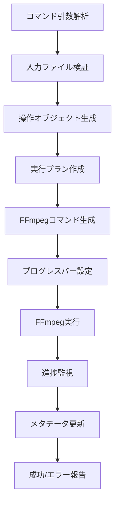

### 5.2 動画トリミング処理フロー

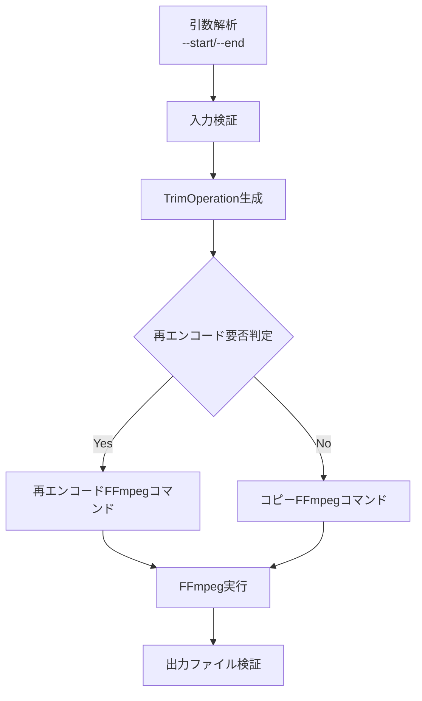

### 5.3 動画結合処理フロー

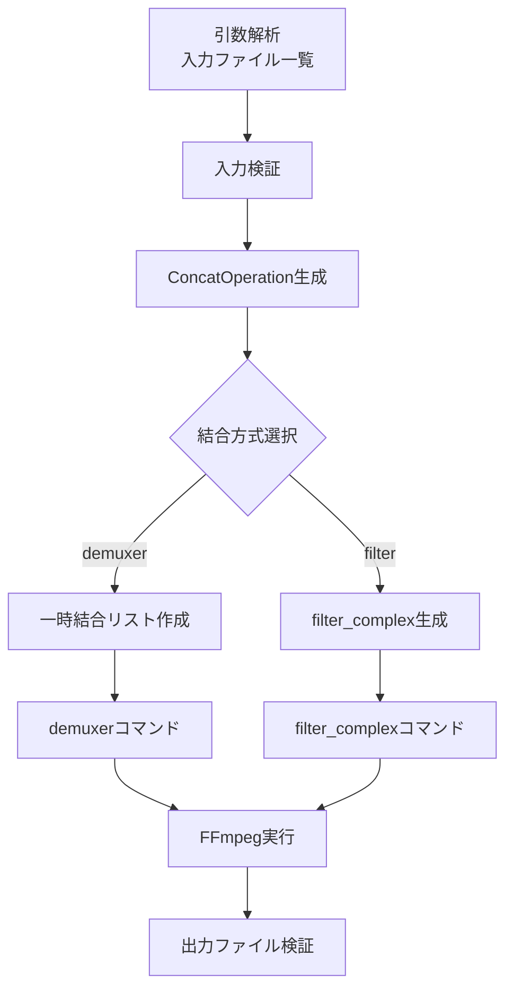

## 6. ユニットテスト設計

### 6.1 CLI モジュールテスト

- コマンドライン引数解析の正確性
- ヘルプテキスト表示の正確性
- サブコマンド登録と取得の正確性
- 無効な引数に対するエラー処理
- 進捗表示の機能
- グローバルオプションの適用

### 6.2 Core モジュールテスト

- 設定ファイル読み込みの正確性
- デフォルト設定の適用
- 環境変数からの設定上書き
- エラー型の正確な動作
- コンテキスト生成と初期化

### 6.3 Processing モジュールテスト

- FFmpegラッパーの初期化と検出
- コマンド生成の正確性
- 出力解析の正確性
- 進捗情報の解析
- 処理中断と再開
- エラーハンドリング

### 6.4 Project モジュールテスト

- プロジェクト保存と読み込み
- 編集操作の適用
- Undo/Redoの正確性
- タイムライン操作の整合性
- アセット管理の正確性

### 6.5 Asset モジュールテスト

- アセットインポートの正確性
- メタデータ抽出の正確性
- プロキシ生成の品質
- 異なる形式のサポート
- エラーケースのハンドリング

## 7. 統合テスト設計

### 7.1 コマンドライン統合テスト

- 各コマンドの実行結果の検証
- 入出力ファイルのバリデーション
- エラーケースのハンドリング
- 進捗表示の検証
- パイプラインテスト

### 7.2 バッチ処理テスト

- 複数ファイルの処理
- エラーからの回復
- 並列処理の効率
- 処理結果の統計

### 7.3 プロジェクト編集テスト

- プロジェクト作成から書き出しまでの一連のフロー
- 複雑な編集操作のシーケンス
- 大規模プロジェクトの性能
- エラー復旧メカニズム

## 8. パフォーマンステスト設計

### 8.1 処理速度ベンチマーク

- 各操作タイプの処理時間測定
- FFmpegパラメータと速度の関係分析
- ハードウェアアクセラレーション効果測定
- 並列処理の効率測定

### 8.2 リソース使用測定

- メモリ使用量プロファイリング
- CPU使用率測定
- ディスクI/O測定
- 大規模ファイル処理時のリソース管理

### 8.3 スケーラビリティテスト

- ファイルサイズによる性能変化
- 処理複雑さによる性能変化
- 並列度による性能変化
- 長時間処理の安定性